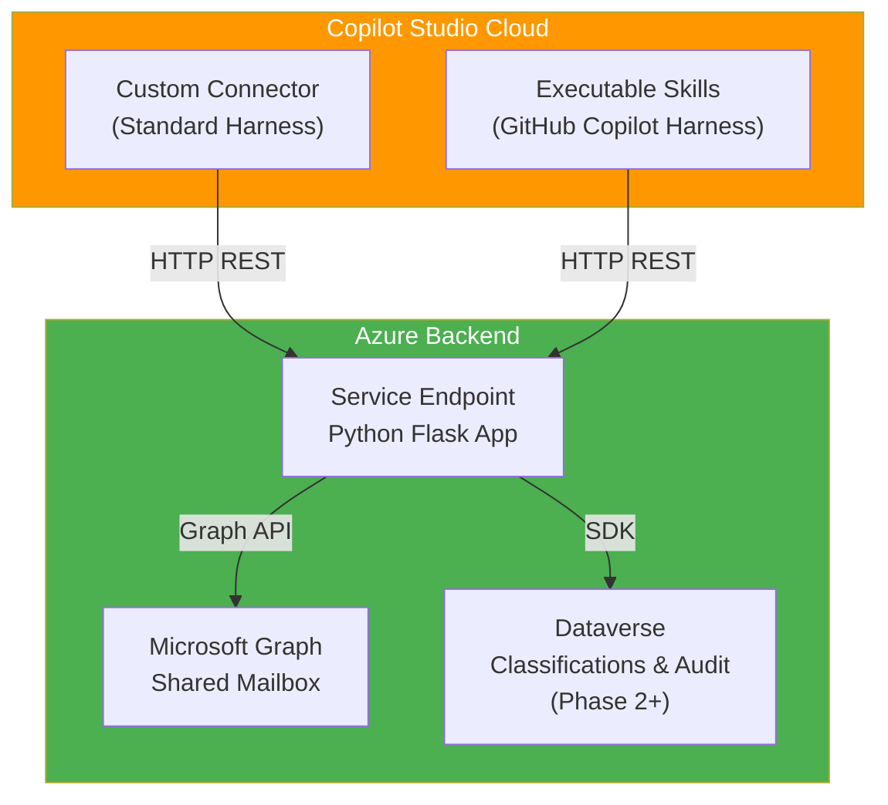

# Shared Mailbox Email Classification for Copilot Studio

A comprehensive solution for automatically classifying and routing emails in shared mailboxes using Microsoft Copilot Studio, Azure backend services, and machine learning classifiers.

## Overview

This project provides:

- **Standard Harness:** Custom Connector for Power Platform integration
- **GitHub Copilot Harness:** Executable Skills in Copilot Studio
- **Backend Service:** Azure-hosted Python application with Microsoft Graph API integration
- **Classification Engine:** Rule-based and AI-powered message routing
- **Audit Trail:** Dataverse-based logging and compliance tracking

## Status Overview

| Component | Status | Version |
|-----------|--------|---------|
| **Foundation & Documentation** | ✅ IMPLEMENTED | v0.1.0 |
| **Phase 1: App Registration & Backend** | ✅ IMPLEMENTED | v0.2.0 |
| **Phase 2: Classification Table** | 🔄 IN PROGRESS | v0.3.0 |
| **Phase 3-7: Advanced Features** | 📋 ROADMAP | v0.4.0+ |

---

## ✅ IMPLEMENTED

### v0.1.0: Foundation
- ✅ Implementation roadmap with decision tree
- ✅ Semantic versioning (v0.1.0 baseline)
- ✅ Standardized commit conventions (What's New, What's Fixed, What's Modified, Breaking Changes)
- ✅ Changelog tracking all versions
- ✅ Project structure and wiki module

### v0.2.0: Phase 1 - Shared Mailbox Skill & Custom Connector
- ✅ Complete Phase 1 wiki documentation with step-by-step setup
- ✅ Application registration in Microsoft Entra
  - ✅ API permissions (Mail.Read, Mail.Read.Shared, Mail.Send, Mail.Send.Shared)
  - ✅ Client credentials (Client ID, Tenant ID, Secret)
  - ✅ Testing procedures for credential validation
- ✅ Azure App Service deployment
  - ✅ Resource group and App Service plan creation
  - ✅ Environment variable configuration (Azure Client ID/Secret/Tenant)
  - ✅ Health check endpoints
- ✅ Custom Connector (Standard Harness)
  - ✅ OpenAPI specification
  - ✅ Azure AD authentication configuration
  - ✅ Testing procedures with expected outputs
- ✅ Executable Skills (GitHub Copilot Harness)
  - ✅ FetchMessage skill
  - ✅ ClassifyMessage skill
  - ✅ CreateDraft skill
- ✅ Backend Reference Implementation (Python Flask)
  - ✅ /health endpoint
  - ✅ /api/mailbox/messages (list)
  - ✅ /api/mailbox/messages/{id} (get single)
  - ✅ /api/mailbox/classify endpoint
  - ✅ /api/mailbox/drafts endpoint
- ✅ PowerShell Automation Scripts (all with copyright headers)
  - ✅ test-app-registration.ps1
  - ✅ create-app-service.ps1
  - ✅ configure-app-service.ps1
  - ✅ test-backend.ps1
  - ✅ grant-mailbox-permissions.ps1
- ✅ Comprehensive Testing & Verification
  - ✅ Test procedures for every step
  - ✅ Expected output examples
  - ✅ Troubleshooting tables
  - ✅ End-to-end integration testing

---

## 🔄 IN PROGRESS

### v0.3.0: Phase 2 - Classification via Dataverse Table
- 🔄 Dataverse classification table schema
  - 🔄 Column definitions (className, classExamples, classTarget, etc.)
  - 🔄 Sample classification data (Invoice, Support, Contract, etc.)
- 🔄 Rule-based classifier implementation
  - 🔄 Keyword matching logic
  - 🔄 Confidence scoring
  - 🔄 Target routing configuration
- 🔄 Classification audit table
  - 🔄 Decision tracking
  - 🔄 Timestamp and provider logging
- 🔄 Copilot Studio skill actions
  - 🔄 ClassifyMessage action with Dataverse lookup
  - 🔄 Result aggregation and confidence calculation
- 🔄 Backend endpoint integration
  - 🔄 Dataverse SDK authentication
  - 🔄 Classification query and caching

---

## 📋 ROADMAP

### v0.4.0: Phase 3 - Draft Creation & Routing
- 📋 Draft composition engine
  - 📋 Routing block generation
  - 📋 Smart template selection
  - 📋 Knowledge base integration
- 📋 Microsoft Graph draft creation
  - 📋 Reply draft API calls
  - 📋 Draft attachment handling
  - 📋 Signature and disclaimer injection
- 📋 Draft preview in Copilot Studio
  - 📋 Pre-send review workflow
  - 📋 User approval gate
- 📋 Draft submission to Outlook
  - 📋 Schedule or immediate send
  - 📋 Send tracking and logging

### v0.5.0: Phase 4 - Override Workflow & Approvals
- 📋 Manual classification override capability
  - 📋 Copilot Studio UI for override
  - 📋 Audit trail for all changes
  - 📋 Approval routing for override
- 📋 State machine implementation
  - 📋 New → Classified → Approved → Sent
  - 📋 Revert and retry states
  - 📋 Escalation workflows
- 📋 Approval matrix configuration
  - 📋 User/group-based approval routes
  - 📋 Time-based escalation
  - 📋 SLA tracking

### v0.6.0: Phase 5 - MCP Server Integration
- 📋 Model Context Protocol (MCP) server
  - 📋 Tool definitions for classification
  - 📋 Tool definitions for draft creation
  - 📋 Tool definitions for override
- 📋 GitHub Copilot CLI integration
  - 📋 Local executable commands
  - 📋 MCP tool invocation from CLI
  - 📋 Response formatting and display
- 📋 Tool documentation and schema validation

### v0.7.0: Phase 6 - BART Classifier Integration
- 📋 BART model fine-tuning pipeline
  - 📋 Training data preparation from audit logs
  - 📋 Model training and validation
  - 📋 Performance metrics (precision, recall, F1)
- 📋 Azure Machine Learning deployment
  - 📋 Foundry model registration
  - 📋 Endpoint configuration and scaling
  - 📋 A/B testing framework
- 📋 Confidence-based fallback routing
  - 📋 High confidence: Auto-route
  - 📋 Medium confidence: Suggest to user
  - 📋 Low confidence: Manual review queue

### v0.8.0 - v0.9.x: Phase 7 - Production Hardening
- 📋 Monitoring and observability
  - 📋 Application Insights telemetry
  - 📋 Custom metrics and dashboards
  - 📋 Alert configuration
- 📋 Logging and compliance
  - 📋 Audit log retention (90+ days)
  - 📋 Compliance report generation
  - 📋 Data residency and encryption
- 📋 Security hardening
  - 📋 Input validation and sanitization
  - 📋 Rate limiting and throttling
  - 📋 CORS and authentication hardening
- 📋 Performance optimization
  - 📋 Caching strategy (Redis)
  - 📋 Database query optimization
  - 📋 Background job processing (async)
- 📋 Disaster recovery and backup
  - 📋 Backup strategy for Dataverse
  - 📋 failover configuration
  - 📋 RTO/RPO documentation

### v1.0.0: General Availability
- 📋 Production-ready release
- 📋 Full documentation and training materials
- 📋 Support and maintenance model
- 📋 SLA commitments

---

## Quick Start

### Prerequisites

- Microsoft 365 tenant with Copilot Studio
- Azure subscription
- Shared mailbox with appropriate permissions
- PowerShell 7+ with Azure CLI

### Setup Steps (Phase 1: v0.2.0)

1. **Read Phase 1 Documentation** – [docs/wiki/phase-1-mailbox-setup.md](docs/wiki/phase-1-mailbox-setup.md)
2. **Create App Registration** – Follow Step 3 in Phase 1 guide
3. **Deploy Backend Service** – Follow Step 4 in Phase 1 guide
4. **Configure Custom Connector** – Follow Step 5 in Phase 1 guide
5. **Set Up Executable Skills** – Follow Step 6 in Phase 1 guide
6. **Run Integration Tests** – Follow Step 7 in Phase 1 guide

**Next Phase:** After Phase 1 is complete, proceed to [Phase 2: Classification](docs/wiki/phase-2-classification-table.md) (currently in progress).

## Architecture



## Documentation

- **[Wiki Home](docs/wiki/index.md)** – Complete implementation guide and reference
- **[Phase 1: Shared Mailbox Skill & Custom Connector](docs/wiki/phase-1-mailbox-setup.md)** ✅ COMPLETE
  - Setup app registration, backend, custom connector, and executable skills
  - Comprehensive testing procedures and troubleshooting
- **[Phase 2: Classification via Table](docs/wiki/phase-2-classification-table.md)** 🔄 IN PROGRESS
  - Classification table schema and rule-based classifier
- **[Implementation Plan](docs/implementation-plan.md)** – Full roadmap with detailed phases
- **[Changelog](CHANGELOG.md)** – Version history and release notes
- **[Commit Conventions](COMMIT_CONVENTION.md)** – Standardized commit message format

## Project Structure

```
bridge365/
├── README.md                           # This file
├── CHANGELOG.md                        # Version history
├── COMMIT_CONVENTION.md                # Commit message format
├── LICENSE                             # Project license
├── docs/
│   ├── implementation-plan.md          # Full roadmap and phases
│   ├── shared-mailbox-classification-master-guide.md  # Reference guide
│   └── wiki/                           # Phase-by-phase implementation guides
│       ├── index.md                    # Wiki home
│       ├── phase-1-mailbox-setup.md    # ✅ Phase 1 complete with testing
│       ├── phase-2-classification-table.md  # 🔄 Phase 2 in progress
│       ├── scripts/
│       │   ├── test-app-registration.ps1
│       │   ├── create-app-service.ps1
│       │   ├── configure-app-service.ps1
│       │   ├── test-backend.ps1
│       │   ├── grant-mailbox-permissions.ps1
│       │   ├── setup-shared-mailbox-skill.ps1
│       │   ├── setup-custom-connector.ps1
│       │   ├── setup-classification-table.ps1
│       │   └── create-sample-classifications.ps1
│       └── diagrams/                  # Architecture diagrams
└── backend/                            # 📋 Python Flask service (Phase 1 reference implementation)
    ├── app.py                          # Reference implementation
    ├── requirements.txt                # Python dependencies
    └── ...
```

## Support & Contribution

For questions or issues:
1. Check relevant phase documentation in [docs/wiki/](docs/wiki/)
2. Review troubleshooting section in the phase guide
3. Check [Implementation Plan](docs/implementation-plan.md) for detailed phase definitions
4. Verify all test procedures in the phase documentation pass

## License

Licensed under the project LICENSE file.

## Copyright

(c) 2026 Holger Imbery (contact@holgerimbery.blog)

All code samples include copyright headers. See individual files for details.

---

**Current Status:** 
- ✅ Phase 1 Complete (v0.2.0)
- 🔄 Phase 2 In Progress (v0.3.0)
- 📋 Phases 3-7 Roadmap

**[Start Phase 1 Setup](docs/wiki/phase-1-mailbox-setup.md)** | **[View Roadmap](docs/implementation-plan.md)**
