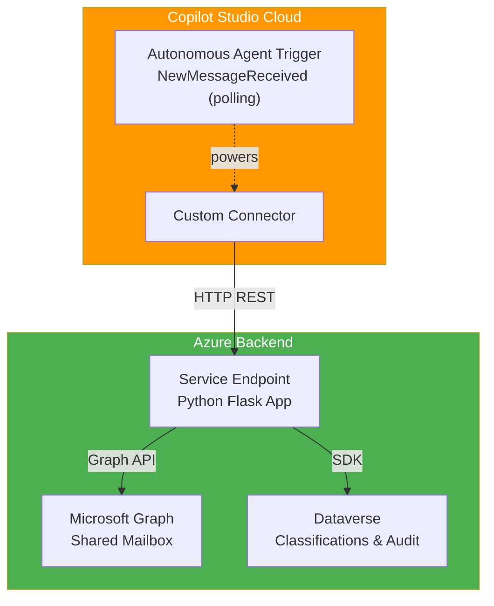

# Bridge365: Transforming Shared Mailboxes into AI-Powered Service Hubs

A comprehensive solution for automatically classifying and routing emails in shared mailboxes using Microsoft Copilot Studio, Azure backend services, and machine learning classifiers.

## Overview

This project provides:

- **Custom Connector:** Power Platform integration, including an autonomous-agent polling trigger
- **Backend Service:** Azure-hosted Python application with Microsoft Graph API integration
- **Classification Engine:** Rule-based and AI-powered message routing
- **Audit Trail:** Dataverse-based logging and compliance tracking

## Quick Start

### Prerequisites

- Microsoft 365 tenant with Copilot Studio
- Azure subscription
- Shared mailbox with appropriate permissions
- PowerShell 7+ with Azure CLI

### Setup Steps

1. **Read Phase 1 Documentation**
   ```
   docs/wiki/phase-1-mailbox-setup.md
   ```

2. **Follow Step-by-Step Setup**
   - Create Application Registration (Step 3)
   - Deploy Backend Service (Step 4)
   - Configure Custom Connector, optionally as an autonomous agent trigger (Step 5)
   - Run Integration Tests (Step 6)

3. **Test Each Component**
   All phases include testing procedures with expected outputs.

4. **Next Phase**
   After Phase 1 is complete, proceed to Phase 2: Classification (currently in progress).

## Architecture



## Documentation

**Phase-by-Phase Guides:**
- [Phase 1: Shared Mailbox Custom Connector Setup](docs/wiki/phase-1-mailbox-setup.md) ✅ Complete
- [Phase 2: Classification via Dataverse Table](docs/wiki/phase-2-classification-table.md) 🔄 In Progress

**Reference Documentation:**
- [Wiki Home](docs/wiki/index.md) - Overview and navigation
- [Implementation Plan](docs/implementation-plan.md) - Full roadmap with all phases
- [Changelog](CHANGELOG.md) - Version history and release notes
- [Commit Conventions](COMMIT_CONVENTION.md) - Standardized commit message format

**Helper Scripts:**
All scripts include copyright headers.
- `docs/wiki/scripts/test-app-registration.ps1` - Validate app registration credentials
- `docs/wiki/scripts/grant-mailbox-permissions.ps1` - Configure mailbox access
- `backend-service/scripts/create-app-service.ps1` - Create Azure App Service
- `backend-service/scripts/configure-app-service.ps1` - Set environment variables
- `backend-service/scripts/test-backend.ps1` - Test backend endpoints (health, messages, classify, drafts, poll)
- `backend-service/scripts/enable-backend-auth.ps1`, `configure-allowlist.ps1`, `secure-client-secret.ps1`, `restrict-network-access.ps1`, `review-backend-logs.ps1` - Security hardening
- `dataverse/scripts/deploy-dataverse-tables.ps1` - Create/update the Phase 2 Dataverse tables from `dataverse/schemas/*.schema.json`
- `dataverse/scripts/seed-sample-classifications.ps1` - Load sample classification rules

## Project Structure

```
bridge365/
├── README.md                           # This file
├── CHANGELOG.md                        # Version history
├── COMMIT_CONVENTION.md                # Commit message format
├── LICENSE                             # Project license
├── backend-service/                    # Flask backend service
│   ├── app.py                          # Backend application (incl. /poll trigger endpoint)
│   ├── requirements.txt                # Python dependencies
│   └── scripts/                        # Deployment & security-hardening scripts
├── custom-connector/                   # Power Platform custom connector
│   ├── README.md                       # Setup guide, incl. autonomous agent trigger
│   ├── openapi.template.yaml           # Committed connector OpenAPI template (actions + polling trigger)
│   └── openapi.yaml                    # Generated, gitignored (real backend host)
├── dataverse/                          # Phase 2 Dataverse classification tables
│   ├── README.md                       # Setup guide
│   ├── schemas/                        # Table column templates (JSON)
│   └── scripts/                        # deploy-dataverse-tables.ps1, seed-sample-classifications.ps1
└── docs/
    ├── implementation-plan.md          # Full roadmap and phases
    ├── status.md                       # Status Summary & Detailed Status (moved from README)
    ├── shared-mailbox-classification-master-guide.md  # Reference guide
    └── wiki/                           # Phase-by-phase guides
        ├── index.md                    # Wiki home
        ├── phase-1-mailbox-setup.md    # Phase 1 (complete with testing)
        ├── phase-2-classification-table.md  # Phase 2 (in progress)
        └── scripts/                    # Shared app-registration scripts
```

## Support & Contribution

For questions or issues:
1. Check the relevant phase documentation in `docs/wiki/`
2. Review the troubleshooting section in the phase guide
3. Check [Implementation Plan](docs/implementation-plan.md) for detailed phase definitions
4. Verify all test procedures pass

## License

Licensed under the project LICENSE file.

## Copyright

(c) 2026 Holger Imbery (contact@holgerimbery.blog)

All code samples include copyright headers. See individual files for details.

---

**Current Version:** v0.5.4 | [View Changelog](CHANGELOG.md) | [View Status & Roadmap](docs/status.md) | [View Implementation Plan](docs/implementation-plan.md)
