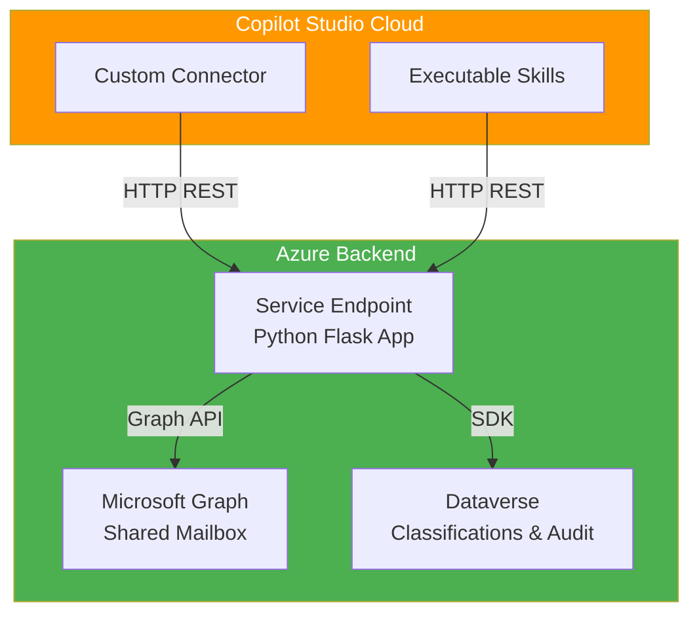

# Shared Mailbox Email Classification for Copilot Studio

A comprehensive solution for automatically classifying and routing emails in shared mailboxes using Microsoft Copilot Studio, Azure backend services, and machine learning classifiers.

## Overview

This project provides:

- **Standard Harness:** Custom Connector for Power Platform integration
- **GitHub Copilot Harness:** Executable Skills in Copilot Studio
- **Backend Service:** Azure-hosted Python application with Microsoft Graph API integration
- **Classification Engine:** Rule-based and AI-powered message routing
- **Audit Trail:** Dataverse-based logging and compliance tracking

## Quick Start

### Prerequisites

- Microsoft 365 tenant with Copilot Studio
- Azure subscription
- Shared mailbox with appropriate permissions
- PowerShell 7+ with Azure CLI

### Setup Steps

1. **Phase 1: Foundation & Connectors** – Set up app registration, backend service, and custom connector
2. **Phase 2: Classification Table** – Create Dataverse classification rules
3. **Phase 3: Draft Creation** – Implement reply draft generation
4. **Phase 4: Override Workflow** – Add manual classification override capability
5. **Phase 5: MCP Integration** – Add model context protocol support
6. **Phase 6: BART Classifier** – Deploy advanced AI classifier
7. **Phase 7: Production Hardening** – Deploy to production with monitoring

**See [Implementation Guide](docs/wiki/index.md)** for detailed step-by-step instructions.

## Architecture



## Documentation

- **[Wiki Home](docs/wiki/index.md)** – Complete implementation guide and reference
- **[Phase 1: Shared Mailbox Skill & Custom Connector](docs/wiki/phase-1-mailbox-setup.md)** – Setup app registration, backend, custom connector, and executable skills
- **[Phase 2: Classification via Table](docs/wiki/phase-2-classification-table.md)** – Create classification rules and implement rule-based classifier
- **[Implementation Plan](docs/implementation-plan.md)** – Full roadmap and feature definitions
- **[Changelog](CHANGELOG.md)** – Version history and release notes
- **[Commit Conventions](COMMIT_CONVENTION.md)** – Standardized commit message format

## Features

### Phase 1: Foundation (v0.2.0)
- ✅ Application registration in Microsoft Entra
- ✅ Azure App Service deployment
- ✅ Custom Connector (Standard Harness)
- ✅ Executable Skills (GitHub Copilot Harness)
- ✅ Backend REST API with Microsoft Graph integration

### Phase 2: Classification (v0.3.0 - In Progress)
- 🔄 Dataverse classification table schema
- 🔄 Rule-based classifier implementation
- 🔄 Classification audit table
- 🔄 Copilot Studio skill integration

### Phase 3-7: Planned
- 📋 Draft creation and routing
- 📋 Override workflow with approvals
- 📋 MCP server and tool definitions
- 📋 BART AI classifier training
- 📋 Production hardening and monitoring

## Getting Started

### Step 1: Read Phase 1 Documentation

```bash
# Open Phase 1 setup guide
explorer .\docs\wiki\phase-1-mailbox-setup.md
```

Follow the step-by-step instructions to:
1. Create app registration
2. Deploy backend service
3. Configure custom connector
4. Set up executable skills

### Step 2: Test All Components

Each section in the documentation includes testing procedures:

```powershell
# Test app registration
.\docs\wiki\scripts\test-app-registration.ps1 -ClientId "..." -ClientSecret "..." -TenantId "..."

# Test backend endpoints
.\docs\wiki\scripts\test-backend.ps1 -BackendUrl "https://your-app.azurewebsites.net"
```

### Step 3: Next Phase

After Phase 1 is complete, proceed to [Phase 2: Classification](docs/wiki/phase-2-classification-table.md).

## Version History

| Version | Status | Features |
|---------|--------|----------|
| v0.1.0 | ✅ Released | Implementation plan, changelog, commit conventions |
| v0.1.1 | ✅ Released | Reordered phases, Phase 1 wiki documentation |
| v0.2.0 | ✅ Released | Phase 1 complete: Foundation & Connectors |
| v0.3.0 | 🔄 In Progress | Phase 2: Classification Table |
| v1.0.0 | 📋 Planned | Production release |

See [Changelog](CHANGELOG.md) for detailed release notes.

## Project Structure

```
bridge365/
├── README.md                           # This file
├── CHANGELOG.md                        # Version history
├── COMMIT_CONVENTION.md                # Commit message format
├── LICENSE                             # Project license
├── docs/
│   ├── implementation-plan.md          # Full roadmap
│   ├── shared-mailbox-classification-master-guide.md  # Reference guide
│   └── wiki/                           # Implementation guides
│       ├── index.md                    # Wiki home
│       ├── phase-1-mailbox-setup.md    # Phase 1 detailed setup
│       ├── phase-2-classification-table.md  # Phase 2 documentation
│       ├── scripts/
│       │   ├── setup-shared-mailbox-skill.ps1
│       │   ├── setup-custom-connector.ps1
│       │   ├── setup-classification-table.ps1
│       │   ├── create-sample-classifications.ps1
│       │   ├── test-app-registration.ps1
│       │   ├── test-backend.ps1
│       │   └── grant-mailbox-permissions.ps1
│       └── mermaid-diagrams/           # Architecture diagrams
└── backend/                            # Python Flask service (to be created)
    ├── app.py
    ├── requirements.txt
    └── ...
```

## Support & Contribution

For questions or issues:
1. Check [Phase 1 Documentation](docs/wiki/phase-1-mailbox-setup.md)
2. Review troubleshooting section in relevant phase
3. Check [Implementation Plan](docs/implementation-plan.md)

## License

Licensed under the project LICENSE file.

## Copyright

(c) 2026 Holger Imbery (contact@holgerimbery.blog)

All code samples include copyright headers. See individual files for details.

---

**Status:** Phase 1 complete ✅ | Phase 2 in progress 🔄 | [Start Phase 1 Setup](docs/wiki/phase-1-mailbox-setup.md)
