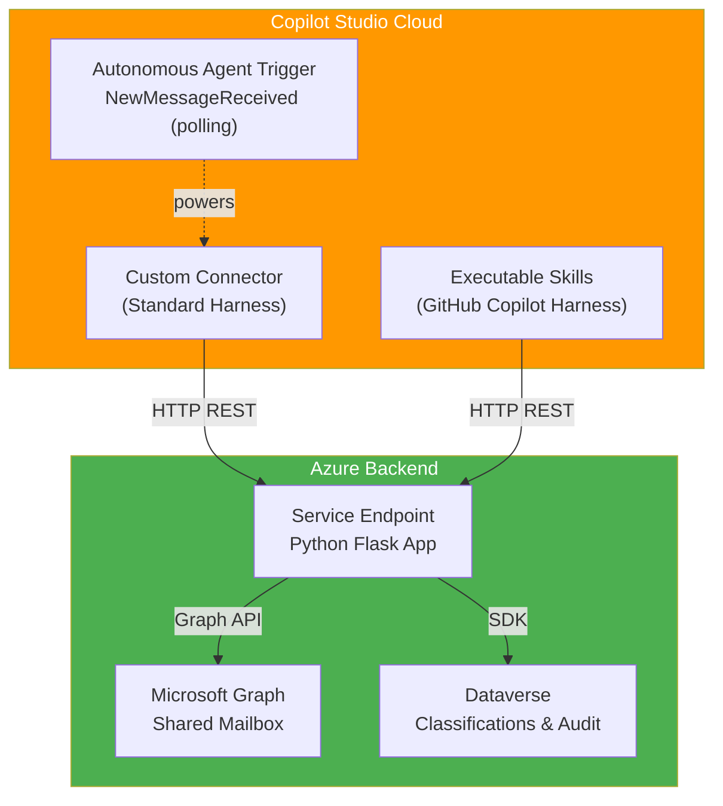

# Bridge365: Transforming Shared Mailboxes into AI-Powered Service Hubs

A comprehensive solution for automatically classifying and routing emails in shared mailboxes using Microsoft Copilot Studio, Azure backend services, and machine learning classifiers.

## Overview

This project provides:

- **Standard Harness:** Custom Connector for Power Platform integration, including an autonomous-agent polling trigger
- **GitHub Copilot Harness:** Executable Skills in Copilot Studio
- **Backend Service:** Azure-hosted Python application with Microsoft Graph API integration
- **Classification Engine:** Rule-based and AI-powered message routing
- **Audit Trail:** Dataverse-based logging and compliance tracking

## Status Summary

| Component | Status | Version |
|-----------|--------|---------|
| Foundation & Documentation | ✅ Complete | v0.1.0 |
| Phase 1: App Registration & Backend | ✅ Complete | v0.2.0 |
| Phase 1: Security Hardening | ✅ Complete | v0.3.0 |
| Phase 1: Repo Reorganization (backend-service / custom-connector / SharedMailboxSkills) | ✅ Complete | v0.4.0 |
| Phase 1: Custom Connector Autonomous Agent Trigger | ✅ Complete | v0.4.1 |
| Phase 1: Copilot Studio Workflow Trigger (GitHub Copilot Harness) | ✅ Complete | v0.4.2 |
| Phase 1: Script Parameter Management (.env Support) | ✅ Complete | v0.4.3 |
| Phase 1: Extract Remaining Inline Test Scripts (.env Support) | ✅ Complete | v0.4.4 |
| Phase 1: Move .env to Repo Root | ✅ Complete | v0.4.5 |
| Phase 1: GitHub Wiki Sync Automation | ✅ Complete | v0.4.6 |
| Phase 1: Fix Wiki Internal Page Links | ✅ Complete | v0.4.7 |
| Phase 1: Fix .env Quoted-Value Parsing | ✅ Complete | v0.4.8 |
| Phase 1: Fix .env Default-Fallback Bug (LOCATION/MAILBOX_ADDRESS) | ✅ Complete | v0.4.9 |
| Phase 2: Classification Table | 🔄 In Progress | v0.5.0 (planned) |
| Phase 3-7: Advanced Features | 📋 Planned | v0.6.0+ |

## Quick Start (Phase 1: v0.4.9)

### Prerequisites

- Microsoft 365 tenant with Copilot Studio
- Azure subscription
- Shared mailbox with appropriate permissions
- PowerShell 7+ with Azure CLI

### Setup Steps

1. **Read Phase 1 Documentation**
   ```
   docs/wiki/phase-1-mailbox-setup.md
   ```

2. **Follow Step-by-Step Setup**
   - Create Application Registration (Step 3)
   - Deploy Backend Service (Step 4)
   - Configure Custom Connector, optionally as an autonomous agent trigger (Step 5)
   - Set Up Executable Skills (Step 6)
   - Run Integration Tests (Step 7)

3. **Test Each Component**
   All phases include testing procedures with expected outputs.

4. **Next Phase**
   After Phase 1 is complete, proceed to Phase 2: Classification (currently in progress).

## Architecture



## Documentation

**Phase-by-Phase Guides:**
- [Phase 1: Shared Mailbox Skill & Custom Connector](docs/wiki/phase-1-mailbox-setup.md) ✅ Complete
- [Phase 2: Classification via Dataverse Table](docs/wiki/phase-2-classification-table.md) 🔄 In Progress

**Reference Documentation:**
- [Wiki Home](docs/wiki/index.md) - Overview and navigation
- [Implementation Plan](docs/implementation-plan.md) - Full roadmap with all phases
- [Changelog](CHANGELOG.md) - Version history and release notes
- [Commit Conventions](COMMIT_CONVENTION.md) - Standardized commit message format

**Helper Scripts:**
All scripts include copyright headers.
- `docs/wiki/scripts/test-app-registration.ps1` - Validate app registration credentials
- `docs/wiki/scripts/grant-mailbox-permissions.ps1` - Configure mailbox access
- `backend-service/scripts/create-app-service.ps1` - Create Azure App Service
- `backend-service/scripts/configure-app-service.ps1` - Set environment variables
- `backend-service/scripts/test-backend.ps1` - Test backend endpoints (health, messages, classify, drafts, poll)
- `backend-service/scripts/enable-backend-auth.ps1`, `configure-allowlist.ps1`, `secure-client-secret.ps1`, `restrict-network-access.ps1`, `review-backend-logs.ps1` - Security hardening
- `docs/wiki/scripts/setup-classification-table.ps1` - Create Dataverse table
- `docs/wiki/scripts/create-sample-classifications.ps1` - Load sample data

## Project Structure

```
bridge365/
├── README.md                           # This file
├── CHANGELOG.md                        # Version history
├── COMMIT_CONVENTION.md                # Commit message format
├── LICENSE                             # Project license
├── backend-service/                    # Flask backend service
│   ├── app.py                          # Backend application (incl. /poll trigger endpoint)
│   ├── requirements.txt                # Python dependencies
│   └── scripts/                        # Deployment & security-hardening scripts
├── custom-connector/                   # Standard harness (Power Platform connector)
│   ├── README.md                       # Setup guide, incl. autonomous agent trigger
│   └── openapi.yaml                    # Connector OpenAPI definition (actions + polling trigger)
├── SharedMailboxSkills/                # GitHub Copilot harness (executable skills)
│   ├── README.md                       # Setup guide
│   └── skills.json                     # Skill/action definitions
└── docs/
    ├── implementation-plan.md          # Full roadmap and phases
    ├── shared-mailbox-classification-master-guide.md  # Reference guide
    └── wiki/                           # Phase-by-phase guides
        ├── index.md                    # Wiki home
        ├── phase-1-mailbox-setup.md    # Phase 1 (complete with testing)
        ├── phase-2-classification-table.md  # Phase 2 (in progress)
        └── scripts/                    # Shared app-registration & Phase 2 scripts
```

## Support & Contribution

For questions or issues:
1. Check the relevant phase documentation in `docs/wiki/`
2. Review the troubleshooting section in the phase guide
3. Check [Implementation Plan](docs/implementation-plan.md) for detailed phase definitions
4. Verify all test procedures pass

## License

Licensed under the project LICENSE file.

## Copyright

(c) 2026 Holger Imbery (contact@holgerimbery.blog)

All code samples include copyright headers. See individual files for details.

---

# Detailed Status

## ✅ IMPLEMENTED

### v0.1.0: Foundation
- ✅ Implementation roadmap with decision tree
- ✅ Semantic versioning (v0.1.0 baseline)
- ✅ Standardized commit conventions (What's New, What's Fixed, What's Modified, Breaking Changes)
- ✅ Changelog tracking all versions
- ✅ Project structure and wiki module

### v0.2.0: Phase 1 - Shared Mailbox Skill & Custom Connector
- ✅ Complete Phase 1 wiki documentation with step-by-step setup
- ✅ Application registration in Microsoft Entra
  - ✅ API permissions (Mail.Read, Mail.Read.Shared, Mail.Send, Mail.Send.Shared)
  - ✅ Client credentials (Client ID, Tenant ID, Secret)
  - ✅ Testing procedures for credential validation
- ✅ Azure App Service deployment
  - ✅ Resource group and App Service plan creation
  - ✅ Environment variable configuration (Azure Client ID/Secret/Tenant)
  - ✅ Health check endpoints
- ✅ Custom Connector (Standard Harness)
  - ✅ OpenAPI specification
  - ✅ Azure AD authentication configuration
  - ✅ Testing procedures with expected outputs
- ✅ Executable Skills (GitHub Copilot Harness)
  - ✅ FetchMessage skill
  - ✅ ClassifyMessage skill
  - ✅ CreateDraft skill
- ✅ Backend Reference Implementation (Python Flask)
  - ✅ /health endpoint
  - ✅ /api/mailbox/messages (list)
  - ✅ /api/mailbox/messages/{id} (get single)
  - ✅ /api/mailbox/classify endpoint
  - ✅ /api/mailbox/drafts endpoint
- ✅ PowerShell Automation Scripts (all with copyright headers)
  - ✅ test-app-registration.ps1
  - ✅ create-app-service.ps1
  - ✅ configure-app-service.ps1
  - ✅ test-backend.ps1
  - ✅ grant-mailbox-permissions.ps1
- ✅ Comprehensive Testing & Verification
  - ✅ Test procedures for every step
  - ✅ Expected output examples
  - ✅ Troubleshooting tables
  - ✅ End-to-end integration testing

### v0.2.1: Documentation Improvements
- ✅ README restructured for clarity
- ✅ Fixed wiki navigation links
- ✅ Moved detailed status to end of README
- ✅ Quick start placed after short status summary
- ✅ Helper scripts documentation
- ✅ Support and contribution guidelines

### v0.2.2: Shared Mailbox Permission Guidance Fix
- ✅ Corrected Step 3.2 app permissions to application-only Graph scopes
- ✅ Replaced incorrect Exchange service-principal guidance with `New-ApplicationAccessPolicy`, scoped to a mail-enabled security group
- ✅ Guarded `Connect-ExchangeOnline` verification step against session/parameter errors

### v0.3.0: Security Hardening
- ✅ Phase 1 section "4.6 Security Hardening (Required Before Production Use)" with 6 controls: JWT authentication, tenant/client-id allowlist, mailbox scope re-verification, Key Vault secret storage, network access restriction, log sanitization
- ✅ Security Hardening Checklist Summary table
- ✅ Five new PowerShell scripts: `enable-backend-auth.ps1`, `configure-allowlist.ps1`, `secure-client-secret.ps1`, `restrict-network-access.ps1`, `review-backend-logs.ps1`

### v0.3.1 - v0.3.2: Script Consistency Fixes
- ✅ Synced 5 scripts referenced only as inline wiki code blocks into standalone files in `docs/wiki/scripts/`
- ✅ Standardized parameter naming (`-ClientId` instead of `-AppId`) across all scripts
- ✅ Removed 2 stale, unreferenced scripts with an inconsistent naming convention

### v0.4.0: Repo Reorganization
- ✅ New `backend-service/` folder: real `app.py`/`requirements.txt` plus deployment/security scripts
- ✅ New `custom-connector/` folder: `openapi.yaml` (Swagger 2.0) and setup guide
- ✅ New `SharedMailboxSkills/` folder: `skills.json` and setup guide
- ✅ Wiki and README updated to reference the new folder locations

### v0.4.1: Custom Connector Autonomous Agent Trigger
- ✅ `NewMessageReceived` polling trigger operation added to `custom-connector/openapi.yaml` (`x-ms-trigger: batch`)
- ✅ Matching `/api/mailbox/messages/poll` endpoint added to `backend-service/app.py` (newest-first, checkpoint-filtered)
- ✅ `backend-service/scripts/test-backend.ps1` extended with a poll-endpoint test
- ✅ Setup guide for wiring the trigger to an autonomous agent (Generative Orchestration, solution-aware cloud flow sharing, author-credential caveat)

### v0.4.2: Copilot Studio Workflow Trigger (GitHub Copilot Harness)
- ✅ New Step 5 "Trigger the Agent Autonomously with a Copilot Studio Workflow" in `SharedMailboxSkills/README.md`, using Copilot Studio's native Workflows feature (connector trigger + Agent node with the `FetchMessage`/`ClassifyMessage`/`CreateDraft` skills as tools)
- ✅ New Step 6.5 in `docs/wiki/phase-1-mailbox-setup.md` cross-referencing the Workflow setup guide
- ✅ New **SendMessage** and **SendDraftMessage** actions across all layers (`backend-service/app.py`, `custom-connector/openapi.yaml`, `SharedMailboxSkills/skills.json`), letting an agent send a brand-new message directly or send an existing draft after optional human review

### v0.4.3: Script Parameter Management (.env Support)
- ✅ New `.env.example` template in `backend-service/` covering all configurable parameters (resource group, app service name, Entra ID credentials, allowlist settings, testing backend URL/mailbox, security group name)
- ✅ All 8 `backend-service/scripts/*.ps1` scripts refactored to load parameters from `.env` when not supplied via CLI, with validation if a value is still missing
- ✅ `.gitignore` added to keep a real `backend-service/.env` (with secrets) out of version control

### v0.4.4: Extract Remaining Inline Test Scripts (.env Support)
- ✅ New `test-app-service.ps1` (`backend-service/scripts/`) extracted from the inline Step 4.2 snippet, with `.env` support
- ✅ New `confirm-mailbox-scope-restriction.ps1` (`docs/wiki/scripts/`) extracted from the inline Step 4.6.3 snippet, with `.env` support
- ✅ All 12 scripts referenced in `docs/wiki/phase-1-mailbox-setup.md` now have matching script files, `.env` support, and a `**Script:**` link

### v0.4.5: Move .env to Repo Root
- ✅ `.env.example` moved from `backend-service/.env.example` to the repo root, so it is visible immediately instead of buried inside `backend-service/`
- ✅ All 12 setup scripts now read the real `.env` from the repo root instead of `backend-service/.env`
- ⚠️ Breaking: if you already created a `backend-service/.env`, move it to the repo root (`.env`)

### v0.4.6: GitHub Wiki Sync Automation
- ✅ New `.github/workflows/sync-wiki.yml` mirrors `docs/wiki/*.md` into the repository's native Wiki tab on every push to `main` touching `docs/wiki/**` (or manually via `workflow_dispatch`)
- ✅ New `.github/scripts/sync-wiki.py` renames `index.md` to `Home.md` and rewrites relative links to scripts/backend-service/custom-connector/SharedMailboxSkills into absolute GitHub blob URLs
- ⚠️ Setup required: add a repository secret `WIKI_SYNC_TOKEN` (PAT with `repo` or `Contents: Read and write` scope) - the default `GITHUB_TOKEN` cannot push to the wiki repo

### v0.4.7: Fix Wiki Internal Page Links
- 🐛 Fixed `.github/scripts/sync-wiki.py`: internal links between wiki pages (e.g. `phase-1-mailbox-setup.md`) now have the `.md` extension stripped, since GitHub Wiki resolves pages by slug and a link keeping `.md` rendered raw/unrendered text or an empty page instead of navigating correctly

### v0.4.8: Fix .env Quoted-Value Parsing
- 🐛 Fixed the `Load-EnvFile` helper (all 12 setup/test scripts) to strip surrounding quotes from `.env` values (e.g. `TENANT_ID= "xxxx"`) - previously the literal quote characters were kept, causing token requests to fail with `400 Bad Request` when relying on `.env` instead of CLI parameters

### v0.4.9: Fix .env Default-Fallback Bug (LOCATION/MAILBOX_ADDRESS)
- 🐛 Fixed `create-app-service.ps1` and `test-backend.ps1`: the `.env` fallback for `-Location`/`-MailboxAddress` used PowerShell's boolean `-or` operator instead of a proper conditional, so it evaluated to the literal string `"True"` instead of the `.env` value - causing `az group create` to fail with `LocationNotAvailableForResourceGroup: The provided location 'True' is not available`

---

## 🔄 IN PROGRESS

### v0.5.0 (planned): Phase 2 - Classification via Dataverse Table
- 🔄 Dataverse classification table schema
  - 🔄 Column definitions (className, classExamples, classTarget, etc.)
  - 🔄 Sample classification data (Invoice, Support, Contract, etc.)
- 🔄 Rule-based classifier implementation
  - 🔄 Keyword matching logic
  - 🔄 Confidence scoring
  - 🔄 Target routing configuration
- 🔄 Classification audit table
  - 🔄 Decision tracking
  - 🔄 Timestamp and provider logging
- 🔄 Copilot Studio skill actions
  - 🔄 ClassifyMessage action with Dataverse lookup
  - 🔄 Result aggregation and confidence calculation
- 🔄 Backend endpoint integration
  - 🔄 Dataverse SDK authentication
  - 🔄 Classification query and caching

---

## 📋 ROADMAP

### v0.6.0: Phase 3 - Draft Creation & Routing
- 📋 Draft composition engine with routing block generation
- 📋 Microsoft Graph draft creation API
- 📋 Draft preview in Copilot Studio
- 📋 Draft submission and tracking

### v0.7.0: Phase 4 - Override Workflow & Approvals
- 📋 Manual classification override capability
- 📋 State machine implementation
- 📋 Approval matrix configuration

### v0.8.0: Phase 5 - MCP Server Integration
- 📋 Model Context Protocol (MCP) server
- 📋 GitHub Copilot CLI integration
- 📋 Tool documentation and schema validation

### v0.9.0: Phase 6 - BART Classifier Integration
- 📋 BART model fine-tuning pipeline
- 📋 Azure Machine Learning deployment
- 📋 Confidence-based fallback routing

### v0.9.x: Phase 7 - Production Hardening
- 📋 Monitoring and observability
- 📋 Logging and compliance
- 📋 Security hardening and optimization
- 📋 Disaster recovery and backup

### v1.0.0: General Availability
- 📋 Production-ready release
- 📋 Full documentation and training
- 📋 Support and maintenance model

---

## 💡 BACKLOG (Unscheduled)

Ideas captured for future consideration, not yet assigned to a version or phase.

- 📋 **Promotional website** - a public-facing marketing/landing site to serve as a promotional entrypoint for the project (project overview, key capabilities, links to docs/wiki and the repo), separate from the technical documentation in this README and the wiki.
- 📋 **ServiceHub webpage** - a web application for human service reps to work alongside the autonomous mailbox agent, with role-based authorization levels: **Work with Emails** (view/respond to messages), **Reclassify Email** (correct/override AI classifications), and **Administrative Functions** (tenant/mailbox configuration). This gives SMEs the option to add a human-in-the-loop layer to their email automation instead of running fully autonomous. The admin interface also provides tools to fine-tune the BART classifier and to add/replace knowledge sources used by the solution's autonomous mode.

---

**Current Version:** v0.4.9 | [View Changelog](CHANGELOG.md) | [View Implementation Plan](docs/implementation-plan.md)
