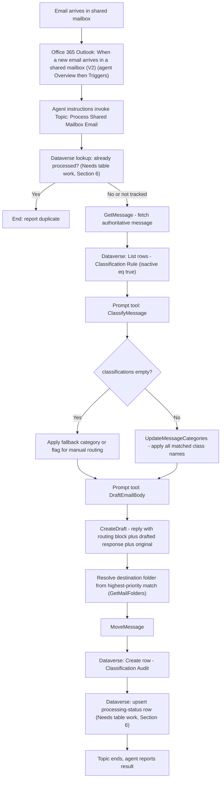

<!--
Copyright (c) 2026 Holger Imbery (contact@holgerimbery.blog)
Licensed under the project LICENSE file.
-->

# Bridge365 Agent Implementation Guide (Standard Orchestration)

## Read this first

This guide walks a human, step by step, through building the Bridge365
Copilot Studio agent using **standard orchestration** - a Topic with
trigger phrases/conditions that calls connector actions and Prompt tools
directly, invoked by the connector's autonomous polling trigger. It is
**not** the generative/autonomous "agent flow" pattern (a separate
`When an agent calls the flow` cloud flow) - that is a different
orchestration style and is out of scope here.

**Two things are treated as fixed, given inputs - do not modify them:**

- `backend-service/` (the Flask app and its Graph API routes)
- `custom-connector/` (the imported connector and its operations)

Everything else - Copilot Studio artifacts (agent, topic, prompt tools,
trigger) and Dataverse tables - is fair game to build, and to extend
beyond what today's wiki docs describe, if the design needs it. Where
this guide needs a table or column that does not exist yet, or a change
to an existing one, it says so explicitly under a **"Needs table work"**
label instead of quietly assuming it, and tells you how to add it using
the project's schema-file + deploy-script pattern. It does not restrict
itself to only what `docs/wiki/` already documents.

**This guide is not infallible.** Copilot Studio's UI and behavior
change, and this document can drift from the live product. Before each
major step, there is a **"Verify first"** box - do those checks before
proceeding, and if something does not match, reconcile the difference
before continuing rather than guessing. If you find this guide is wrong
about something, fix this file in the same change as your implementation
work.

This guide assumes Phase 1 (mailbox connector) and Phase 2
(classification tables + Prompt tools) are already deployed. If they are
not, complete those first - see the Quick Start in the repository root
`README.md`.

---

## 0. Fixed inputs - verify, do not modify

**Verify first:** these two are your ground truth for operation names,
parameters, and behavior. Read them before wiring anything, and re-check
them if a later step behaves unexpectedly - they are more likely to be
right than this guide's summary of them.

| Source | What to check |
|---|---|
| `custom-connector/openapi.template.yaml` | Exact operation IDs and parameter names (`GetMessage`, `ClassifyMessage`, `CreateDraft`, `UpdateDraft`, `SendMessage`, `SendDraftMessage`, `GetMailFolders`, `UpdateMessageCategories`, `MoveMessage`, `GetMessagesDelta`, `GetAttachments`, `GetAttachment`, `GetExtendedProperty`, `SetExtendedProperty`, `NewMessageReceived`, `GetMessages`) |
| `custom-connector/README.md`, Step 5 | Background only - documents Bridge365's own optional `NewMessageReceived` polling trigger. This guide instead uses the **standard Office 365 Outlook connector's** shared-mailbox trigger (Section 4.3), so this row is not required reading, but the "call actions directly" pattern it describes for trigger instructions still applies. |
| `backend-service/app.py` | What each connector operation actually does server-side and its **real response shape** - none of the connector's responses declare an OpenAPI schema (Section 4.4), so this file is the only reliable source for field names |
| `dataverse/schemas/*.schema.json` | Current Dataverse tables and their real column names |

Do not modify `backend-service/` or `custom-connector/` to make this
guide easier to implement. If a capability genuinely does not exist
there (e.g. a new Graph operation), that is a scope decision for the
project maintainer, not something to silently patch in while following
this guide - flag it and stop.

---

## 1. What exists vs. what this guide builds

| Capability | Status |
|---|---|
| Connector actions (get/create draft/move/categorize/folders/attachments/extended properties) | Given (Section 0) |
| Autonomous kickoff trigger | Use the standard **Office 365 Outlook** connector's shared-mailbox trigger (Section 4.3) - not Bridge365's own trigger. Everything after kickoff still calls Bridge365 operations (Section 0). |
| Classification Rule table (`classificationrule`) | Exists today, reused as-is |
| Classification Audit table (`classificationaudit`) | Exists today, reused as-is (see Section 6 for a suggested extension) |
| `ClassifyMessage` Prompt tool, `DraftEmailBody` Prompt tool | Documented in `docs/wiki/phase-2-classification-table.md`; build them in Copilot Studio if not already built |
| A single Topic chaining classify to categorize to draft to route to persist, with idempotency and human review | **This guide adds it** |
| A Dataverse table (or `classificationaudit` extension) to track per-message processing status for idempotency/retry | **Needs table work - see Section 6** |

---

## 2. Design principles

- Dataverse rules (`classificationrule`) are the single source of truth -
  do not hardcode rules in the Topic.
- One email can trigger multiple classifications. Apply **all** matching
  categories, but route to a folder using only the highest-priority
  match (Section 5).
- A human always reviews the generated draft before sending. Never call
  `SendMessage`/`SendDraftMessage` from this flow.
- Processing should be idempotent: reprocessing the same source message
  must not create a second draft or move it twice.
- Failures must be visible, not silently swallowed.

---

## 3. Architecture



---

## 4. Step-by-step: build the agent and Topic

### 4.1 Create the agent

**Verify first:** check whether a Bridge365 agent already exists in your
Copilot Studio environment before creating a duplicate.

1. Go to https://copilotstudio.microsoft.com, select the environment
   that holds your Dataverse tables and imported connector.
2. Create a new agent (or open the existing one), e.g.
   `Bridge365 Shared Mailbox Agent`.
3. Set agent instructions that describe the mailbox role and forbid
   auto-send, e.g.:

   ```text
   You help process email received in a shared mailbox. When a new message
   arrives, run the "Process Shared Mailbox Email" topic. Never send or
   auto-reply to a message yourself - always leave the generated reply as a
   draft for a human to review and send.
   ```

### 4.2 Add the connector and Dataverse tools to the agent

**Verify first:** the navigation below matches Microsoft's current
"Use Power Platform connectors as tools in Copilot Studio agents" guide
(agents built on the standard harness) - re-check that page before
following these steps, since Copilot Studio's own labels/menus change
between releases and the previous "Settings > Connectors/Actions"
description in this guide did not match any current screen and has been
corrected here. Do not import or reconfigure the connector itself; that
is given (Section 0) - you are only adding it as a callable tool.

**Naming note:** this guide calls the imported connector "**Bridge365**"
throughout for readability. **Verify first:** `custom-connector/README.md`
currently instructs you to name it `SharedMailboxConnector` when you
create it, and the connector's own OpenAPI `info.title` is `bridge365`
(`custom-connector/openapi.template.yaml`). If you deployed it following
that README as-is, the connector you'll actually see in the picker below
is named `SharedMailboxConnector`, not "Bridge365" - either rename it in
the Power Apps custom connector portal to match this guide, or mentally
substitute `SharedMailboxConnector` wherever this guide says "Bridge365
connector."

1. Select **Agents** and open the Bridge365 agent.
2. Go to the agent's **Tools** page and select **Add a tool**.
3. Select **Connector**, then search for the imported Bridge365 connector
   and select the specific operations you need (`GetMessage`,
   `ClassifyMessage`, `UpdateMessageCategories`, `CreateDraft`,
   `GetMailFolders`, `MoveMessage`, etc. - see Section 0). If a
   connection does not already exist, select **Create new connection**,
   then **Add and configure** for each tool.
4. Add the Dataverse tables as tools using the **classic Dataverse
   connector actions**, not the Dataverse MCP Server - repeat step 2-3
   with **Add a tool** > **Connector** > search **Microsoft Dataverse**,
   and add the specific, per-table actions you need (**List rows**,
   **Add a new row**, **Update a row**) against `classificationrule` /
   `classificationaudit` (and any table from Section 6) as separate
   tools.

   **Why not the Dataverse MCP Server:** Copilot Studio also offers a
   **Dataverse MCP Server** tool (Model Context Protocol, preview - see
   ["Connect to Dataverse with model context protocol in Microsoft
   Copilot Studio"](https://learn.microsoft.com/power-apps/maker/data-platform/data-platform-mcp-copilot-studio)).
   It exposes generic, schema-agnostic tools (`read_query`, `search`,
   `create_record`, `update_record`, `list_tables`, `describe_table`,
   etc.) meant for an agent to reason over Dataverse conversationally at
   runtime - well suited to open-ended, generative exploration, not to
   this Topic's need for exact, typed, table-specific actions (e.g.
   filter `classificationrule` on `isactive eq true` and a fixed column
   list) wired deterministically into a fixed node sequence. The classic
   per-table connector actions are the better fit for standard
   orchestration; reconsider the MCP Server only if you later add a
   conversational Topic that lets a human ask free-form questions over
   Dataverse data.
5. These become available to call as nodes from any Topic. You can also
   add a connector/Dataverse tool directly while editing a Topic, via
   **Add node (+)** > **Add a tool** > **Connector**, instead of adding
   it at the agent level first - both end up callable the same way.

### 4.3 Configure the autonomous trigger

**Use the standard connector, not Bridge365's own trigger.** This guide
uses the prebuilt **Office 365 Outlook** connector's event trigger for
kickoff, not Bridge365's own `NewMessageReceived` polling operation
(documented as an alternative in `custom-connector/README.md`, Step 5).
The standard connector trigger is available in every environment without
importing anything and does not depend on the Bridge365 connector being
shared into the agent's solution. This does not change anything about
the fixed `backend-service/` / `custom-connector/` given inputs
(Section 0): the Outlook trigger only *starts* the Topic; every
subsequent step still calls Bridge365's own operations (`GetMessage`,
`ClassifyMessage`, `UpdateMessageCategories`, `CreateDraft`,
`MoveMessage`, ...) exactly as documented elsewhere in this guide.

**Verify first:** event triggers of any kind (Bridge365's or Outlook's)
require **Generative Orchestration** turned on for the agent - see
["Add an event trigger"](https://learn.microsoft.com/microsoft-copilot-studio/authoring-trigger-event)
and the
[event trigger overview](https://learn.microsoft.com/microsoft-copilot-studio/authoring-triggers-about).
Confirm this is enabled before continuing; if it is not available in
your environment, event-based kickoff is not possible at all regardless
of which connector you pick; a manual/trigger-phrase Topic (Section 4.4)
is the fallback.

1. On the agent's **Overview** page, go to **Triggers** and select
   **Add trigger**.
2. Search for **Office 365 Outlook** and select **When a new email
   arrives in a shared mailbox (V2)**.
3. Provide authentication for the shared mailbox if prompted. Event
   triggers authenticate using the agent maker's (author's) credentials
   only - confirm that account has access to the shared mailbox.
4. Configure: the shared mailbox address, **Folder** = `Inbox` (or your
   monitored folder), and any available filters to exclude mail the
   process itself generates (e.g. exclude `Drafts`/`Sent Items`/your
   processed-folder tree if the trigger's options expose folder
   exclusion; otherwise enforce this inside the Topic instead).
5. **Verify first - where to actually see the output fields:** the
   Copilot Studio trigger picker does not show them directly. Go to
   **Overview > Triggers**, select the **(...)** menu on this trigger,
   choose **Edit in Power Automate**, open the trigger node, and expand
   **Parameters** - the fields are nested one level down, inside a
   single `message` object (not flat top-level fields), commonly
   `message/id`, `message/from`, `message/subject`, `message/body`,
   `message/receivedDateTime`, `message/conversationId`. Treat this as a
   starting point, not a guarantee, since Microsoft can add or rename
   fields between connector versions - always re-check it live rather
   than trusting this list. Use `message/id` as `MessageId` and your
   configured address as `MailboxAddress` when invoking `GetMessage` in
   Section 4.4, step 2 - still fetch the authoritative message through
   Bridge365's `GetMessage` rather than trusting this trigger's own
   `message/body`/`message/subject` as the source of truth, per this
   guide's design principles (Section 2).
6. This trigger polls on a recurrence - it is not an instant push
   notification. Confirm the polling interval meets your latency
   expectations.
7. Define the trigger payload and the "When this trigger fires"
   instructions (Step 6 of
   ["Add an event trigger"](https://learn.microsoft.com/microsoft-copilot-studio/authoring-trigger-event)).
   Reference the Topic built below by name, e.g.:

   ```text
   A new email arrived in the shared mailbox. Run the "Process Shared Mailbox
   Email" topic with this message's id and mailbox address. Do not answer the
   sender directly.
   ```

**Verify first - there is no guaranteed trigger-to-topic parameter
mapping.** Per Microsoft's own docs on
["Manage topic inputs and outputs"](https://learn.microsoft.com/microsoft-copilot-studio/advanced-managing-topic-inputs-outputs)
and the
[event trigger overview](https://learn.microsoft.com/microsoft-copilot-studio/authoring-triggers-about),
whether the trigger reliably invokes a specific Topic with its declared
inputs filled correctly depends on the agent's generative orchestrator
interpreting the "When this trigger fires" instructions and the trigger
payload - it is inference-based, not a deterministic pass-through, for
any connector's event trigger, not just Bridge365's. Test this explicitly
(Section 8) before relying on it; if the orchestrator does not reliably
invoke the Topic with the right values, write the "When this trigger
fires" instructions to call the connector actions and Prompt tools
directly instead, following the same order as Section 4.4's node list.
### 4.4 Create the Topic: "Process Shared Mailbox Email"

Create a new Topic. Give it a small set of trigger phrases for manual
testing, e.g. `process mailbox message`, `classify this email` - a
plain trigger-phrase Topic does not receive the connector trigger's
payload automatically, so manual testing means typing/pasting the
message id and mailbox address yourself when prompted.

**Topic inputs:** declare these under the Topic's **Details** panel,
**Inputs** tab (this is a real, documented feature - see
["Manage topic inputs and outputs"](https://learn.microsoft.com/microsoft-copilot-studio/advanced-managing-topic-inputs-outputs) -
not something to assume works a particular way without checking the live
UI, since the exact panel labels have changed across Copilot Studio
releases):

| Input | Type | Fill behavior |
|---|---|---|
| `MailboxAddress` | Text | From conversation context if generative orchestration fills it reliably (verify), otherwise prompt/fixed value |
| `MessageId` | Text | Same as above |

Once declared, reference them in the topic as `Topic.MailboxAddress` /
`Topic.MessageId`. If automatic fill from the autonomous trigger's
payload proves unreliable in testing, fall back to extracting the values
yourself with a **Parse Value** node against `Activity.Value` (the event
payload variable - see the
[event trigger overview](https://learn.microsoft.com/microsoft-copilot-studio/authoring-triggers-about)),
or drop the separate-Topic design and have the trigger's instructions
call the actions directly per the note in Section 4.3.

**Verify first:** re-check `custom-connector/openapi.template.yaml` for
the exact input parameter names of `GetMessage`,
`UpdateMessageCategories`, `CreateDraft`, `GetMailFolders`, and
`MoveMessage` before wiring the Topic.

**Verify first - every Bridge365 operation returns an untyped response,
confirmed by reading the connector's own spec.** Checked directly in
`custom-connector/openapi.template.yaml`: none of its operations
(`GetMessage`, `ClassifyMessage`, `CreateDraft`, `UpdateDraft`,
`SendMessage`, `SendDraftMessage`, `GetMailFolders`,
`UpdateMessageCategories`, `MoveMessage`, `GetMessagesDelta`,
`GetAttachments`, `GetAttachment`, `GetExtendedProperty`,
`SetExtendedProperty`) declare a response `schema` - only a plain-text
`description` (e.g. `"{ draftId, subject, draftUrl }"` for `CreateDraft`).
Because Copilot Studio can only split a tool's response into named output
fields when the response has a typed schema, every one of these nodes
exposes a single untyped response (typically a JSON string) under
**Completion**, not individual fields like `subject`/`body`/`id` - do not
assume named fields appear; check live before relying on any field name
below.

**How to get named fields out of any Bridge365 connector node** (this is
Microsoft's own documented
["Parse value" workflow](https://learn.microsoft.com/microsoft-copilot-studio/authoring-variables#parse-values),
walked through here for `GetMessage` as a worked example - repeat once
per Bridge365 node whose fields you need):

1. On the canvas, select **Add node (+)** directly under the node whose
   response you want to parse (e.g. `GetMessage`). Point to **Variable
   management**, and select **Parse value**.
2. **Before this works, the source node's output must be exposed - this
   is a real, confirmed step, not a guess.** Go back to the `GetMessage`
   node itself and open its **Completion** section. Expand **Advanced**,
   then find **"Outputs available to the agent and other tools"**. In
   current Copilot Studio, this section lists a single generic output
   named **`Response`** (there is no per-field breakout - this matches
   Section 4.4's "Verify first" note above) alongside an **All** option.
   Confirm `Response` is available/selected here - if it is not, it will
   not appear in the next sub-step at all. Then, in the new **Parse
   value** node, select the box under **the variable to parse** - a
   picker panel opens listing variables from earlier nodes, usually
   grouped by node name. Find and select `GetMessage`'s `Response`
   output there.
3. For **Data type**, select **From Sample Data**.
4. Select **Get Schema from Sample JSON**. An editor opens - paste a
   *real* captured response for that operation (run it once in the test
   pane first and copy the actual JSON output; do not guess the shape
   from the OpenAPI description text, which is documentation, not a
   contract), then select **Confirm**. Copilot Studio infers a Record
   schema from that sample. If you have not captured a real response yet,
   a minimal starting sample for `GetMessage` (matching the raw Graph
   message shape from `backend-service/app.py` - only include fields you
   plan to actually use) is:

   ```json
   {
     "id": "AAMkAGI2AAA=",
     "subject": "Invoice question",
     "bodyPreview": "Hi, I have a question about invoice 12345...",
     "body": {
       "contentType": "html",
       "content": "<html><body>Hi, I have a question about invoice 12345...</body></html>"
     },
     "from": {
       "emailAddress": {
         "name": "Jane Doe",
         "address": "jane.doe@example.com"
       }
     },
     "receivedDateTime": "2026-09-07T09:15:00Z"
   }
   ```

   Replace this with a real captured response as soon as you can - the
   live message may include fields this sample omits.
5. Choose **the variable to hold the parsed value** - usually select
   **Create new** to make a fresh variable (e.g. `ParsedGetMessage`). It
   is now typed as **Record**, and its fields are available via dot
   notation with IntelliSense in later nodes (e.g.
   `ParsedGetMessage.subject`, `ParsedGetMessage.from.emailAddress.address`).
   If you want a flatter, separately-named variable instead of dotted
   paths (e.g. `MessageSubject` instead of `ParsedGetMessage.subject`),
   add a **Set variable value** node afterward and set the new variable
   to the parsed Record's field.

For reference, reading `backend-service/app.py` directly shows these
actual response shapes today, to use as your sample JSON per operation:
   - `GetMessage` returns the **raw Microsoft Graph message object**
     unfiltered - notably `id`, `subject`, `bodyPreview`, `body.content`,
     `body.contentType`, `from.emailAddress.address`,
     `from.emailAddress.name`, `receivedDateTime`.
   - `UpdateMessageCategories` returns `{ messageId, categories: [...] }`.
   - `CreateDraft`/`UpdateDraft` return `{ draftId, subject, draftUrl }`.
   - `GetMailFolders` returns the **raw Graph OData page**, so the folder
     array is nested under `.value` (each item has `id`, `displayName`,
     `parentFolderId`, `childFolderCount`) - not a bare array.
   - `MoveMessage` returns `{ movedMessageId, destinationId }`.
   Re-verify this against the live `app.py` before trusting it, since
   this file can change independently of this guide.

Do not modify `custom-connector/openapi.template.yaml` to add response
schemas as a shortcut around this (Section 0's fixed-inputs rule) - that
is a scope decision for the project maintainer, not something to
silently patch in while following this guide.

Build the Topic nodes in this order:

1. **Idempotency check.** Add a Dataverse "List rows" action against your
   processing-status source (Section 6). In the node's **Inputs**, set
   **Table name** to your table (e.g. Message Processing Status), then
   put your query in **Filter rows** using standard Dataverse OData
   syntax - a single-quoted string built with dynamic content, e.g.:
   ```
   mailboxaddress eq 'MailboxAddress' and sourcemessageid eq 'SourceMessageId'
   ```
   Do not type the variable names as literal text - use the node's
   dynamic-content/variable picker to insert `MailboxAddress` and
   `SourceMessageId` (from step 2's `Parse value`, or from the trigger
   for the mailbox address) so each is substituted with its actual
   value at run time, not treated as the literal word. Column names
   must match your table's real logical names (all-lowercase, no
   spaces) - verify them in **Solutions -> your table -> Columns**
   before typing this filter, per Section 2's "verify first" principle.
   **Verify first:** confirm your List rows node actually exposes a
   **Filter rows** input before relying on it - some Copilot Studio
   versions/tool configurations do not surface it. If it is missing,
   list all rows unfiltered instead and shape/filter the result
   afterward with a **Parse value** node plus a Power Fx `Filter()` or
   `LookUp()` expression - the same pattern used for `GetMailFolders`
   above, and spelled out concretely below step 3.
   If a matching row is returned with `processingstatus` = `Completed`,
   end the Topic and report "already processed".
2. **`GetMessage`** - call with mailbox address and message id. Add a
   **Parse value** node right after it (per the pattern above) and pull
   out `subject`, `body.content`, `from.emailAddress.address`,
   `from.emailAddress.name`, and `id`. Rename the parsed values for
   clarity (e.g. `MessageSubject`, `MessageBody`, `SenderAddress`,
   `SenderName`, `SourceMessageId`). Keep `SourceMessageId` distinct from
   any later "moved message id" - moving a message returns a new id.
3. **Dataverse "List rows"** on `classificationrule`. If your node
   exposes **Filter rows**, set it to `isactive eq true` - unquoted,
   since a Yes/No column is `Edm.Boolean` in the Dataverse Web API, not
   a string; quotes are only needed around Text/Choice-label values
   like `'MailboxAddress'` in step 1 (verify `isactive` is the real
   logical name for that column first); if it
   doesn't, list all rows and filter afterward with Power Fx per the
   shaping guidance below. Either way, in **Select columns** (if
   present) or by using dot-notation later, you only need `classname`,
   `classexamples`, `classtarget`, `classtargetemail`, `priority`,
   `modellabel`. Dataverse list actions are natively typed by the table
   schema, so this one does return proper per-column fields on each
   row - the untyped-response issue described above is specific to the
   Bridge365 connector, not to Dataverse.
4. **Shape the rules as the `ClassificationRules` JSON string** the
   `ClassifyMessage` Prompt tool expects (see
   `docs/wiki/phase-2-classification-table.md`, Section 4.1, for the
   exact target shape - an array of objects with `className`,
   `classExamples`, `classTarget`, `classTargetEmail`). There are two
   cases:
   - **If step 3's Filter rows worked** and returned only active rules,
     add a **Set variable value** (or Compose) node and build the JSON
     string with `JSON()` over the returned rows collection, e.g. a
     Power Fx expression such as
     `JSON(ForAll(ListRowsOutput, {className: classname, classExamples: classexamples, classTarget: classtarget, classTargetEmail: classtargetemail}))`
     - adjust `ListRowsOutput` to whatever the List rows node's own
       output variable is actually named in your Topic (check its
       Completion/output settings, since Dataverse list actions may
       still need their output exposed the same way as other tool
       nodes before you can reference it).
   - **If step 3 returned all rows unfiltered** (no Filter rows
     available), first narrow to active rows, then build the same JSON
     string, e.g.
     `JSON(ForAll(Filter(ListRowsOutput, isactive = true), {className: classname, classExamples: classexamples, classTarget: classtarget, classTargetEmail: classtargetemail}))`
     - `Filter()` runs entirely in Power Fx after the rows arrive, so it
       works regardless of whether the connector itself supports
       server-side filtering. This is the same "list everything, then
       shape/filter in Power Fx" pattern already used for
       `GetMailFolders` above.
   Store the result in a new String variable (e.g.
   `ClassificationRulesJson`) and pass that variable - not the raw
   rows - as the `ClassificationRules` input to the Prompt tool in the
   next step.
5. **Call the `ClassifyMessage` Prompt tool** (build per Section 4.1 of
   that doc if not already built). Prompt tools declare their own typed
   Outputs tab, so `classifications`, `needsHumanRoutingDecision`, and
   `confidence` come back as named fields directly - no Parse value node
   needed here.
6. **Condition: `classifications` is empty.**
   - If empty: apply a fallback category (a fixed string, or a
     Dataverse-configured "Unclassified" rule if you choose to add one)
     and continue - still create a draft and route to a clearly named
     unclassified/review folder.
   - If not empty: continue normally.
7. **Build the categories array** - distinct `className` values from
   `classifications`.
8. **`UpdateMessageCategories`** - call with mailbox address,
   `SourceMessageId`, and the categories array. This operation
   **replaces** categories rather than merging - if the message could
   already carry categories worth keeping, fetch and merge first. Its
   response (`{ messageId, categories }`) is only useful to confirm the
   write; parse it only if you want to double-check the applied
   categories.
9. **Call the `DraftEmailBody` Prompt tool** (Section 4.2 of the same
   doc), passing sender, mailbox address, subject, body, and
   `classifications`.
10. **`CreateDraft`** - call with the resulting HTML body
    (`contentType: "html"`), replying to `SourceMessageId`. Parse the
    response (`{ draftId, subject, draftUrl }`) and keep `draftId` - you
    need it in step 14.
11. **Resolve the destination folder** - sort `classifications` by
    `priority` descending (tie-break: `confidence`/`score` descending)
    and take the winning entry's target as the folder name (Section 5).
12. **`GetMailFolders`** to resolve the destination folder id. Parse the
    response and remember the array is under `.value`, not top-level -
    filter `.value` for the entry whose `displayName` matches your target
    folder name, then take its `id`. Prefer pre-provisioned folders over
    dynamic creation to avoid race conditions and naming drift.
13. **`MoveMessage`** - call with `SourceMessageId` and the resolved
    folder id. Parse the response (`{ movedMessageId, destinationId }`)
    and keep `movedMessageId` separately - you need it in step 15.
14. **Dataverse "Create row"** on `classificationaudit` - write
    `messageid` (`SourceMessageId`), `classificationresult` (full JSON
    from the `ClassifyMessage` Prompt tool's `classifications` output),
    `provider`, `confidence`, `needshumanreview`, and
    `classificationruleid` if a single dominant rule applies. If you
    extend this table per Section 6, also write the new columns here in
    the same call.
15. **Upsert the processing-status record** (Section 6) with status
    `Completed`, `draftId` (step 10), `movedMessageId` (step 13), and the
    destination folder.
16. **End the Topic**, returning a short summary (status, categories
    applied, destination folder, draft id) as the agent's result.

### 4.5 Error handling

Wrap steps 2 through 15 so a failure at any call leaves a clear trail:

- On failure, branch to a short "failure" path that: (a) does not move
  the original message if categorization or draft creation has not
  succeeded, (b) upserts the processing-status record with status
  `Failed` and a short error message, (c) ends the Topic with a clear
  failure summary.
- Never log connector secrets, access tokens, or (where avoidable)
  complete sensitive email bodies into general-purpose diagnostics.

---

## 5. Priority-based folder routing

Categories are applied for every matched classification - that is not in
question. Folder routing is different: a message can only live in one
folder, so pick exactly one classification to route by:

1. Sort matched classifications by `priority` (from `classificationrule`)
   descending.
2. Break ties by `confidence`/`score` descending.
3. Use the winning entry's target department/folder name as the
   destination.

Sort **after** classification and **before** categories are applied, so
both the categories call and folder resolution read the same ordered
list. Confidence should never override priority - priority is the
deliberate, human-configured tie-breaker.

---

## 6. Needs table work: idempotency and audit tracking

Nothing here modifies `backend-service/` or `custom-connector/` - this is
purely a Dataverse schema change, added the same way the existing
Phase 2 tables were added: a schema JSON file plus the existing deploy
script. Pick one of two approaches; do not do both.

**Option A - extend `classificationaudit` (smaller change):**
Add columns to `dataverse/schemas/classification-audit.schema.json`:
`movedmessageid` (Text), `draftid` (Text), `destinationfolder` (Text),
`processingstatus` (Choice or Text: `Processing`/`Completed`/`Failed`),
`errormessage` (Memo), and an alternate key on
`mailboxaddress` (new column) + the existing `messageid`. This keeps
audit and processing-status in one place but conflates "what did the
classifier decide" with "how far did processing get."

**Option B - new table (cleaner separation, recommended):**
Add a new file, e.g.
`dataverse/schemas/message-processing-status.schema.json`, modeled on the
structure of `classification-audit.schema.json`
(`logicalName`/`displayName`/`primaryAttribute`/`attributes`). Suggested
columns: `mailboxaddress` (Text), `sourcemessageid` (Text),
`movedmessageid` (Text), `draftid` (Text), `destinationfolder` (Text),
`processingstatus` (Choice/Text), `processedon` (Date and time),
`errormessage` (Memo). Add an alternate key on `mailboxaddress` +
`sourcemessageid` - this, not subject/sender/received-time, is the only
safe uniqueness key across mailboxes.

Either way:

1. Write or edit the schema file following the existing JSON format in
   `dataverse/schemas/`.
2. Run `.\dataverse\scripts\deploy-dataverse-tables.ps1` - **verify
   first** by reading the current `dataverse/README.md` for the exact
   invocation, since it may have changed. The script is described as
   idempotent (safe to re-run), but confirm that is still true before
   running it against a shared environment.
3. Test the deploy against a non-production Dataverse environment first.
4. If you chose Option A, update step 14 in Section 4.4 to also set the
   new columns; if Option B, add step 15's Dataverse action against the
   new table.

---

## 7. Prompt tools

Build `ClassifyMessage` and `DraftEmailBody` per
`docs/wiki/phase-2-classification-table.md`, Sections 4.1 and 4.2
(instructions text, inputs, output shape) if they do not already exist.
The Topic steps above assume the field names documented there
(`classifications[].className/classTarget/classTargetEmail/score/reason`,
`needsHumanRoutingDecision`, `confidence`). If your implementation needs
different fields, that is a legitimate change - just update this guide
and the wiki doc together so they stay consistent with each other.

**Verify first:** test both Prompt tools in isolation in their Test pane
using the example input/output in that doc before wiring the Topic to
them.

---

## 8. Test case

**Input email**

```text
Subject: Product pricing, documentation, delivery address and invoice 4711

Please send pricing for Product X and current documentation. Please change
our shipment address to Example Street 10, Berlin. I also have a question
about an incorrect amount on invoice 4711.
```

**Expected behavior**

1. `ClassifyMessage` returns multiple classifications (e.g. Sales,
   Information, Shipping, Billing) with distinct priorities.
2. All matched class names are applied as categories via
   `UpdateMessageCategories`.
3. `DraftEmailBody` produces one HTML draft containing the routing block,
   a single reply addressing all requests, and the original message.
4. `MoveMessage` files the original message under the folder for the
   highest-priority match only.
5. A `classificationaudit` row is created recording the full result.
6. Reprocessing the same message id does not create a second draft or
   move it again (verify against whichever Section 6 option you built).

---

## 9. Deployment checklist

- [ ] Phase 1 and Phase 2 are deployed and independently tested.
- [ ] `ClassifyMessage` and `DraftEmailBody` Prompt tools pass their own
      Test-pane checks.
- [ ] The Topic in Section 4.4 is built using verified connector
      operation names/parameters from
      `custom-connector/openapi.template.yaml`.
- [ ] The autonomous trigger is configured per
      `custom-connector/README.md`, Step 5, with Generative Orchestration
      and solution-aware cloud flow sharing confirmed enabled.
- [ ] Destination folders exist (pre-provisioned) or folder creation is
      handled deliberately.
- [ ] The Section 6 table work (Option A or B) is deployed via
      `deploy-dataverse-tables.ps1` and tested with a duplicate delivery.
- [ ] Ran the Section 8 test case and confirmed every expected outcome.
- [ ] Confirmed no `SendMessage`/`SendDraftMessage` call exists anywhere
      in this Topic - a human must send.
- [ ] `backend-service/` and `custom-connector/` were not modified as
      part of this work.
- [ ] DLP policies reviewed for the connectors/Dataverse tables this
      Topic touches.
- [ ] Published the agent, then monitored the first real production runs
      before declaring this done.

---

## 10. If something doesn't match this guide

This guide was written against the state of this repository at the time
it was added. If a connector operation, table column, or Prompt-tool
field name here does not match the actual files, **the actual files
win** - update this guide rather than working around the discrepancy
silently.
