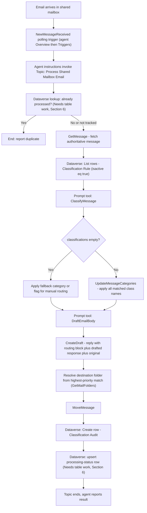

<!--
Copyright (c) 2026 Holger Imbery (contact@holgerimbery.blog)
Licensed under the project LICENSE file.
-->

# Bridge365 Agent Implementation Guide (Standard Orchestration)

## Read this first

This guide walks a human, step by step, through building the Bridge365
Copilot Studio agent using **standard orchestration** - a Topic with
trigger phrases/conditions that calls connector actions and Prompt tools
directly, invoked by the connector's autonomous polling trigger. It is
**not** the generative/autonomous "agent flow" pattern (a separate
`When an agent calls the flow` cloud flow) - that is a different
orchestration style and is out of scope here.

**Two things are treated as fixed, given inputs - do not modify them:**

- `backend-service/` (the Flask app and its Graph API routes)
- `custom-connector/` (the imported connector and its operations)

Everything else - Copilot Studio artifacts (agent, topic, prompt tools,
trigger) and Dataverse tables - is fair game to build, and to extend
beyond what today's wiki docs describe, if the design needs it. Where
this guide needs a table or column that does not exist yet, or a change
to an existing one, it says so explicitly under a **"Needs table work"**
label instead of quietly assuming it, and tells you how to add it using
the project's schema-file + deploy-script pattern. It does not restrict
itself to only what `docs/wiki/` already documents.

**This guide is not infallible.** Copilot Studio's UI and behavior
change, and this document can drift from the live product. Before each
major step, there is a **"Verify first"** box - do those checks before
proceeding, and if something does not match, reconcile the difference
before continuing rather than guessing. If you find this guide is wrong
about something, fix this file in the same change as your implementation
work.

This guide assumes Phase 1 (mailbox connector) and Phase 2
(classification tables + Prompt tools) are already deployed. If they are
not, complete those first - see the Quick Start in the repository root
`README.md`.

---

## 0. Fixed inputs - verify, do not modify

**Verify first:** these two are your ground truth for operation names,
parameters, and behavior. Read them before wiring anything, and re-check
them if a later step behaves unexpectedly - they are more likely to be
right than this guide's summary of them.

| Source | What to check |
|---|---|
| `custom-connector/openapi.template.yaml` | Exact operation IDs and parameter names (`GetMessage`, `ClassifyMessage`, `CreateDraft`, `UpdateDraft`, `SendMessage`, `SendDraftMessage`, `GetMailFolders`, `UpdateMessageCategories`, `MoveMessage`, `GetMessagesDelta`, `GetAttachments`, `GetAttachment`, `GetExtendedProperty`, `SetExtendedProperty`, `NewMessageReceived`, `GetMessages`) |
| `custom-connector/README.md`, Step 5 | How the autonomous agent trigger is actually wired (`NewMessageReceived` polling trigger, its prerequisites, its checkpoint behavior) |
| `backend-service/app.py` | What each connector operation actually does server-side, if a parameter's exact effect is unclear |
| `dataverse/schemas/*.schema.json` | Current Dataverse tables and their real column names |

Do not modify `backend-service/` or `custom-connector/` to make this
guide easier to implement. If a capability genuinely does not exist
there (e.g. a new Graph operation), that is a scope decision for the
project maintainer, not something to silently patch in while following
this guide - flag it and stop.

---

## 1. What exists vs. what this guide builds

| Capability | Status |
|---|---|
| Connector actions (get/create draft/move/categorize/folders/attachments/extended properties) | Given (Section 0) |
| `NewMessageReceived` polling trigger | Given (Section 0) |
| Classification Rule table (`classificationrule`) | Exists today, reused as-is |
| Classification Audit table (`classificationaudit`) | Exists today, reused as-is (see Section 6 for a suggested extension) |
| `ClassifyMessage` Prompt tool, `DraftEmailBody` Prompt tool | Documented in `docs/wiki/phase-2-classification-table.md`; build them in Copilot Studio if not already built |
| A single Topic chaining classify to categorize to draft to route to persist, with idempotency and human review | **This guide adds it** |
| A Dataverse table (or `classificationaudit` extension) to track per-message processing status for idempotency/retry | **Needs table work - see Section 6** |

---

## 2. Design principles

- Dataverse rules (`classificationrule`) are the single source of truth -
  do not hardcode rules in the Topic.
- One email can trigger multiple classifications. Apply **all** matching
  categories, but route to a folder using only the highest-priority
  match (Section 5).
- A human always reviews the generated draft before sending. Never call
  `SendMessage`/`SendDraftMessage` from this flow.
- Processing should be idempotent: reprocessing the same source message
  must not create a second draft or move it twice.
- Failures must be visible, not silently swallowed.

---

## 3. Architecture



---

## 4. Step-by-step: build the agent and Topic

### 4.1 Create the agent

**Verify first:** check whether a Bridge365 agent already exists in your
Copilot Studio environment before creating a duplicate.

1. Go to https://copilotstudio.microsoft.com, select the environment
   that holds your Dataverse tables and imported connector.
2. Create a new agent (or open the existing one), e.g.
   `Bridge365 Shared Mailbox Agent`.
3. Set agent instructions that describe the mailbox role and forbid
   auto-send, e.g.:

   ```text
   You help process email received in a shared mailbox. When a new message
   arrives, run the "Process Shared Mailbox Email" topic. Never send or
   auto-reply to a message yourself - always leave the generated reply as a
   draft for a human to review and send.
   ```

### 4.2 Add the connector and Dataverse tools to the agent

**Verify first:** the navigation below matches Microsoft's current
"Use Power Platform connectors as tools in Copilot Studio agents" guide
(agents built on the standard harness) - re-check that page before
following these steps, since Copilot Studio's own labels/menus change
between releases and the previous "Settings > Connectors/Actions"
description in this guide did not match any current screen and has been
corrected here. Do not import or reconfigure the connector itself; that
is given (Section 0) - you are only adding it as a callable tool.

**Naming note:** this guide calls the imported connector "**Bridge365**"
throughout for readability. **Verify first:** `custom-connector/README.md`
currently instructs you to name it `SharedMailboxConnector` when you
create it, and the connector's own OpenAPI `info.title` is `bridge365`
(`custom-connector/openapi.template.yaml`). If you deployed it following
that README as-is, the connector you'll actually see in the picker below
is named `SharedMailboxConnector`, not "Bridge365" - either rename it in
the Power Apps custom connector portal to match this guide, or mentally
substitute `SharedMailboxConnector` wherever this guide says "Bridge365
connector."

1. Select **Agents** and open the Bridge365 agent.
2. Go to the agent's **Tools** page and select **Add a tool**.
3. Select **Connector**, then search for the imported Bridge365 connector
   and select the specific operations you need (`GetMessage`,
   `ClassifyMessage`, `UpdateMessageCategories`, `CreateDraft`,
   `GetMailFolders`, `MoveMessage`, etc. - see Section 0). If a
   connection does not already exist, select **Create new connection**,
   then **Add and configure** for each tool.
4. Add the Dataverse tables as tools using the **classic Dataverse
   connector actions**, not the Dataverse MCP Server - repeat step 2-3
   with **Add a tool** > **Connector** > search **Microsoft Dataverse**,
   and add the specific, per-table actions you need (**List rows**,
   **Add a new row**, **Update a row**) against `classificationrule` /
   `classificationaudit` (and any table from Section 6) as separate
   tools.

   **Why not the Dataverse MCP Server:** Copilot Studio also offers a
   **Dataverse MCP Server** tool (Model Context Protocol, preview - see
   ["Connect to Dataverse with model context protocol in Microsoft
   Copilot Studio"](https://learn.microsoft.com/power-apps/maker/data-platform/data-platform-mcp-copilot-studio)).
   It exposes generic, schema-agnostic tools (`read_query`, `search`,
   `create_record`, `update_record`, `list_tables`, `describe_table`,
   etc.) meant for an agent to reason over Dataverse conversationally at
   runtime - well suited to open-ended, generative exploration, not to
   this Topic's need for exact, typed, table-specific actions (e.g.
   filter `classificationrule` on `isactive eq true` and a fixed column
   list) wired deterministically into a fixed node sequence. The classic
   per-table connector actions are the better fit for standard
   orchestration; reconsider the MCP Server only if you later add a
   conversational Topic that lets a human ask free-form questions over
   Dataverse data.
5. These become available to call as nodes from any Topic. You can also
   add a connector/Dataverse tool directly while editing a Topic, via
   **Add node (+)** > **Add a tool** > **Connector**, instead of adding
   it at the agent level first - both end up callable the same way.

### 4.3 Configure the autonomous trigger

**Option A - the Bridge365 connector's own trigger (preferred if visible).**
Follow `custom-connector/README.md`, Step 5, exactly for how it is wired -
its trigger is the polling operation `NewMessageReceived`, not a native
mail-arrival trigger. That section requires **Generative Orchestration**
enabled on the agent and **solution-aware cloud flow sharing** enabled on
the environment; confirm both before continuing.

**If `NewMessageReceived` does not show up under Overview > Triggers >
Add trigger**, common causes are: Generative Orchestration or
solution-aware cloud flow sharing not actually enabled yet, the Bridge365
connector not added to/shared through the same solution as the agent, a
DLP policy blocking event triggers for custom connectors in this
environment, or a licensing/tenant restriction on custom-connector event
triggers. Check those before assuming the trigger is unavailable.

**Option B - the standard Office 365 Outlook shared-mailbox trigger (use
this if Option A genuinely is not available).** The prebuilt **Office 365
Outlook** connector exposes **When a new email arrives in a shared
mailbox (V2)**, a standard/premium connector trigger that every
environment has without importing anything - it is far more likely to be
selectable in the trigger picker than a custom connector's own trigger.
This does not change anything about the fixed `backend-service/` /
`custom-connector/` given inputs (Section 0): you use this trigger only
to *start* the Topic; every subsequent step still calls Bridge365's own
operations (`GetMessage`, `ClassifyMessage`, `UpdateMessageCategories`,
`CreateDraft`, `MoveMessage`, ...) exactly as documented elsewhere in
this guide.

1. Under Overview > Triggers > **Add trigger**, search **Office 365
   Outlook** instead of the Bridge365 connector, and select **When a new
   email arrives in a shared mailbox (V2)**.
2. Configure: the shared mailbox address, **Folder** = `Inbox` (or your
   monitored folder), and any available filters to exclude mail the
   process itself generates (e.g. exclude `Drafts`/`Sent Items`/your
   processed-folder tree if the trigger's options expose folder
   exclusion; otherwise enforce this inside the Topic instead).
3. **Verify first:** confirm the exact output field names in the live
   trigger picker before wiring the Topic - commonly `Id`, `From`,
   `Subject`, `Body`, `ReceivedDateTime`, `ConversationId`, but treat
   this as a starting point, not a guarantee, since Microsoft can add or
   rename fields between connector versions. Use the trigger's `Id` as
   `MessageId` and your configured address as `MailboxAddress` when
   invoking `GetMessage` in Section 4.4, step 2 - still fetch the
   authoritative message through Bridge365's `GetMessage` rather than
   trusting this trigger's own `Body`/`Subject` as the source of truth,
   per this guide's design principles (Section 2).
4. This trigger polls on a recurrence, like `NewMessageReceived` - it is
   not an instant push notification. Confirm the polling interval meets
   your latency expectations.

**Verify first - there is no guaranteed trigger-to-topic parameter
mapping, for either option above.** As documented in
`custom-connector/README.md`, Step 5, the Bridge365 trigger's own worked
example has the "When this trigger fires" instructions tell the
generative orchestrator to call actions
directly (`ClassifyMessage`, `CreateDraft`, `SendDraftMessage`) - it does
not name a Topic at all. If you want the trigger to run a specific Topic
instead (Section 4.4), that depends on the orchestrator choosing to call
that Topic as a tool and correctly filling its declared inputs from
conversation context - this is inference-based, not a deterministic
pass-through, per Microsoft's own docs on
["Manage topic inputs and outputs"](https://learn.microsoft.com/microsoft-copilot-studio/advanced-managing-topic-inputs-outputs)
and the
[event trigger overview](https://learn.microsoft.com/microsoft-copilot-studio/event-trigger-overview).
Test this explicitly (Section 8) before relying on it; if the orchestrator
does not reliably invoke the Topic with the right values, write the "When
this trigger fires" instructions to call the connector actions and Prompt
tools directly instead, following the same order as Section 4.4's node
list.

In the trigger's "When this trigger fires" instructions, reference the
Topic built below by name, e.g.:

```text
A new email arrived in the shared mailbox. Run the "Process Shared Mailbox
Email" topic with this message's id and mailbox address. Do not answer the
sender directly.
```

### 4.4 Create the Topic: "Process Shared Mailbox Email"

Create a new Topic. Give it a small set of trigger phrases for manual
testing, e.g. `process mailbox message`, `classify this email` - a
plain trigger-phrase Topic does not receive the connector trigger's
payload automatically, so manual testing means typing/pasting the
message id and mailbox address yourself when prompted.

**Topic inputs:** declare these under the Topic's **Details** panel,
**Inputs** tab (this is a real, documented feature - see
["Manage topic inputs and outputs"](https://learn.microsoft.com/microsoft-copilot-studio/advanced-managing-topic-inputs-outputs) -
not something to assume works a particular way without checking the live
UI, since the exact panel labels have changed across Copilot Studio
releases):

| Input | Type | Fill behavior |
|---|---|---|
| `MailboxAddress` | Text | From conversation context if generative orchestration fills it reliably (verify), otherwise prompt/fixed value |
| `MessageId` | Text | Same as above |

Once declared, reference them in the topic as `Topic.MailboxAddress` /
`Topic.MessageId`. If automatic fill from the autonomous trigger's
payload proves unreliable in testing, fall back to extracting the values
yourself with a **Parse Value** node against `Activity.Value` (the event
payload variable - see the
[event trigger overview](https://learn.microsoft.com/microsoft-copilot-studio/event-trigger-overview)),
or drop the separate-Topic design and have the trigger's instructions
call the actions directly per the note in Section 4.3.

**Verify first:** re-check `custom-connector/openapi.template.yaml` for
the exact input parameter names of `GetMessage`,
`UpdateMessageCategories`, `CreateDraft`, `GetMailFolders`, and
`MoveMessage` before wiring the Topic.

Build the Topic nodes in this order:

1. **Idempotency check.** Add a Dataverse "List rows" action against your
   processing-status source (Section 6), filtered by `mailboxaddress` +
   `sourcemessageid`. If a row/flag shows status `Completed`, end the
   Topic and report "already processed".
2. **`GetMessage`** - call with mailbox address and message id. Store the
   returned subject, body, sender name/address, and the message `id` in
   Topic variables. Keep this `id` distinct from any later "moved
   message id" - moving a message returns a new id.
3. **Dataverse "List rows"** on `classificationrule`, filter
   `isactive eq true`, select `classname`, `classexamples`, `classtarget`,
   `classtargetemail`, `priority`, `modellabel`.
4. **Shape the rules as JSON** with a Compose/Set-variable action,
   matching the `ClassificationRules` input shape in
   `docs/wiki/phase-2-classification-table.md`, Section 4.1.
5. **Call the `ClassifyMessage` Prompt tool** (build per Section 4.1 of
   that doc if not already built). Store `classifications`,
   `needsHumanRoutingDecision`, `confidence`.
6. **Condition: `classifications` is empty.**
   - If empty: apply a fallback category (a fixed string, or a
     Dataverse-configured "Unclassified" rule if you choose to add one)
     and continue - still create a draft and route to a clearly named
     unclassified/review folder.
   - If not empty: continue normally.
7. **Build the categories array** - distinct `className` values from
   `classifications`.
8. **`UpdateMessageCategories`** - call with mailbox address, the
   `GetMessage` result's `id`, and the categories array. This operation
   **replaces** categories rather than merging - if the message could
   already carry categories worth keeping, fetch and merge first.
9. **Call the `DraftEmailBody` Prompt tool** (Section 4.2 of the same
   doc), passing sender, mailbox address, subject, body, and
   `classifications`.
10. **`CreateDraft`** - call with the resulting HTML body
    (`contentType: "html"`), replying to the original message id.
11. **Resolve the destination folder** - sort `classifications` by
    `priority` descending (tie-break: `confidence`/`score` descending)
    and take the winning entry's target as the folder name (Section 5).
12. **`GetMailFolders`** to resolve the destination folder id. Prefer
    pre-provisioned folders over dynamic creation to avoid race
    conditions and naming drift.
13. **`MoveMessage`** - call with the original message id and resolved
    folder id. Store the returned moved-message id separately.
14. **Dataverse "Create row"** on `classificationaudit` - write
    `messageid` (the original `GetMessage` id), `classificationresult`
    (full JSON from `ClassifyMessage`), `provider`, `confidence`,
    `needshumanreview`, and `classificationruleid` if a single dominant
    rule applies. If you extend this table per Section 6, also write the
    new columns here in the same call.
15. **Upsert the processing-status record** (Section 6) with status
    `Completed`, draft id, moved-message id, destination folder.
16. **End the Topic**, returning a short summary (status, categories
    applied, destination folder, draft id) as the agent's result.

### 4.5 Error handling

Wrap steps 2 through 15 so a failure at any call leaves a clear trail:

- On failure, branch to a short "failure" path that: (a) does not move
  the original message if categorization or draft creation has not
  succeeded, (b) upserts the processing-status record with status
  `Failed` and a short error message, (c) ends the Topic with a clear
  failure summary.
- Never log connector secrets, access tokens, or (where avoidable)
  complete sensitive email bodies into general-purpose diagnostics.

---

## 5. Priority-based folder routing

Categories are applied for every matched classification - that is not in
question. Folder routing is different: a message can only live in one
folder, so pick exactly one classification to route by:

1. Sort matched classifications by `priority` (from `classificationrule`)
   descending.
2. Break ties by `confidence`/`score` descending.
3. Use the winning entry's target department/folder name as the
   destination.

Sort **after** classification and **before** categories are applied, so
both the categories call and folder resolution read the same ordered
list. Confidence should never override priority - priority is the
deliberate, human-configured tie-breaker.

---

## 6. Needs table work: idempotency and audit tracking

Nothing here modifies `backend-service/` or `custom-connector/` - this is
purely a Dataverse schema change, added the same way the existing
Phase 2 tables were added: a schema JSON file plus the existing deploy
script. Pick one of two approaches; do not do both.

**Option A - extend `classificationaudit` (smaller change):**
Add columns to `dataverse/schemas/classification-audit.schema.json`:
`movedmessageid` (Text), `draftid` (Text), `destinationfolder` (Text),
`processingstatus` (Choice or Text: `Processing`/`Completed`/`Failed`),
`errormessage` (Memo), and an alternate key on
`mailboxaddress` (new column) + the existing `messageid`. This keeps
audit and processing-status in one place but conflates "what did the
classifier decide" with "how far did processing get."

**Option B - new table (cleaner separation, recommended):**
Add a new file, e.g.
`dataverse/schemas/message-processing-status.schema.json`, modeled on the
structure of `classification-audit.schema.json`
(`logicalName`/`displayName`/`primaryAttribute`/`attributes`). Suggested
columns: `mailboxaddress` (Text), `sourcemessageid` (Text),
`movedmessageid` (Text), `draftid` (Text), `destinationfolder` (Text),
`processingstatus` (Choice/Text), `processedon` (Date and time),
`errormessage` (Memo). Add an alternate key on `mailboxaddress` +
`sourcemessageid` - this, not subject/sender/received-time, is the only
safe uniqueness key across mailboxes.

Either way:

1. Write or edit the schema file following the existing JSON format in
   `dataverse/schemas/`.
2. Run `.\dataverse\scripts\deploy-dataverse-tables.ps1` - **verify
   first** by reading the current `dataverse/README.md` for the exact
   invocation, since it may have changed. The script is described as
   idempotent (safe to re-run), but confirm that is still true before
   running it against a shared environment.
3. Test the deploy against a non-production Dataverse environment first.
4. If you chose Option A, update step 14 in Section 4.4 to also set the
   new columns; if Option B, add step 15's Dataverse action against the
   new table.

---

## 7. Prompt tools

Build `ClassifyMessage` and `DraftEmailBody` per
`docs/wiki/phase-2-classification-table.md`, Sections 4.1 and 4.2
(instructions text, inputs, output shape) if they do not already exist.
The Topic steps above assume the field names documented there
(`classifications[].className/classTarget/classTargetEmail/score/reason`,
`needsHumanRoutingDecision`, `confidence`). If your implementation needs
different fields, that is a legitimate change - just update this guide
and the wiki doc together so they stay consistent with each other.

**Verify first:** test both Prompt tools in isolation in their Test pane
using the example input/output in that doc before wiring the Topic to
them.

---

## 8. Test case

**Input email**

```text
Subject: Product pricing, documentation, delivery address and invoice 4711

Please send pricing for Product X and current documentation. Please change
our shipment address to Example Street 10, Berlin. I also have a question
about an incorrect amount on invoice 4711.
```

**Expected behavior**

1. `ClassifyMessage` returns multiple classifications (e.g. Sales,
   Information, Shipping, Billing) with distinct priorities.
2. All matched class names are applied as categories via
   `UpdateMessageCategories`.
3. `DraftEmailBody` produces one HTML draft containing the routing block,
   a single reply addressing all requests, and the original message.
4. `MoveMessage` files the original message under the folder for the
   highest-priority match only.
5. A `classificationaudit` row is created recording the full result.
6. Reprocessing the same message id does not create a second draft or
   move it again (verify against whichever Section 6 option you built).

---

## 9. Deployment checklist

- [ ] Phase 1 and Phase 2 are deployed and independently tested.
- [ ] `ClassifyMessage` and `DraftEmailBody` Prompt tools pass their own
      Test-pane checks.
- [ ] The Topic in Section 4.4 is built using verified connector
      operation names/parameters from
      `custom-connector/openapi.template.yaml`.
- [ ] The autonomous trigger is configured per
      `custom-connector/README.md`, Step 5, with Generative Orchestration
      and solution-aware cloud flow sharing confirmed enabled.
- [ ] Destination folders exist (pre-provisioned) or folder creation is
      handled deliberately.
- [ ] The Section 6 table work (Option A or B) is deployed via
      `deploy-dataverse-tables.ps1` and tested with a duplicate delivery.
- [ ] Ran the Section 8 test case and confirmed every expected outcome.
- [ ] Confirmed no `SendMessage`/`SendDraftMessage` call exists anywhere
      in this Topic - a human must send.
- [ ] `backend-service/` and `custom-connector/` were not modified as
      part of this work.
- [ ] DLP policies reviewed for the connectors/Dataverse tables this
      Topic touches.
- [ ] Published the agent, then monitored the first real production runs
      before declaring this done.

---

## 10. If something doesn't match this guide

This guide was written against the state of this repository at the time
it was added. If a connector operation, table column, or Prompt-tool
field name here does not match the actual files, **the actual files
win** - update this guide rather than working around the discrepancy
silently.
