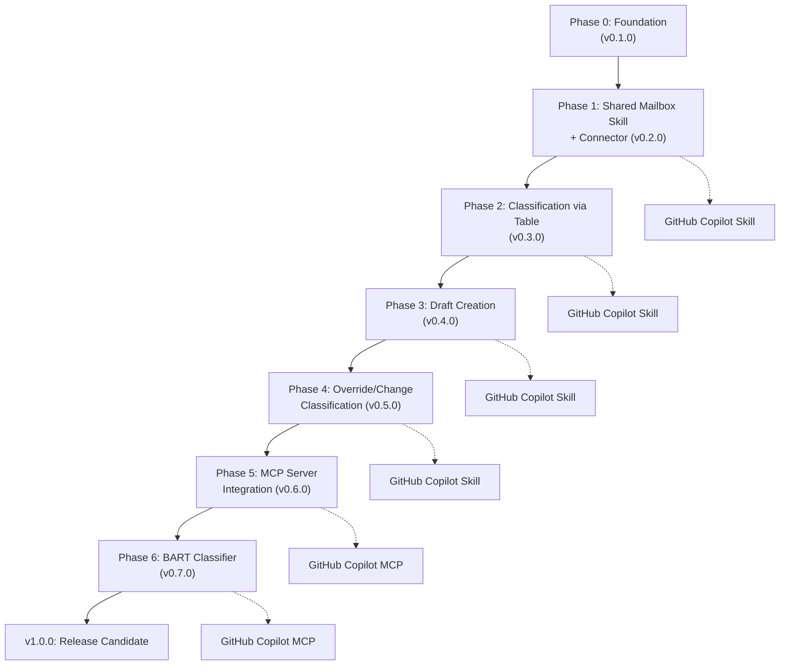

# Email Classification Module — Implementation Plan

**Version:** 0.1.1  
**Last Updated:** 2026-09-02  
**Status:** In Development

---

## Overview

This document outlines the phased implementation of the shared mailbox email classification and drafting module for Microsoft Power Platform environments. Implementation prioritizes **Copilot Studio standard harness** with **GitHub Copilot harness integration in parallel** for all phases.

Source guidance: See `docs/shared-mailbox-classification-master-guide.md`.

---

## Major Implementation Steps (Feature-Level)



**Legend:** Solid lines = Copilot Studio standard harness (primary). Dotted lines = GitHub Copilot harness (parallel implementation).

---

## Detailed Phases

### Phase 0: Foundation (v0.1.0)

**Objective:** Project structure, dependencies, configuration, and base service scaffolding.

**Deliverables:**
- Project layout (src/, tests/, docs/, docs/wiki/)
- Python environment (dependencies in `requirements.txt`)
- Configuration schema (`.env` template and Pydantic models)
- Base service class with dependency injection
- Unit test framework
- This implementation plan, changelog, and wiki module structure

**Success Criteria:**
- Project runs and all tests pass
- Configuration is externalized and validated
- Wiki structure is ready for phase documentation

**Major PR:** "Foundation: project structure, configuration, and wiki scaffolding"

---

### Phase 1: Shared Mailbox Skill + Custom Connector (v0.2.0)

**Objective:** Build the core shared mailbox service, Copilot Studio skill, and custom connector.

**Harnesses:** Copilot Studio standard (primary) + GitHub Copilot executable skill (parallel)

**Deliverables:**

**Shared Mailbox Service (core):**
- Microsoft Graph mailbox client
- Message fetching and iteration
- Webhook/subscription handling
- Configuration for shared mailbox address and permissions

**Copilot Studio Standard Harness (primary):**
- Skill scaffolding and registration
- Skill actions for message retrieval and draft management
- Custom connector OpenAPI spec (endpoints for mailbox operations)
- Authentication (workload identity / Entra)
- Connector operations stubs (to be filled in later phases)

**GitHub Copilot Harness (parallel):**
- Executable skill CLI commands for mailbox access
- `SKILL.md` documentation with usage examples
- Authentication integration

**Wiki & Documentation:**
- `docs/wiki/phase-1-mailbox-setup.md` — human-readable Copilot Studio setup guide
- `docs/wiki/scripts/setup-shared-mailbox-skill.ps1` — PowerShell provisioning script
- `docs/wiki/scripts/setup-custom-connector.ps1` — Custom connector setup script
- Mermaid diagrams for message fetching flow

**Success Criteria:**
- Skill can authenticate and fetch messages from shared mailbox
- Connector operations are registered in OpenAPI spec
- Both harnesses can retrieve a test message
- Wiki includes step-by-step Copilot Studio setup
- PowerShell scripts automate connector registration

**Major PR:** "Feature: Shared mailbox skill and custom connector (Phase 1)"

---

### Phase 2: Classification via Table (v0.3.0)

**Objective:** Integrate classification table, implement rule-based classifier, and route messages.

**Harnesses:** Copilot Studio standard (primary) + GitHub Copilot skill (parallel)

**Deliverables:**

**Classification Table & Provider:**
- Dataverse classification table schema (uuid, className, classExamples, classTarget, classTargetEmail, isActive, priority, modelLabel)
- Rule-based classifier (deterministic keyword matching)
- Classification output schema (messageId, classifications[], needsHumanRoutingDecision, provider, modelVersion)
- Validation against table rows

**Copilot Studio Standard Harness:**
- Skill action: `classify_message` returns all plausible classifications
- Connector operation: `ClassifyMessage`
- Store classification results in Dataverse audit table

**GitHub Copilot Harness:**
- CLI command: `classify-message --message-id '<id>'`
- Output matches Copilot Studio schema

**Wiki & Documentation:**
- `docs/wiki/phase-2-classification-table.md` — table setup and rule configuration
- `docs/wiki/scripts/setup-classification-table.ps1` — Dataverse table provisioning
- `docs/wiki/scripts/create-sample-classifications.ps1` — Sample classification data
- Mermaid diagram: classification flow

**Success Criteria:**
- Classification table created in Dataverse with sample data
- Rule-based classifier returns all matching classes
- Multi-class results are handled correctly
- Both harnesses return identical classification output
- PowerShell scripts automate table setup

**Major PR:** "Feature: Classification via table and rule-based classifier (Phase 2)"

---

### Phase 3: Draft Creation (v0.4.0)

**Objective:** Generate reply drafts with routing block and optional knowledge integration.

**Harnesses:** Copilot Studio standard (primary) + GitHub Copilot skill (parallel)

**Deliverables:**

**Draft Generation:**
- Routing block generator (HTML format, sender + classifications + departments)
- Routing block detector and removal functions
- Draft creation via Microsoft Graph `createReply`
- Knowledge retrieval (optional) from approved sources
- Customer-facing answer composition
- Complete draft body: routing block + answer + original email below

**Copilot Studio Standard Harness:**
- Skill action: `create_response_draft` takes messageId, classifications, optional knowledge passages
- Skill action: `remove_routing_block` for cleanup after review
- Connector operations: `CreateResponseDraft`, `RemoveRoutingBlock`
- Prepare-send guard that rejects drafts with routing block present

**GitHub Copilot Harness:**
- CLI commands: `create-response-draft`, `remove-routing-block`
- Same output and validation

**Wiki & Documentation:**
- `docs/wiki/phase-3-draft-creation.md` — draft generation workflow and approval flow
- `docs/wiki/scripts/test-draft-creation.ps1` — Test script to verify draft generation
- Mermaid diagram: end-to-end draft workflow (original email → classification → draft → review)

**Success Criteria:**
- Drafts include routing block with all classifications and departments
- Routing block is marked with `data-internal-routing-block="true"`
- Original email is sanitized and included below the proposed answer
- Prepare-send rejects drafts while block is present
- Both harnesses create identical drafts

**Major PR:** "Feature: Draft creation with routing block and knowledge grounding (Phase 3)"

---

### Phase 4: Override/Change Classification (v0.5.0)

**Objective:** Allow reviewers to accept, reject, or override automated classifications before sending.

**Harnesses:** Copilot Studio standard (primary) + GitHub Copilot skill (parallel)

**Deliverables:**

**Override Workflow:**
- Dataverse classification audit records (proposed and final classifications)
- Override table that captures reviewer decisions and comments
- Rebuild routing block after override
- Invalidate prior prepare-send approval on override

**Copilot Studio Standard Harness:**
- Skill action: `get_classification_record` (fetch processing record and all proposed classifications)
- Skill action: `set_classification_override` (accept/reject/change classifications)
- Skill action: `rebuild_routing_block` (regenerate block from final classifications)
- Model-driven app form (optional) for classification review UI

**GitHub Copilot Harness:**
- CLI commands: `get-classification-record`, `set-classification-override`, `rebuild-routing-block`

**Wiki & Documentation:**
- `docs/wiki/phase-4-override-workflow.md` — override and approval workflow
- `docs/wiki/scripts/test-override-workflow.ps1` — Test override and rebuild
- Mermaid state diagram: classification workflow (proposed → review → override? → final → send)

**Success Criteria:**
- Reviewers can view all proposed classifications and change them
- Override comment is mandatory
- Routing block is regenerated with final classifications
- Prepare-send approval is invalidated after override
- Audit trail captures all changes

**Major PR:** "Feature: Classification override and workflow control (Phase 4)"

---

### Phase 5: MCP Server Integration (v0.6.0)

**Objective:** Add MCP server layer for standardized tool invocation across harnesses.

**Harnesses:** Copilot Studio standard + GitHub Copilot (both via MCP)

**Deliverables:**

**MCP Server:**
- Implement MCP tools for all mailbox operations:
  - `fetch_incoming_message`
  - `classify_incoming_email`
  - `retrieve_answer_knowledge`
  - `create_grounded_response_draft`
  - `get_classification_processing_record`
  - `set_classification_override`
  - `rebuild_draft_routing_block`
  - `remove_internal_routing_block`
- Tool schemas with input validation
- Error handling and retry logic

**Copilot Studio Standard Harness:**
- MCP integration (connect skill to MCP server)
- Agents can invoke MCP tools directly

**GitHub Copilot Harness:**
- MCP client configuration
- CLI commands invoke MCP tools

**Wiki & Documentation:**
- `docs/wiki/phase-5-mcp-integration.md` — MCP server architecture and tool schemas
- `docs/wiki/scripts/start-mcp-server.ps1` — Start MCP server for local testing
- Mermaid diagram: tool call flow (harness → MCP server → backend service)

**Success Criteria:**
- MCP server starts and exposes all tools
- Both harnesses can invoke tools via MCP
- Tool schemas are complete and validated
- Error responses are informative

**Major PR:** "Feature: MCP server and standardized tool layer (Phase 5)"

---

### Phase 6: BART Classifier (v0.7.0)

**Objective:** Add machine learning classifier option (Foundry BART or Azure ML).

**Harnesses:** Copilot Studio standard + GitHub Copilot (via MCP)

**Deliverables:**

**BART Classifier:**
- Foundry BART endpoint deployment (or Azure ML managed online endpoint)
- Classification provider factory (switch between rules and BART)
- Configuration: `CLASSIFICATION_PROVIDER=foundry-bart`, `BART_ENDPOINT`, `BART_AUDIENCE`
- Multi-label score processing and threshold calibration
- Fallback to rules if BART endpoint fails

**Copilot Studio / GitHub Copilot:**
- MCP tool `classify_incoming_email` auto-selects provider based on config
- No harness-level changes needed; provider is transparent

**Wiki & Documentation:**
- `docs/wiki/phase-6-bart-classifier.md` — BART model training, deployment, and evaluation
- `docs/wiki/scripts/deploy-bart-endpoint.ps1` — Foundry/Azure ML deployment script
- `docs/wiki/scripts/evaluate-bart.ps1` — Evaluation and metrics collection
- Python training script reference (transformers + multi-label setup)

**Success Criteria:**
- BART endpoint is deployed and responsive
- Classification provider factory selects BART correctly
- Multi-label thresholds are calibrated
- Fallback to rules works on endpoint failure
- Evaluation metrics are documented

**Major PR:** "Feature: BART machine learning classifier and Foundry deployment (Phase 6)"

---

### Phase 7: Release Candidate (v1.0.0)

**Objective:** Stabilize, test, and prepare for production release.

**Deliverables:**
- All phases complete and tested
- End-to-end acceptance tests
- Complete wiki documentation
- Security review and hardening
- Operations runbook and monitoring setup
- Performance benchmarks

**Success Criteria:**
- All acceptance criteria from all phases are met
- No known critical or high-severity issues
- Ready for production deployment

**Major PR:** "Release: v1.0.0 production candidate"

---

## Version Increment Strategy

| Version Range | Trigger | Change Type |
|---|---|---|
| `0.1.0` → `0.2.0` | New feature or element adds functionality | Minor |
| `0.2.1` | Bug fix, security patch, documentation | Patch |
| `0.1.0` → `1.0.0` | Feature complete, production-ready | Major |

**Rules:**
- **Major:** Product at release-candidate quality.
- **Minor:** New feature, element, or capability (phases in this plan).
- **Patch:** Bug fixes, documentation, non-breaking refactors.

---

## Commit and PR Message Convention

Every commit tied to a major phase should follow this structure:

```
<Type>: <Short summary>

What's New:
- Describe new features or capabilities added.

What's Fixed:
- Describe bugs or issues resolved.

What's Modified:
- Describe changes to existing behavior.

Breaking Changes:
- None. (or describe incompatibilities)

Co-authored-by: Copilot App <223556219+Copilot@users.noreply.github.com>
```

---

## Wiki Module Structure

All human-readable documentation is stored under `docs/wiki/` as a self-contained module:

- `docs/wiki/index.md` — overview and navigation
- `docs/wiki/phase-<N>-<topic>.md` — per-phase setup guides
- `docs/wiki/scripts/` — PowerShell helper scripts
- `docs/wiki/diagrams/` — Mermaid diagram sources

Each phase wiki includes:
- Step-by-step Copilot Studio/Azure setup instructions
- PowerShell scripts with full copyright and license headers
- Mermaid diagrams illustrating workflows

---

## Copyright & License

All code and documentation in this repository includes copyright headers:

```
(c) 2026 Holger Imbery (contact@holgerimbery.blog)
Licensed under [LICENSE FILE]
```

---

## Next Steps

1. Implement Phase 0 (already v0.1.0).
2. Implement Phase 1 (Shared Mailbox Skill + Connector) → tag `v0.2.0`.
3. Implement Phase 2 (Classification via Table) → tag `v0.3.0`.
4. Continue sequentially through Phase 6 → tag `v1.0.0`.

---

## References

- Source: `docs/shared-mailbox-classification-master-guide.md`
- Changelog: `CHANGELOG.md`
- Commit conventions: `COMMIT_CONVENTION.md`
- Wiki: `docs/wiki/`
