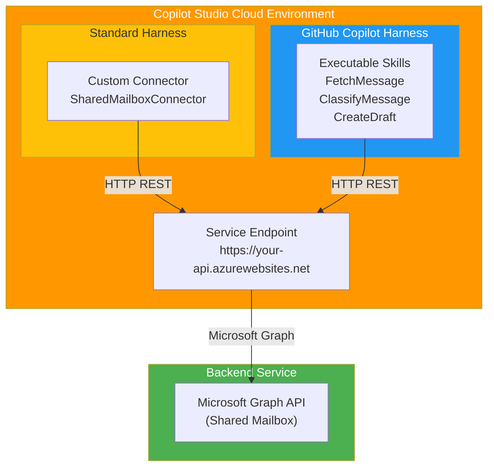

# Phase 1: Shared Mailbox Skill & Custom Connector Setup

**Objective:** Build the core shared mailbox service with custom connector (standard harness) and executable skills (GitHub Copilot harness).

**Harnesses:** 
- **Standard Harness:** Custom Connector only (calls backend service)
- **GitHub Copilot Harness:** Executable Skills in Copilot Studio (also calls backend service)

---

## 1. Prerequisites

- Copilot Studio environment (Power Platform tenant)
- Power Platform admin access
- Shared mailbox address and permissions
- Application registration in Microsoft Entra (for mailbox access via Graph API)
- PowerShell 7+ with Azure/Exchange modules (for setup only)

---

## 2. Architecture (Copilot Studio Cloud Execution)

### Two Parallel Harnesses in Copilot Studio

Both harnesses execute within Copilot Studio cloud environment, calling the same backend:

- **Standard Harness:** Custom connector (no skills needed) → Backend service
- **GitHub Copilot Harness:** Executable skills in Copilot Studio → Same backend service
- **Backend Service:** Azure-hosted, handles mailbox access via Microsoft Graph API

No local execution. Everything is cloud-based in Copilot Studio.

### Architecture Diagram



**Key Architecture Points:**

1. **Standard Harness = Custom Connector only** – Direct HTTP bridge to backend service
2. **GitHub Copilot Harness = Executable Skills** – Reusable skill components in Copilot Studio
3. **Both call the same backend** – Consistent behavior, single source of truth
4. **Backend handles all business logic** – Mailbox access, classification, draft creation

---

## 3. Application Registration (Required - for Graph API Access)

You **MUST** create an app registration because your backend service needs authenticated access to the shared mailbox.

### Why It's Needed

Your backend service must authenticate to Microsoft Graph to:
- Read emails from the shared mailbox
- Send draft emails on behalf of the shared mailbox
- Access mailbox metadata

Only authenticated applications can access shared mailboxes via Graph API.

### How to Create It

#### Step 1: Register the Application in Entra ID

1. Navigate to **[Azure Portal](https://portal.azure.com)** → **Microsoft Entra ID** → **App registrations**
2. Click **New registration**
3. Fill in:
   - **Name:** `SharedMailboxClassifier`
   - **Supported account types:** `Accounts in this organizational directory only`
   - **Redirect URI:** Leave blank
4. Click **Register**

#### Step 2: Add API Permissions

1. Go to **API permissions**
2. Click **Add a permission** → **Microsoft Graph**
3. Select **Application permissions** (for daemon/service scenario)
4. Add these permissions:
   - `Mail.Read` – Read messages
   - `Mail.Read.Shared` – Read shared mailboxes
   - `Mail.Send` – Send emails
   - `Mail.Send.Shared` – Send as shared mailbox
5. Click **Add permissions**
6. Click **Grant admin consent for [Tenant]**

#### Step 3: Create Client Credentials

1. Go to **Certificates & secrets**
2. Click **New client secret**
3. Expiration: **12 months** (or your policy)
4. Copy and **store securely:**
   - **Client ID** (Application ID)
   - **Tenant ID** (Directory ID)
   - **Client Secret** (Value - never share this)

Use a secure vault for secrets (Azure Key Vault, GitHub Secrets, etc.)

#### Step 4: Grant Mailbox Permissions

Give the app registration access to send emails from the shared mailbox:

```powershell
# (c) 2026 Holger Imbery (contact@holgerimbery.blog)
# Licensed under the project LICENSE file.

param(
    [Parameter(Mandatory)] [string]$ClientId,
    [Parameter(Mandatory)] [string]$MailboxAddress
)

# Connect to Exchange Online
Connect-ExchangeOnline

# Grant Send As permission
Add-MailboxPermission -Identity $MailboxAddress `
    -User $ClientId `
    -AccessRights SendAs `
    -InheritanceType All `
    -Confirm:$false

Write-Host "✓ SendAs permission granted for $ClientId on $MailboxAddress" -ForegroundColor Green
```

Run it:

```powershell
.\docs\wiki\scripts\grant-mailbox-permissions.ps1 `
    -ClientId "your-client-id-here" `
    -MailboxAddress "shared-mailbox@company.com"
```

---

## 4. Custom Connector Setup (Standard Harness)

### 4.1 Create the Connector in Power Platform

1. Open **Power Platform** → **Data** → **Connectors** → **New Connector** → **From OpenAPI**
2. Name: `SharedMailboxConnector`
3. Host: `your-api-host.azurewebsites.net` (your backend service URL)

### 4.2 API Endpoints

The connector defines the interface between Copilot Studio and your backend:

**GET /api/mailbox/messages**
- Query messages from shared mailbox
- Parameters: mailboxAddress, top (default 10)
- Returns: Array of Message objects

**GET /api/mailbox/messages/{messageId}**
- Fetch single message
- Returns: Message object with id, subject, from, body, receivedDateTime

**POST /api/mailbox/classify**
- Classify a message
- Body: { messageId: string }
- Returns: Array of classifications with className, confidence, targetEmail

**POST /api/mailbox/drafts**
- Create reply draft
- Body: { messageId, subject, body, classifications }
- Returns: { draftId, url }

### 4.3 Configure Authentication

1. **Authentication type:** Azure AD (Entra)
2. **Tenant ID:** Your Azure tenant ID
3. **Client ID:** Your app registration Client ID
4. **Client secret:** Stored securely in Azure Key Vault

Use the PowerShell script:

```powershell
.\docs\wiki\scripts\setup-custom-connector.ps1 `
    -EnvironmentId "your-env-id" `
    -ConnectorName "SharedMailboxConnector" `
    -ApiHost "your-api-host.azurewebsites.net"
```

---

## 5. GitHub Copilot Harness (Parallel - Executable Skills)

### 5.1 Create Executable Skills in Copilot Studio

Add executable skills that provide the same operations as the custom connector:

**Skill 1: FetchMessage**
```
Input: 
  - mailboxAddress (text)
  - messageId (text)

Output:
  - message (object: {id, subject, from, body, receivedDateTime})
```

**Skill 2: ClassifyMessage**
```
Input:
  - mailboxAddress (text)
  - messageId (text)

Output:
  - classifications (array: [{className, confidence, targetEmail}])
```

**Skill 3: CreateDraft**
```
Input:
  - mailboxAddress (text)
  - messageId (text)
  - subject (text)
  - body (text)
  - classifications (array)

Output:
  - draftId (text)
  - draftUrl (text)
```

### 5.2 Implementation in Copilot Studio

Each executable skill calls the backend service via HTTP:

```json
{
  "name": "FetchMessage",
  "type": "executable",
  "trigger": "invocation",
  "inputs": {
    "mailboxAddress": "string",
    "messageId": "string"
  },
  "actions": [
    {
      "type": "http",
      "method": "GET",
      "url": "https://your-api-host.azurewebsites.net/api/mailbox/messages/{messageId}",
      "headers": {
        "Authorization": "Bearer <token>",
        "Content-Type": "application/json"
      }
    }
  ],
  "outputs": {
    "message": "<http-response-body>"
  }
}
```

### 5.3 SKILL.md Documentation

Create `SKILL.md` with usage examples:

```markdown
# Shared Mailbox Classifier Skills

## Available Skills

### FetchMessage
Retrieve a single message from the shared mailbox.

**Usage:**
```
FetchMessage(
  mailboxAddress: "shared@company.com",
  messageId: "AAMkADhhZGFmND..."
)
```

**Returns:**
```json
{
  "id": "AAMkADhhZGFmND...",
  "subject": "Invoice for August",
  "from": "sender@external.com",
  "body": "Please review attached invoice...",
  "receivedDateTime": "2026-09-02T10:30:00Z"
}
```

### ClassifyMessage
Classify a message based on Dataverse rules.

**Usage:**
```
ClassifyMessage(
  mailboxAddress: "shared@company.com",
  messageId: "AAMkADhhZGFmND..."
)
```

**Returns:**
```json
[
  {
    "className": "Invoice Question",
    "confidence": 0.92,
    "targetEmail": "finance@company.com"
  }
]
```

### CreateDraft
Create a reply draft with classification and routing.

**Usage:**
```
CreateDraft(
  mailboxAddress: "shared@company.com",
  messageId: "AAMkADhhZGFmND...",
  subject: "Re: Invoice for August",
  body: "Thank you for your inquiry. Your invoice has been routed to Finance.",
  classifications: [{"className": "Invoice Question"}]
)
```

**Returns:**
```json
{
  "draftId": "AAMkADhhZGFmND...",
  "draftUrl": "https://outlook.office.com/mail/..."
}
```
```

---

## 6. Backend Service Requirements

Your backend service (hosted on Azure App Service, Functions, or Container Apps) must:

1. **Authenticate to Microsoft Graph** using the app registration credentials
2. **Expose REST endpoints:**
   - GET /api/mailbox/messages – List messages
   - GET /api/mailbox/messages/{id} – Get single message
   - POST /api/mailbox/classify – Classify message
   - POST /api/mailbox/drafts – Create draft
3. **Handle Dataverse calls** (Phase 2) for classification lookups
4. **Log audit trails** to Dataverse

Example backend structure:

```python
# (c) 2026 Holger Imbery (contact@holgerimbery.blog)
# Licensed under the project LICENSE file.
# backend/app.py - Shared Mailbox Service

from flask import Flask, request, jsonify
from azure.identity import ClientSecretCredential
from msgraph.core import GraphClient
import os

app = Flask(__name__)

# Initialize Graph client
credential = ClientSecretCredential(
    client_id=os.getenv("AZURE_CLIENT_ID"),
    client_secret=os.getenv("AZURE_CLIENT_SECRET"),
    tenant_id=os.getenv("AZURE_TENANT_ID")
)
graph_client = GraphClient(credential=credential)

@app.route("/api/mailbox/messages", methods=["GET"])
def get_messages():
    """Fetch messages from shared mailbox"""
    mailbox = request.args.get("mailboxAddress")
    top = request.args.get("top", 10, type=int)
    
    # Call Microsoft Graph API
    response = graph_client.get(
        f"/users/{mailbox}/messages?$top={top}"
    )
    return jsonify(response.json())

@app.route("/api/mailbox/classify", methods=["POST"])
def classify_message():
    """Classify message based on rules"""
    data = request.json
    message_id = data.get("messageId")
    
    # Query Dataverse for classification rules (Phase 2)
    # Apply rule-based classifier
    
    return jsonify({
        "classifications": [
            {"className": "Invoice Question", "confidence": 0.92, "targetEmail": "finance@company.com"}
        ]
    })

if __name__ == "__main__":
    app.run(host="0.0.0.0", port=5000)
```

---

## 7. Testing the Setup

### Test Custom Connector (Standard Harness)

1. Open **Power Platform** → **Data** → **Connectors** → **SharedMailboxConnector**
2. Click **Test**
3. Invoke GetMessages with your shared mailbox address
4. Verify HTTP 200 and message array in response

### Test Executable Skills (GitHub Copilot Harness)

1. Open your Copilot Studio agent
2. Add the **FetchMessage** executable skill to a topic
3. Invoke with test mailbox address and message ID
4. Verify output matches custom connector response

### Integration Test

Create a simple Copilot Studio topic that:
1. Calls FetchMessage to get a message
2. Calls ClassifyMessage to classify it
3. Calls CreateDraft to generate a response
4. Verify the complete flow works

---

## 8. Troubleshooting

| Issue | Resolution |
|---|---|
| **401 Unauthorized from backend** | Verify app registration credentials are set in backend environment variables |
| **403 Forbidden** | Check mailbox permissions; run grant-mailbox-permissions.ps1 script |
| **Connector authentication fails** | Reconfigure Entra credentials in custom connector settings |
| **Skill action times out** | Check backend service is running and responding; verify network connectivity |
| **Graph API permission denied** | Verify API permissions are added and admin consent granted in Entra ID |

---

## 9. Next Steps

- Proceed to Phase 2: Classification via Dataverse table
- Implement backend service endpoints
- Create sample classification data

---

## References

- [Microsoft Graph Mail API](https://learn.microsoft.com/graph/api/resources/message)
- [Copilot Studio Skills](https://learn.microsoft.com/power-virtual-agents/advanced-generative-actions)
- [Power Platform Custom Connectors](https://learn.microsoft.com/connectors/custom-connectors/)
- [Azure App Service](https://learn.microsoft.com/azure/app-service/)
- [OAuth 2.0 Client Credentials Flow](https://learn.microsoft.com/entra/identity-platform/v2-oauth2-client-creds-grant-flow)

---

**Copyright & License**

(c) 2026 Holger Imbery (contact@holgerimbery.blog)

Licensed under the project LICENSE file.
