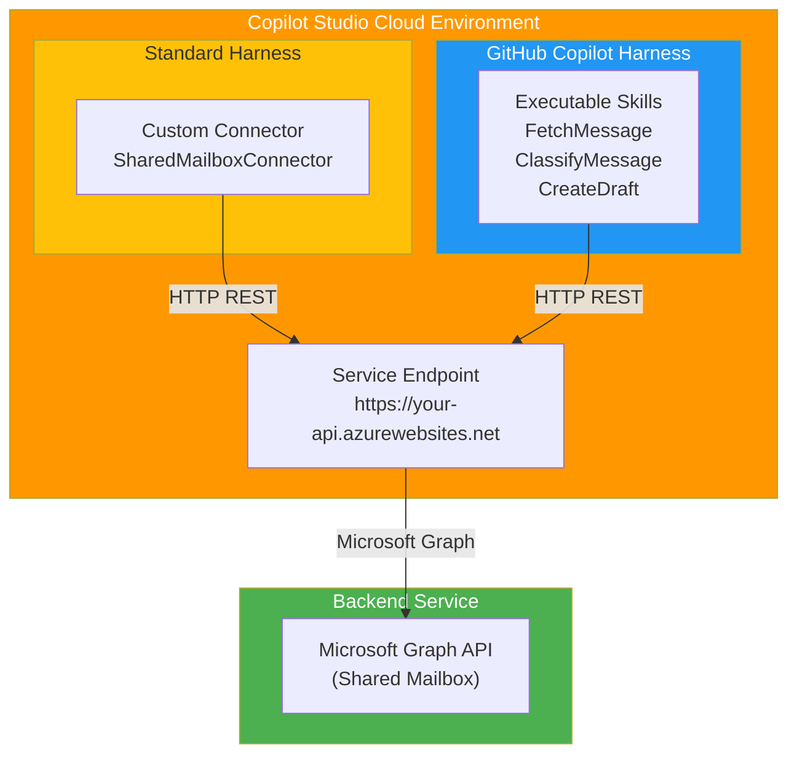

# Phase 1: Shared Mailbox Skill & Custom Connector Setup

**Objective:** Build the core shared mailbox service with custom connector (standard harness) and executable skills (GitHub Copilot harness).

**Harnesses:** 
- **Standard Harness:** Custom Connector only (calls backend service)
- **GitHub Copilot Harness:** Executable Skills in Copilot Studio (also calls backend service)

---

## 1. Prerequisites

- Copilot Studio environment (Power Platform tenant)
- Power Platform admin access
- Shared mailbox address and permissions
- Application registration in Microsoft Entra (for mailbox access via Graph API)
- Azure subscription with App Service or Container Apps available
- PowerShell 7+ with Azure CLI modules
- Python 3.10+ or .NET 8+ for local development

---

## 2. Architecture (Copilot Studio Cloud Execution)

### Two Parallel Harnesses in Copilot Studio

Both harnesses execute within Copilot Studio cloud environment, calling the same backend:

- **Standard Harness:** Custom connector (no skills needed) → Backend service
- **GitHub Copilot Harness:** Executable skills in Copilot Studio → Same backend service
- **Backend Service:** Azure-hosted, handles mailbox access via Microsoft Graph API

No local execution. Everything is cloud-based in Copilot Studio.

### Architecture Diagram



---

## 3. Application Registration (Required - for Graph API Access)

You **MUST** create an app registration because your backend service needs authenticated access to the shared mailbox.

### Step 3.1: Register the Application in Entra ID

1. Navigate to **[Azure Portal](https://portal.azure.com)**
2. Search for **Microsoft Entra ID** (or click left sidebar → **Microsoft Entra ID**)
3. Click **App registrations** (left sidebar)
4. Click **New registration** (top-left button)
5. Fill in:
   - **Name:** `SharedMailboxClassifier`
   - **Supported account types:** `Accounts in this organizational directory only`
   - **Redirect URI:** Leave blank
6. Click **Register**

### Step 3.2: Add API Permissions

1. In the app registration, click **API permissions** (left sidebar)
2. Click **Add a permission** (top-left)
3. Search for and select **Microsoft Graph**
4. Choose **Application permissions** (not Delegated)
5. Search and add these permissions:
   - `Mail.Read` - Read messages (application permission)
   - `Mail.Send` - Send emails (application permission)
6. Click **Add permissions**
7. Click **Grant admin consent for [Your Tenant]** (and confirm)

> **Important:** `Mail.Read.Shared` and `Mail.Send.Shared` will **not** appear in this picker.
> Those scopes only apply to delegated permissions (a signed-in user acting on a shared mailbox they have delegate access to). Since this backend uses application (client credentials) permissions, shared mailbox access is granted differently by giving the app’s service principal `FullAccess` and `SendAs` rights directly on the mailbox in Exchange Online (see Step 3.5 below).

### Step 3.3: Create Client Credentials

1. Click **Certificates & secrets** (left sidebar)
2. Click **New client secret** (top-left button)
3. Set expiration to **12 months** (or your policy)
4. Click **Add**
5. **Copy the Value immediately** (you can't see it again!)
6. Note your:
   - **Client ID** (from Overview tab: Application (client) ID)
   - **Tenant ID** (from Overview tab: Directory (tenant) ID)
   - **Client Secret** (from Certificates & secrets: Value)

Store these securely in Azure Key Vault or a password manager.

### Step 3.4: Test App Registration

```powershell
# (c) 2026 Holger Imbery (contact@holgerimbery.blog)
# Licensed under the project LICENSE file.
# Test app registration credentials

param(
    [Parameter(Mandatory)] [string]$ClientId,
    [Parameter(Mandatory)] [string]$ClientSecret,
    [Parameter(Mandatory)] [string]$TenantId
)

$TokenUrl = "https://login.microsoftonline.com/$TenantId/oauth2/v2.0/token"

$Body = @{
    grant_type = "client_credentials"
    client_id = $ClientId
    client_secret = $ClientSecret
    scope = "https://graph.microsoft.com/.default"
}

try {
    $Response = Invoke-RestMethod -Uri $TokenUrl -Method Post -Body $Body
    Write-Host "✓ Token acquired successfully" -ForegroundColor Green
    Write-Host "  Token expires in: $($Response.expires_in) seconds" -ForegroundColor Gray
    Write-Host "  Access Token: $($Response.access_token.Substring(0, 50))..." -ForegroundColor Gray
} catch {
    Write-Host "✗ Token acquisition failed" -ForegroundColor Red
    Write-Host "  Error: $($_.Exception.Message)" -ForegroundColor Red
}
```

Run it:

```powershell
.\docs\wiki\scripts\test-app-registration.ps1 `
    -ClientId "your-client-id" `
    -ClientSecret "your-client-secret" `
    -TenantId "your-tenant-id"
```

**Expected output:**
```
✓ Token acquired successfully
  Token expires in: 3599 seconds
  Access Token: eyJ0eXAiOiJKV1QiLCJhbGciOi...
```

If you get **401 Unauthorized**, check that:
- Client ID, secret, and tenant ID are correct
- Secret hasn't expired
- App registration is in the correct tenant

### Step 3.5: Restrict Shared Mailbox Access with an Application Access Policy

Important correction: with **application permissions** (`Mail.Read`, `Mail.Send` + admin consent), Microsoft Graph already grants the app access to **every mailbox in the tenant** - no `FullAccess`/`SendAs` mailbox permission is needed, and `Add-MailboxPermission` / `Get-ServicePrincipal` are the wrong tools here (that's why `Get-ServicePrincipal` failed with "couldn't be found" - the app was never registered as an Exchange service principal, and does not need to be).

The correct - and recommended - step is to **restrict** the app so it can only access the shared mailbox, instead of every mailbox in the org. This is done with `New-ApplicationAccessPolicy`, scoped to a mail-enabled security group.

```powershell
# (c) 2026 Holger Imbery (contact@holgerimbery.blog)
# Licensed under the project LICENSE file.
# Restricts an app-only Graph application (Mail.Read/Mail.Send) to only
# access the specified shared mailbox, instead of every mailbox in the tenant.

param(
    [Parameter(Mandatory)] [string]$AppId,
    [Parameter(Mandatory)] [string]$MailboxAddress,
    [Parameter(Mandatory)] [string]$SecurityGroupName
)

Connect-ExchangeOnline

# 1. Create a mail-enabled security group scoped to this app (if it doesn't exist yet)
$Group = Get-DistributionGroup -Identity $SecurityGroupName -ErrorAction SilentlyContinue
if (-not $Group) {
    New-DistributionGroup -Name $SecurityGroupName -Type Security | Out-Null
    Write-Host "Created mail-enabled security group: $SecurityGroupName" -ForegroundColor Cyan
}

# 2. Add the shared mailbox as a member of the group
Add-DistributionGroupMember -Identity $SecurityGroupName -Member $MailboxAddress -ErrorAction SilentlyContinue

# 3. Restrict the app so it can only access mailboxes in this group
New-ApplicationAccessPolicy -AccessRight RestrictAccess `
    -AppId $AppId `
    -PolicyScopeGroupId $SecurityGroupName `
    -Description "Restrict $AppId to shared mailbox $MailboxAddress"

Write-Host "Application access policy created: $AppId restricted to $SecurityGroupName" -ForegroundColor Green
```

Save it as `docs/wiki/scripts/grant-mailbox-permissions.ps1`.

Run it:

```powershell
.\docs\wiki\scripts\grant-mailbox-permissions.ps1 `
    -AppId "your-app-client-id" `
    -MailboxAddress "shared-mailbox@company.com" `
    -SecurityGroupName "AppAccess-SharedMailbox"
```

**Expected output:**
```
Created mail-enabled security group: AppAccess-SharedMailbox
Application access policy created: your-app-client-id restricted to AppAccess-SharedMailbox
```

**Verify the policy took effect:**

```powershell
if (-not (Get-ConnectionInformation)) { Connect-ExchangeOnline }

Test-ApplicationAccessPolicy -Identity "shared-mailbox@company.com" -AppId "your-app-client-id"
```

**Expected output (example):**
```
AppId               : your-app-client-id
Mailbox             : shared-mailbox@company.com
AccessCheckedResult : Granted
```

If `AccessCheckedResult` shows `Denied`, wait 30-60 minutes for policy propagation (Application Access Policies can take up to an hour to apply tenant-wide), then re-run the test.

**Note on FullAccess/SendAs:** Those mailbox permissions apply to **delegated** (user sign-in) access via EWS/Outlook, not to app-only Graph API calls. Do not use `Add-MailboxPermission`/`Add-RecipientPermission` for this scenario - they are unnecessary and were removed from this guide because they caused the `Get-ServicePrincipal` error reported during validation.


---

## 4. Backend Service Deployment (How to Get the URL)

This is the central component that both harnesses call. You must deploy it to Azure.

### Step 4.1: Create Azure App Service

```powershell
# (c) 2026 Holger Imbery (contact@holgerimbery.blog)
# Licensed under the project LICENSE file.

param(
    [Parameter(Mandatory)] [string]$ResourceGroup,
    [Parameter(Mandatory)] [string]$AppServiceName,
    [string]$Location = "eastus"
)

Write-Host "Creating Azure App Service..." -ForegroundColor Yellow

# Create resource group
az group create --name $ResourceGroup --location $Location
Write-Host "✓ Resource group created: $ResourceGroup" -ForegroundColor Green

# Create App Service plan
az appservice plan create `
    --resource-group $ResourceGroup `
    --name "$AppServiceName-plan" `
    --sku B1 `
    --is-linux

Write-Host "✓ App Service plan created" -ForegroundColor Green

# Create web app
az webapp create `
    --resource-group $ResourceGroup `
    --plan "$AppServiceName-plan" `
    --name $AppServiceName `
    --runtime "PYTHON:3.11"

$Url = "https://$AppServiceName.azurewebsites.net"
Write-Host "✓ App Service created: $Url" -ForegroundColor Green
```

Run it:

```powershell
.\docs\wiki\scripts\create-app-service.ps1 `
    -ResourceGroup "shared-mailbox-rg" `
    -AppServiceName "shared-mailbox-classifier"
```

**Expected output:**
```
Creating Azure App Service...
✓ Resource group created: shared-mailbox-rg
✓ App Service plan created
✓ App Service created: https://shared-mailbox-classifier.azurewebsites.net
```

### Step 4.2: Test App Service is Running

```powershell
$BackendUrl = "https://shared-mailbox-classifier.azurewebsites.net"

# Test connectivity
$Response = Invoke-WebRequest -Uri "$BackendUrl/health" -SkipHttpErrorCheck

Write-Host "Status Code: $($Response.StatusCode)" -ForegroundColor Green
Write-Host "Response: $($Response.Content)" -ForegroundColor Gray
```

**Expected output (initially):**
```
Status Code: 404
Response: <!DOCTYPE html><html><body><h1>404 - Web app not found</h1>
```

This is normal — the app is running but no code is deployed yet. We'll deploy code in the next step.

### Step 4.3: Configure Environment Variables

```powershell
# (c) 2026 Holger Imbery (contact@holgerimbery.blog)
# Licensed under the project LICENSE file.

param(
    [Parameter(Mandatory)] [string]$ResourceGroup,
    [Parameter(Mandatory)] [string]$AppServiceName,
    [Parameter(Mandatory)] [string]$ClientId,
    [Parameter(Mandatory)] [string]$ClientSecret,
    [Parameter(Mandatory)] [string]$TenantId
)

az webapp config appsettings set `
    --resource-group $ResourceGroup `
    --name $AppServiceName `
    --settings `
        AZURE_CLIENT_ID=$ClientId `
        AZURE_CLIENT_SECRET=$ClientSecret `
        AZURE_TENANT_ID=$TenantId

Write-Host "✓ Environment variables configured" -ForegroundColor Green
```

Run it:

```powershell
.\docs\wiki\scripts\configure-app-service.ps1 `
    -ResourceGroup "shared-mailbox-rg" `
    -AppServiceName "shared-mailbox-classifier" `
    -ClientId "your-client-id" `
    -ClientSecret "your-client-secret" `
    -TenantId "your-tenant-id"
```

**Expected output:**
```
✓ Environment variables configured
```

### Step 4.4: Deploy Backend Code

Create the Python backend application:

```python
# (c) 2026 Holger Imbery (contact@holgerimbery.blog)
# Licensed under the project LICENSE file.
# backend/app.py - Shared Mailbox Service

from flask import Flask, request, jsonify
from azure.identity import ClientSecretCredential
from msgraph.core import GraphClient
import os
import logging

app = Flask(__name__)
logging.basicConfig(level=logging.INFO)

# Initialize Graph client
try:
    credential = ClientSecretCredential(
        client_id=os.getenv("AZURE_CLIENT_ID"),
        client_secret=os.getenv("AZURE_CLIENT_SECRET"),
        tenant_id=os.getenv("AZURE_TENANT_ID")
    )
    graph_client = GraphClient(credential=credential)
    logging.info("Graph client initialized successfully")
except Exception as e:
    logging.error(f"Failed to initialize Graph client: {e}")

@app.route("/health", methods=["GET"])
def health():
    """Health check endpoint"""
    return jsonify({"status": "healthy", "service": "shared-mailbox-classifier"}), 200

@app.route("/api/mailbox/messages", methods=["GET"])
def get_messages():
    """Fetch messages from shared mailbox"""
    try:
        mailbox = request.args.get("mailboxAddress")
        top = request.args.get("top", 10, type=int)
        
        if not mailbox:
            return jsonify({"error": "mailboxAddress parameter required"}), 400
        
        # Call Microsoft Graph API
        response = graph_client.get(
            f"/users/{mailbox}/messages?$top={top}&$select=id,subject,from,receivedDateTime,bodyPreview"
        )
        return jsonify(response.json()), 200
    except Exception as e:
        logging.error(f"Error fetching messages: {e}")
        return jsonify({"error": str(e)}), 500

@app.route("/api/mailbox/messages/<message_id>", methods=["GET"])
def get_message(message_id):
    """Fetch single message"""
    try:
        mailbox = request.args.get("mailboxAddress")
        if not mailbox:
            return jsonify({"error": "mailboxAddress parameter required"}), 400
        
        response = graph_client.get(
            f"/users/{mailbox}/messages/{message_id}"
        )
        return jsonify(response.json()), 200
    except Exception as e:
        logging.error(f"Error fetching message: {e}")
        return jsonify({"error": str(e)}), 500

@app.route("/api/mailbox/classify", methods=["POST"])
def classify_message():
    """Classify message based on rules"""
    try:
        data = request.json
        message_id = data.get("messageId")
        
        if not message_id:
            return jsonify({"error": "messageId required"}), 400
        
        # Placeholder: Query Dataverse for classification rules (Phase 2)
        # Apply rule-based classifier
        
        return jsonify({
            "classifications": [
                {"className": "Invoice Question", "confidence": 0.92, "targetEmail": "finance@company.com"}
            ]
        }), 200
    except Exception as e:
        logging.error(f"Error classifying message: {e}")
        return jsonify({"error": str(e)}), 500

@app.route("/api/mailbox/drafts", methods=["POST"])
def create_draft():
    """Create reply draft"""
    try:
        data = request.json
        message_id = data.get("messageId")
        subject = data.get("subject")
        body = data.get("body")
        
        if not all([message_id, subject, body]):
            return jsonify({"error": "messageId, subject, body required"}), 400
        
        # Placeholder: Create draft via Graph API (Phase 3)
        
        return jsonify({
            "draftId": "draft-placeholder",
            "draftUrl": "https://outlook.office.com/mail/..."
        }), 200
    except Exception as e:
        logging.error(f"Error creating draft: {e}")
        return jsonify({"error": str(e)}), 500

if __name__ == "__main__":
    app.run(host="0.0.0.0", port=5000)
```

Create `backend/requirements.txt`:

```
Flask==2.3.0
azure-identity==1.13.0
msgraph-core==0.2.2
```

Deploy to App Service:

```powershell
cd backend
git remote add azure https://shared-mailbox-classifier.scm.azurewebsites.net/shared-mailbox-classifier.git
git push azure main
cd ..

Write-Host "✓ Backend deployed" -ForegroundColor Green
```

### Step 4.5: Test Backend Endpoints

```powershell
# (c) 2026 Holger Imbery (contact@holgerimbery.blog)
# Licensed under the project LICENSE file.

param(
    [Parameter(Mandatory)] [string]$BackendUrl,
    [string]$MailboxAddress = "test@company.com"
)

Write-Host "Testing Backend Endpoints" -ForegroundColor Cyan
Write-Host "Backend: $BackendUrl" -ForegroundColor Gray
Write-Host ""

# Test 1: Health endpoint
Write-Host "1. Testing /health endpoint..." -ForegroundColor Yellow
try {
    $Response = Invoke-RestMethod -Uri "$BackendUrl/health" -Method Get
    Write-Host "   ✓ Health check passed" -ForegroundColor Green
    Write-Host "   Response: $($Response | ConvertTo-Json)" -ForegroundColor Gray
} catch {
    Write-Host "   ✗ Health check failed: $($_.Exception.Message)" -ForegroundColor Red
}

Write-Host ""

# Test 2: Get messages endpoint
Write-Host "2. Testing /api/mailbox/messages endpoint..." -ForegroundColor Yellow
try {
    $Response = Invoke-RestMethod -Uri "$BackendUrl/api/mailbox/messages?mailboxAddress=$MailboxAddress&top=5" `
        -Method Get -ErrorAction Stop
    Write-Host "   ✓ Messages endpoint works" -ForegroundColor Green
    Write-Host "   Found $($Response.value.Count) messages" -ForegroundColor Gray
} catch {
    Write-Host "   ⚠ Warning: $($_.Exception.Message)" -ForegroundColor Yellow
    Write-Host "     (This is normal if app registration doesn't have mailbox access yet)" -ForegroundColor Gray
}

Write-Host ""

# Test 3: Classify endpoint
Write-Host "3. Testing /api/mailbox/classify endpoint..." -ForegroundColor Yellow
try {
    $Body = @{ messageId = "test-message-id" } | ConvertTo-Json
    $Response = Invoke-RestMethod -Uri "$BackendUrl/api/mailbox/classify" `
        -Method Post -Body $Body -ContentType "application/json"
    Write-Host "   ✓ Classify endpoint works" -ForegroundColor Green
    Write-Host "   Response: $($Response | ConvertTo-Json)" -ForegroundColor Gray
} catch {
    Write-Host "   ✗ Classify endpoint failed: $($_.Exception.Message)" -ForegroundColor Red
}

Write-Host ""
Write-Host "Testing complete!" -ForegroundColor Cyan
```

Run it:

```powershell
.\docs\wiki\scripts\test-backend.ps1 `
    -BackendUrl "https://shared-mailbox-classifier.azurewebsites.net" `
    -MailboxAddress "shared@company.com"
```

**Expected output:**
```
Testing Backend Endpoints
Backend: https://shared-mailbox-classifier.azurewebsites.net

1. Testing /health endpoint...
   ✓ Health check passed
   Response: {
     "status": "healthy",
     "service": "shared-mailbox-classifier"
   }

2. Testing /api/mailbox/messages endpoint...
   ⚠ Warning: 401 Unauthorized
     (This is normal if app registration doesn't have mailbox access yet)

3. Testing /api/mailbox/classify endpoint...
   ✓ Classify endpoint works
   Response: {
     "classifications": [{"className": "Invoice Question", ...}]
   }

Testing complete!
```

---

## 5. Custom Connector Setup (Standard Harness)

### Step 5.1: Navigate to Power Platform Connectors

1. Open **[Power Platform Admin Center](https://admin.powerplatform.com)**
   - Or: Azure Portal → search **Power Platform** → click **Environments**
2. Select your **environment** (where Copilot Studio is deployed)
3. Click **Power Platform** → **Connectors** (left sidebar)
   - Or: Click the **Environments** tab → your environment → **Connectors**
4. Click **New connector** (top-right)
5. Choose **From OpenAPI**

**Alternative Route (if using Copilot Studio directly):**
1. Open **[Copilot Studio](https://copilotstudio.microsoft.com)**
2. Click your **agent** (or create new)
3. Click **Connectors** (left sidebar under Skills)
4. Click **Create new connector**
5. Select **From OpenAPI**

### Step 5.2: Create the Connector

1. Name: `SharedMailboxConnector`
2. Host: `shared-mailbox-classifier.azurewebsites.net` (your actual backend URL)
3. Leave all other fields default
4. Click **Create**

### Step 5.3: Add API Operations

1. Click **Definition** tab
2. Add these operations:

**Operation 1: GetMessages**
```
Method: GET
Path: /api/mailbox/messages
Query Parameters:
  - mailboxAddress (string, required)
  - top (integer, optional, default: 10)
Response: Array of Message objects
```

**Operation 2: GetMessage**
```
Method: GET
Path: /api/mailbox/messages/{messageId}
URL Parameters:
  - messageId (string, required)
Query Parameters:
  - mailboxAddress (string, required)
Response: Single Message object
```

**Operation 3: ClassifyMessage**
```
Method: POST
Path: /api/mailbox/classify
Body (JSON):
  {
    "messageId": "string"
  }
Response: Array of Classifications
```

**Operation 4: CreateDraft**
```
Method: POST
Path: /api/mailbox/drafts
Body (JSON):
  {
    "messageId": "string",
    "subject": "string",
    "body": "string",
    "classifications": []
  }
Response: { draftId, draftUrl }
```

### Step 5.4: Configure Authentication

1. Click **Security** tab
2. **Authentication type:** Azure AD
3. **Tenant ID:** Your Azure tenant ID
4. **Client ID:** Your app registration Client ID
5. **Client secret:** Stored in Azure Key Vault (reference: `@Microsoft.KeyVault(SecretUri=...)`)

### Step 5.5: Test Custom Connector

1. Click **Test** (top-right)
2. Choose **GetMessages** operation
3. Enter:
   - mailboxAddress: `shared@company.com`
   - top: `5`
4. Click **Test operation**

**Expected output:**
```json
{
  "value": [
    {
      "id": "AAMkADhhZGFmND...",
      "subject": "Invoice for August",
      "from": {
        "emailAddress": {
          "address": "sender@external.com",
          "name": "External Sender"
        }
      },
      "receivedDateTime": "2026-09-02T10:30:00Z"
    }
  ]
}
```

If you get **401 Unauthorized**, verify:
- App registration credentials are correct
- Client ID and secret match
- API permissions are granted and admin consent is given

---

## 6. GitHub Copilot Harness (Parallel - Executable Skills)

### Step 6.1: Create Executable Skills in Copilot Studio

1. Open **Copilot Studio**
2. Click your **agent**
3. Click **Skills** (left sidebar)
4. Click **Create new skill**
5. Name: `SharedMailboxSkills`
6. Description: `Shared mailbox classification and draft management`

### Step 6.2: Add Skill Actions

Add three actions:

**Action 1: FetchMessage**
```
Input: 
  - mailboxAddress (text)
  - messageId (text)

Output:
  - message (object)
```

**Action 2: ClassifyMessage**
```
Input:
  - mailboxAddress (text)
  - messageId (text)

Output:
  - classifications (array)
```

**Action 3: CreateDraft**
```
Input:
  - mailboxAddress (text)
  - messageId (text)
  - subject (text)
  - body (text)

Output:
  - draftId (text)
  - draftUrl (text)
```

### Step 6.3: Implement Actions (Call Backend)

For each action, add an HTTP call to your backend:

```
FetchMessage:
  HTTP GET → https://shared-mailbox-classifier.azurewebsites.net/api/mailbox/messages/{messageId}?mailboxAddress={mailboxAddress}
  Headers: Authorization: Bearer <token>

ClassifyMessage:
  HTTP POST → https://shared-mailbox-classifier.azurewebsites.net/api/mailbox/classify
  Body: { "messageId": "{messageId}" }

CreateDraft:
  HTTP POST → https://shared-mailbox-classifier.azurewebsites.net/api/mailbox/drafts
  Body: { "messageId", "subject", "body", "classifications" }
```

### Step 6.4: Test Executable Skills

In your Copilot Studio agent:

1. Add a **Topic** that uses the **SharedMailboxSkills**
2. Add a step: Call **FetchMessage** skill
3. Set inputs: mailboxAddress = `shared@company.com`, messageId = `<known-id>`
4. **Test** the agent

**Expected output:**
```
Message retrieved:
  Subject: Invoice for August
  From: sender@external.com
  Received: 2026-09-02 10:30 AM
```

---

## 7. Integration Test: End-to-End

Create a Copilot Studio topic that demonstrates both harnesses:

1. **Standard Harness (Custom Connector):**
   - Call custom connector GetMessages
   - Display results

2. **GitHub Copilot Harness (Executable Skills):**
   - Call FetchMessage skill
   - Verify output matches connector

3. **Verify consistency:** Both should return identical message data

---

## 8. Troubleshooting

| Issue | Resolution |
|---|---|
| **Cannot find Power Platform connectors** | Ensure you're in Power Platform Admin Center (admin.powerplatform.com), not Azure Portal |
| **Backend URL returns 404** | App Service is running but code isn't deployed. Push code via git or use zip deploy |
| **401 Unauthorized from backend** | Verify app registration credentials in environment variables |
| **Custom connector test fails** | Check backend /health endpoint is responding. Verify Azure AD authentication is configured |
| **Executable skill times out** | Increase timeout in skill definition. Verify backend is responding to HTTP calls |

---

## 9. Next Steps

- Proceed to Phase 2: Classification via Dataverse table
- Implement remaining backend endpoints
- Create sample classification data

---

## References

- [Power Platform Admin Center](https://admin.powerplatform.com)
- [Copilot Studio](https://copilotstudio.microsoft.com)
- [Microsoft Graph Mail API](https://learn.microsoft.com/graph/api/resources/message)
- [Power Platform Custom Connectors](https://learn.microsoft.com/connectors/custom-connectors/)
- [Azure App Service](https://learn.microsoft.com/azure/app-service/)

---

**Copyright & License**

(c) 2026 Holger Imbery (contact@holgerimbery.blog)

Licensed under the project LICENSE file.
