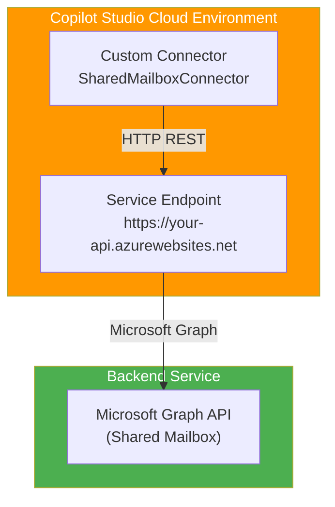

# Phase 1: Shared Mailbox Custom Connector Setup

**Objective:** Build the core shared mailbox service with a custom connector for Copilot Studio.

**Harness:** Custom Connector only (calls backend service)

---

## 1. Prerequisites

- Copilot Studio environment (Power Platform tenant)
- Power Platform admin access
- Shared mailbox address and permissions
- Application registration in Microsoft Entra (for mailbox access via Graph API)
- Azure subscription with App Service or Container Apps available
- PowerShell 7+ with Azure CLI modules
- Python 3.10+ or .NET 8+ for local development

---

## 2. Architecture (Copilot Studio Cloud Execution)

Copilot Studio calls the custom connector, which calls the same Azure-hosted backend:

- **Custom Connector:** `SharedMailboxConnector` → Backend service
- **Backend Service:** Azure-hosted, handles mailbox access via Microsoft Graph API

No local execution. Everything is cloud-based in Copilot Studio.

### Architecture Diagram



---

## 3. Application Registration (Required - for Graph API Access)

You **MUST** create an app registration because your backend service needs authenticated access to the shared mailbox.

### Step 3.1: Register the Application in Entra ID

1. Navigate to **[Azure Portal](https://portal.azure.com)**
2. Search for **Microsoft Entra ID** (or click left sidebar → **Microsoft Entra ID**)
3. Click **App registrations** (left sidebar)
4. Click **New registration** (top-left button)
5. Fill in:
   - **Name:** `SharedMailboxClassifier`
   - **Supported account types:** `Accounts in this organizational directory only`
   - **Redirect URI:** Leave blank
6. Click **Register**

### Step 3.2: Add API Permissions

1. In the app registration, click **API permissions** (left sidebar)
2. Click **Add a permission** (top-left)
3. Search for and select **Microsoft Graph**
4. Choose **Application permissions** (not Delegated)
5. Search and add these permissions:
   - `Mail.Read` - Read messages (application permission)
   - `Mail.Send` - Send emails (application permission)
6. Click **Add permissions**
7. Click **Grant admin consent for [Your Tenant]** (and confirm)

#### Verify Admin Consent Was Actually Granted

Clicking **Grant admin consent** in the portal does not always guarantee the consent was recorded - and Graph calls will fail with `403 Forbidden` if it was not, even though the portal lists the permissions as `Granted`. The portal status column is not a reliable substitute for actually checking. Do not trust `az ad app permission list-grants` either - it only shows delegated (OAuth2) grants and will misleadingly return `[]` for application permissions regardless of consent status.

The authoritative check is the service principal's actual `appRoleAssignments`:

```powershell
# (c) 2026 Holger Imbery (contact@holgerimbery.blog)
# Licensed under the project LICENSE file.
# Confirms admin consent for application permissions was actually recorded,
# not just requested. az ad app permission list-grants only shows delegated
# grants and returns [] for application permissions even when unconsented -
# this is the only reliable check.

$AppId = "your-client-id"
$SpObjectId = az ad sp show --id $AppId --query "id" -o tsv
az rest --method GET --uri "https://graph.microsoft.com/v1.0/servicePrincipals/$SpObjectId/appRoleAssignments"
```

**Expected output:** one entry per application permission (`Mail.Read`, `Mail.Send`, `Mail.ReadWrite`), each with `"principalType": "ServicePrincipal"` and `"resourceDisplayName": "Microsoft Graph"`. An empty `"value": []` means consent was never actually applied, even if the portal shows a green checkmark.

If `appRoleAssignments` is empty, force it via CLI (find the `appRoleId` for the missing permission in the [Microsoft Graph permissions reference](https://learn.microsoft.com/graph/permissions-reference)):

```powershell
az ad app permission add --id $AppId --api 00000003-0000-0000-c000-000000000000 --api-permissions <appRoleId>=Role
az ad app permission grant --id $AppId --api 00000003-0000-0000-c000-000000000000
az ad app permission admin-consent --id $AppId
```

After granting consent this way (or via the portal), **restart the App Service** once the backend is deployed (Step 4.4). Access tokens bake in granted roles at issuance time - a running backend process may hold a cached token issued before consent was granted, and will keep returning `403` until it acquires a fresh token.

### Step 3.3: Create Client Credentials

1. Click **Certificates & secrets** (left sidebar)
2. Click **New client secret** (top-left button)
3. Set expiration to **12 months** (or your policy)
4. Click **Add**
5. **Copy the Value immediately** (you can't see it again!)
6. Note your:
   - **Client ID** (from Overview tab: Application (client) ID)
   - **Tenant ID** (from Overview tab: Directory (tenant) ID)
   - **Client Secret** (from Certificates & secrets: Value)

Store these securely in Azure Key Vault or a password manager.

### Step 3.4: Test App Registration

**Script:** [`test-app-registration.ps1`](scripts/test-app-registration.ps1)

```powershell
# (c) 2026 Holger Imbery (contact@holgerimbery.blog)
# Licensed under the project LICENSE file.
# Test app registration credentials

param(
    [string]$ClientId,
    [string]$ClientSecret,
    [string]$TenantId
)

# Load from .env if parameters not provided
function Load-EnvFile {
    param([string]$EnvPath)
    $env_vars = @{}
    if (Test-Path $EnvPath) {
        Get-Content $EnvPath | Where-Object { $_ -match '=' -and -not $_.StartsWith('#') } | ForEach-Object {
            $key, $value = $_ -split '=', 2
            $env_vars[$key.Trim()] = $value.Trim().Trim('"').Trim("'")
        }
    }
    return $env_vars
}

$RepoRoot = Split-Path (Split-Path (Split-Path $PSScriptRoot -Parent) -Parent) -Parent
$env_file = Join-Path $RepoRoot ".env"
if (Test-Path $env_file) {
    $env_vars = Load-EnvFile $env_file
    if (-not $ClientId) { $ClientId = $env_vars['CLIENT_ID'] }
    if (-not $ClientSecret) { $ClientSecret = $env_vars['CLIENT_SECRET'] }
    if (-not $TenantId) { $TenantId = $env_vars['TENANT_ID'] }
}

# Validate
if (-not $ClientId -or -not $ClientSecret -or -not $TenantId) {
    Write-Error "Missing required parameters: ClientId, ClientSecret, TenantId"
    Write-Host "Provide via CLI parameters or .env file in the repo root" -ForegroundColor Yellow
    exit 1
}

$TokenUrl = "https://login.microsoftonline.com/$TenantId/oauth2/v2.0/token"

$Body = @{
    grant_type = "client_credentials"
    client_id = $ClientId
    client_secret = $ClientSecret
    scope = "https://graph.microsoft.com/.default"
}

try {
    $Response = Invoke-RestMethod -Uri $TokenUrl -Method Post -Body $Body
    Write-Host "✓ Token acquired successfully" -ForegroundColor Green
    Write-Host "  Token expires in: $($Response.expires_in) seconds" -ForegroundColor Gray
    Write-Host "  Access Token: $($Response.access_token.Substring(0, 50))..." -ForegroundColor Gray
} catch {
    Write-Host "✗ Token acquisition failed" -ForegroundColor Red
    Write-Host "  Error: $($_.Exception.Message)" -ForegroundColor Red
}
```

Run it:

```powershell
.\docs\wiki\scripts\test-app-registration.ps1 `
    -ClientId "your-client-id" `
    -ClientSecret "your-client-secret" `
    -TenantId "your-tenant-id"
```

**Expected output:**
```
✓ Token acquired successfully
  Token expires in: 3599 seconds
  Access Token: eyJ0eXAiOiJKV1QiLCJhbGciOi...
```

If you get **401 Unauthorized**, check that:
- Client ID, secret, and tenant ID are correct
- Secret hasn't expired
- App registration is in the correct tenant

### Step 3.5: Restrict Shared Mailbox Access with an Application Access Policy

**Script:** [`grant-mailbox-permissions.ps1`](scripts/grant-mailbox-permissions.ps1)

With **application permissions** (`Mail.Read`, `Mail.Send` + admin consent), Microsoft Graph grants the app access to every mailbox in the tenant. To limit the app to only the shared mailbox, use `New-ApplicationAccessPolicy` scoped to a mail-enabled security group.

```powershell
# (c) 2026 Holger Imbery (contact@holgerimbery.blog)
# Licensed under the project LICENSE file.
# Restricts an app-only Graph application (Mail.Read/Mail.Send) to only
# access the specified shared mailbox, instead of every mailbox in the tenant.

param(
    [string]$ClientId,
    [string]$MailboxAddress,
    [string]$SecurityGroupName
)

# Load from .env if parameters not provided
function Load-EnvFile {
    param([string]$EnvPath)
    $env_vars = @{}
    if (Test-Path $EnvPath) {
        Get-Content $EnvPath | Where-Object { $_ -match '=' -and -not $_.StartsWith('#') } | ForEach-Object {
            $key, $value = $_ -split '=', 2
            $env_vars[$key.Trim()] = $value.Trim().Trim('"').Trim("'")
        }
    }
    return $env_vars
}

$RepoRoot = Split-Path (Split-Path (Split-Path $PSScriptRoot -Parent) -Parent) -Parent
$env_file = Join-Path $RepoRoot ".env"
if (Test-Path $env_file) {
    $env_vars = Load-EnvFile $env_file
    if (-not $ClientId) { $ClientId = $env_vars['CLIENT_ID'] }
    if (-not $MailboxAddress) { $MailboxAddress = $env_vars['MAILBOX_ADDRESS'] }
    if (-not $SecurityGroupName) { $SecurityGroupName = $env_vars['SECURITY_GROUP_NAME'] }
}

# Validate
if (-not $ClientId -or -not $MailboxAddress -or -not $SecurityGroupName) {
    Write-Error "Missing required parameters: ClientId, MailboxAddress, SecurityGroupName"
    Write-Host "Provide via CLI parameters or .env file in the repo root" -ForegroundColor Yellow
    exit 1
}

Connect-ExchangeOnline

# 1. Create a mail-enabled security group scoped to this app (if it doesn't exist yet)
$Group = Get-DistributionGroup -Identity $SecurityGroupName -ErrorAction SilentlyContinue
if (-not $Group) {
    New-DistributionGroup -Name $SecurityGroupName -Type Security | Out-Null
    Write-Host "Created mail-enabled security group: $SecurityGroupName" -ForegroundColor Cyan
}

# 2. Add the shared mailbox as a member of the group
Add-DistributionGroupMember -Identity $SecurityGroupName -Member $MailboxAddress -ErrorAction SilentlyContinue

# 3. Restrict the app so it can only access mailboxes in this group
New-ApplicationAccessPolicy -AccessRight RestrictAccess `
    -AppId $ClientId `
    -PolicyScopeGroupId $SecurityGroupName `
    -Description "Restrict $ClientId to shared mailbox $MailboxAddress"

Write-Host "Application access policy created: $ClientId restricted to $SecurityGroupName" -ForegroundColor Green
```

Run it:

```powershell
.\docs\wiki\scripts\grant-mailbox-permissions.ps1 `
    -ClientId "your-app-client-id" `
    -MailboxAddress "shared-mailbox@company.com" `
    -SecurityGroupName "AppAccess-SharedMailbox"
```

**Expected output:**
```
Created mail-enabled security group: AppAccess-SharedMailbox
Application access policy created: your-app-client-id restricted to AppAccess-SharedMailbox
```

**Verify the policy took effect:**

```powershell
if (-not (Get-ConnectionInformation)) { Connect-ExchangeOnline }

Test-ApplicationAccessPolicy -Identity "shared-mailbox@company.com" -AppId "your-app-client-id"
```

**Expected output (example):**
```
AppId               : your-app-client-id
Mailbox             : shared-mailbox@company.com
AccessCheckedResult : Granted
```

If `AccessCheckedResult` shows `Denied`, wait 30-60 minutes for policy propagation (Application Access Policies can take up to an hour to apply tenant-wide), then re-run the test.

`FullAccess`/`SendAs` mailbox permissions apply to delegated (user sign-in) access via EWS/Outlook, not app-only Graph API calls, and are not needed here.


---

## 4. Backend Service Deployment (How to Get the URL)

This is the central component that both harnesses call. You must deploy it to Azure.

### Step 4.1: Create Azure App Service

**Script:** [`create-app-service.ps1`](../../backend-service/scripts/create-app-service.ps1)

```powershell
# (c) 2026 Holger Imbery (contact@holgerimbery.blog)
# Licensed under the project LICENSE file.

param(
    [string]$ResourceGroup,
    [string]$AppServiceName,
    [string]$Location = "eastus",
    [string]$TenantId,
    [string]$SubscriptionId
)

# Load from .env if parameters not provided
function Load-EnvFile {
    param([string]$EnvPath)
    $env_vars = @{}
    if (Test-Path $EnvPath) {
        Get-Content $EnvPath | Where-Object { $_ -match '=' -and -not $_.StartsWith('#') } | ForEach-Object {
            $key, $value = $_ -split '=', 2
            $env_vars[$key.Trim()] = $value.Trim().Trim('"').Trim("'")
        }
    }
    return $env_vars
}

# Verifies (and optionally switches to) the intended Azure subscription/tenant
# before any resources are created, so a stale `az login` session can't
# silently deploy into the wrong tenant/subscription.
function Confirm-AzureContext {
    param(
        [string]$ExpectedTenantId,
        [string]$ExpectedSubscriptionId
    )

    if ($ExpectedSubscriptionId) {
        az account set --subscription $ExpectedSubscriptionId
        if ($LASTEXITCODE -ne 0) {
            Write-Error "Failed to switch to subscription '$ExpectedSubscriptionId'. Run 'az login' and verify AZURE_SUBSCRIPTION_ID, then retry."
            exit 1
        }
    }

    if ($ExpectedTenantId) {
        $CurrentTenantId = az account show --query tenantId -o tsv
        if ($LASTEXITCODE -ne 0) {
            Write-Error "Failed to read the current Azure CLI context. Run 'az login' and retry."
            exit 1
        }
        if ($CurrentTenantId -ne $ExpectedTenantId) {
            Write-Error "Azure CLI is logged into tenant '$CurrentTenantId', but TENANT_ID specifies '$ExpectedTenantId'. Run 'az login --tenant $ExpectedTenantId' (and 'az account set --subscription <id>' if you have access to multiple subscriptions), then retry."
            exit 1
        }
    }
}

$env_file = Join-Path (Split-Path (Split-Path $PSScriptRoot -Parent) -Parent) ".env"
if (Test-Path $env_file) {
    $env_vars = Load-EnvFile $env_file
    if (-not $ResourceGroup) { $ResourceGroup = $env_vars['RESOURCE_GROUP'] }
    if (-not $AppServiceName) { $AppServiceName = $env_vars['APP_SERVICE_NAME'] }
    if ($Location -eq "eastus" -and $env_vars['LOCATION']) { $Location = $env_vars['LOCATION'] }
    if (-not $TenantId) { $TenantId = $env_vars['TENANT_ID'] }
    if (-not $SubscriptionId) { $SubscriptionId = $env_vars['AZURE_SUBSCRIPTION_ID'] }
}

# Validate
if (-not $ResourceGroup -or -not $AppServiceName) {
    Write-Error "Missing required parameters: ResourceGroup, AppServiceName"
    Write-Host "Provide via CLI parameters or .env file in the repo root" -ForegroundColor Yellow
    exit 1
}

Write-Host "Creating Azure App Service..." -ForegroundColor Yellow

Confirm-AzureContext -ExpectedTenantId $TenantId -ExpectedSubscriptionId $SubscriptionId

# Create resource group
az group create --name $ResourceGroup --location $Location
if ($LASTEXITCODE -ne 0) {
    Write-Error "Failed to create resource group '$ResourceGroup'. See az CLI output above for details."
    exit 1
}
Write-Host "✓ Resource group created: $ResourceGroup" -ForegroundColor Green

# Create App Service plan
az appservice plan create `
    --resource-group $ResourceGroup `
    --name "$AppServiceName-plan" `
    --sku B1 `
    --is-linux

if ($LASTEXITCODE -ne 0) {
    Write-Error "Failed to create App Service plan '$AppServiceName-plan'. Common cause: insufficient regional vCPU quota for the selected SKU - request a quota increase or try a different region/SKU. See az CLI output above for details."
    exit 1
}
Write-Host "✓ App Service plan created" -ForegroundColor Green

# Create web app
az webapp create `
    --resource-group $ResourceGroup `
    --plan "$AppServiceName-plan" `
    --name $AppServiceName `
    --runtime "PYTHON:3.11"

if ($LASTEXITCODE -ne 0) {
    Write-Error "Failed to create App Service '$AppServiceName'. See az CLI output above for details."
    exit 1
}
$Url = "https://$AppServiceName.azurewebsites.net"
Write-Host "✓ App Service created: $Url" -ForegroundColor Green
```

Run it:

```powershell
.\backend-service\scripts\create-app-service.ps1 `
    -ResourceGroup "shared-mailbox-rg" `
    -AppServiceName "shared-mailbox-classifier"
```

**Expected output:**
```
Creating Azure App Service...
✓ Resource group created: shared-mailbox-rg
✓ App Service plan created
✓ App Service created: https://shared-mailbox-classifier.azurewebsites.net
```

### Step 4.2: Test App Service is Running

**Script:** [`test-app-service.ps1`](../../backend-service/scripts/test-app-service.ps1)

```powershell
# (c) 2026 Holger Imbery (contact@holgerimbery.blog)
# Licensed under the project LICENSE file.
# Verifies the Azure App Service is reachable right after creation, before any
# backend code is deployed. Expect a 404 from the platform (not a connection
# error) - that confirms the App Service itself is up.

param(
    [string]$BackendUrl
)

# Load from .env if parameters not provided
function Load-EnvFile {
    param([string]$EnvPath)
    $env_vars = @{}
    if (Test-Path $EnvPath) {
        Get-Content $EnvPath | Where-Object { $_ -match '=' -and -not $_.StartsWith('#') } | ForEach-Object {
            $key, $value = $_ -split '=', 2
            $env_vars[$key.Trim()] = $value.Trim().Trim('"').Trim("'")
        }
    }
    return $env_vars
}

$env_file = Join-Path (Split-Path (Split-Path $PSScriptRoot -Parent) -Parent) ".env"
if (Test-Path $env_file) {
    $env_vars = Load-EnvFile $env_file
    if (-not $BackendUrl) { $BackendUrl = $env_vars['BACKEND_URL'] }
}

# Validate
if (-not $BackendUrl) {
    Write-Error "Missing required parameter: BackendUrl"
    Write-Host "Provide via CLI parameter or .env file in the repo root" -ForegroundColor Yellow
    exit 1
}

# Test connectivity
$Response = Invoke-WebRequest -Uri "$BackendUrl/health" -SkipHttpErrorCheck

Write-Host "Status Code: $($Response.StatusCode)" -ForegroundColor Green
Write-Host "Response: $($Response.Content)" -ForegroundColor Gray
```

Run it:

```powershell
.\backend-service\scripts\test-app-service.ps1 -BackendUrl "https://shared-mailbox-classifier.azurewebsites.net"
```

**Expected output (initially):**
```
Status Code: 404
Response: <!DOCTYPE html><html><body><h1>404 - Web app not found</h1>
```

This is normal — the app is running but no code is deployed yet. We'll deploy code in the next step.

### Step 4.3: Configure Environment Variables

**Script:** [`configure-app-service.ps1`](../../backend-service/scripts/configure-app-service.ps1)

```powershell
# (c) 2026 Holger Imbery (contact@holgerimbery.blog)
# Licensed under the project LICENSE file.

param(
    [string]$ResourceGroup,
    [string]$AppServiceName,
    [string]$ClientId,
    [string]$ClientSecret,
    [string]$TenantId,
    [string]$SubscriptionId
)

# Load from .env if parameters not provided
function Load-EnvFile {
    param([string]$EnvPath)
    $env_vars = @{}
    if (Test-Path $EnvPath) {
        Get-Content $EnvPath | Where-Object { $_ -match '=' -and -not $_.StartsWith('#') } | ForEach-Object {
            $key, $value = $_ -split '=', 2
            $env_vars[$key.Trim()] = $value.Trim().Trim('"').Trim("'")
        }
    }
    return $env_vars
}

# Verifies (and optionally switches to) the intended Azure subscription/tenant
# before any resources are modified, so a stale `az login` session can't
# silently target the wrong tenant/subscription.
function Confirm-AzureContext {
    param(
        [string]$ExpectedTenantId,
        [string]$ExpectedSubscriptionId
    )

    if ($ExpectedSubscriptionId) {
        az account set --subscription $ExpectedSubscriptionId
        if ($LASTEXITCODE -ne 0) {
            Write-Error "Failed to switch to subscription '$ExpectedSubscriptionId'. Run 'az login' and verify AZURE_SUBSCRIPTION_ID, then retry."
            exit 1
        }
    }

    if ($ExpectedTenantId) {
        $CurrentTenantId = az account show --query tenantId -o tsv
        if ($LASTEXITCODE -ne 0) {
            Write-Error "Failed to read the current Azure CLI context. Run 'az login' and retry."
            exit 1
        }
        if ($CurrentTenantId -ne $ExpectedTenantId) {
            Write-Error "Azure CLI is logged into tenant '$CurrentTenantId', but TENANT_ID specifies '$ExpectedTenantId'. Run 'az login --tenant $ExpectedTenantId' (and 'az account set --subscription <id>' if you have access to multiple subscriptions), then retry."
            exit 1
        }
    }
}

$env_file = Join-Path (Split-Path (Split-Path $PSScriptRoot -Parent) -Parent) ".env"
if (Test-Path $env_file) {
    $env_vars = Load-EnvFile $env_file
    if (-not $ResourceGroup) { $ResourceGroup = $env_vars['RESOURCE_GROUP'] }
    if (-not $AppServiceName) { $AppServiceName = $env_vars['APP_SERVICE_NAME'] }
    if (-not $ClientId) { $ClientId = $env_vars['CLIENT_ID'] }
    if (-not $ClientSecret) { $ClientSecret = $env_vars['CLIENT_SECRET'] }
    if (-not $TenantId) { $TenantId = $env_vars['TENANT_ID'] }
    if (-not $SubscriptionId) { $SubscriptionId = $env_vars['AZURE_SUBSCRIPTION_ID'] }
}

# Validate
if (-not $ResourceGroup -or -not $AppServiceName -or -not $ClientId -or -not $ClientSecret -or -not $TenantId) {
    Write-Error "Missing required parameters: ResourceGroup, AppServiceName, ClientId, ClientSecret, TenantId"
    Write-Host "Provide via CLI parameters or .env file in the repo root" -ForegroundColor Yellow
    exit 1
}

Confirm-AzureContext -ExpectedTenantId $TenantId -ExpectedSubscriptionId $SubscriptionId

az webapp config appsettings set `
    --resource-group $ResourceGroup `
    --name $AppServiceName `
    --settings `
        AZURE_CLIENT_ID=$ClientId `
        AZURE_CLIENT_SECRET=$ClientSecret `
        AZURE_TENANT_ID=$TenantId

if ($LASTEXITCODE -ne 0) {
    Write-Error "Failed to configure app settings on '$AppServiceName'. See az CLI output above for details."
    exit 1
}
Write-Host "✓ Environment variables configured" -ForegroundColor Green
```

Save it as `backend-service/scripts/configure-app-service.ps1`.

Run it:

```powershell
.\backend-service\scripts\configure-app-service.ps1 `
    -ResourceGroup "rg-shared-mailbox" `
    -AppServiceName "shared-mailbox-classifier" `
    -ClientId "<app-client-id>" `
    -ClientSecret "<app-client-secret>" `
    -TenantId "<tenant-id>" `
    -SubscriptionId "<subscription-id>"
```

**Expected output:**
```
✓ Environment variables configured
```

### Step 4.4: Deploy Backend Code

**Script:** [`deploy-backend.ps1`](../../backend-service/scripts/deploy-backend.ps1)

The Python backend application source lives in [`backend-service/app.py`](../../backend-service/app.py),
with dependencies in [`backend-service/requirements.txt`](../../backend-service/requirements.txt).

This script deploys via the already-authenticated `az` CLI session, so no separate Git credentials are
ever required. It also removes any conflicting `WEBSITE_RUN_FROM_PACKAGE` setting (which would
otherwise silently disable the Oryx build step and leave `requirements.txt` uninstalled), sets an
explicit startup command, retries transient Kudu 502s, and polls `/health` afterward so you get a clear
pass/fail result instead of an ambiguous hang.

```powershell
# (c) 2026 Holger Imbery (contact@holgerimbery.blog)
# Licensed under the project LICENSE file.
# Fail-safe ZIP deployment for the Python backend to Azure App Service (Linux).
# Fixes two common causes of an endless "Starting the site..." / HTTP 502 loop:
#   1. WEBSITE_RUN_FROM_PACKAGE conflicting with SCM_DO_BUILD_DURING_DEPLOYMENT
#      (when both are set, Oryx silently skips the build and dependencies are
#      never installed, so the app crash-loops on import errors forever).
#   2. Deploying into Kudu/SCM immediately after a restart, before it has
#      finished coming back up, which surfaces as an HTTP 502 on the deploy
#      call itself.
# Also retries transient deployment failures and polls /health afterward so
# you get a clear pass/fail result instead of an ambiguous hang.

param(
    [string]$ResourceGroup,
    [string]$AppServiceName,
    [string]$TenantId,
    [string]$SubscriptionId,
    [int]$MaxDeployAttempts = 3,
    [int]$HealthCheckTimeoutSeconds = 300
)

# Load from .env if parameters not provided
function Load-EnvFile {
    param([string]$EnvPath)
    $env_vars = @{}
    if (Test-Path $EnvPath) {
        Get-Content $EnvPath | Where-Object { $_ -match '=' -and -not $_.StartsWith('#') } | ForEach-Object {
            $key, $value = $_ -split '=', 2
            $env_vars[$key.Trim()] = $value.Trim().Trim('"').Trim("'")
        }
    }
    return $env_vars
}

# Verifies (and optionally switches to) the intended Azure subscription/tenant
# before any resources are modified, so a stale `az login` session can't
# silently target the wrong tenant/subscription.
function Confirm-AzureContext {
    param(
        [string]$ExpectedTenantId,
        [string]$ExpectedSubscriptionId
    )

    if ($ExpectedSubscriptionId) {
        az account set --subscription $ExpectedSubscriptionId
        if ($LASTEXITCODE -ne 0) {
            Write-Error "Failed to switch to subscription '$ExpectedSubscriptionId'. Run 'az login' and verify AZURE_SUBSCRIPTION_ID, then retry."
            exit 1
        }
    }

    if ($ExpectedTenantId) {
        $CurrentTenantId = az account show --query tenantId -o tsv
        if ($LASTEXITCODE -ne 0) {
            Write-Error "Failed to read the current Azure CLI context. Run 'az login' and retry."
            exit 1
        }
        if ($CurrentTenantId -ne $ExpectedTenantId) {
            Write-Error "Azure CLI is logged into tenant '$CurrentTenantId', but TENANT_ID specifies '$ExpectedTenantId'. Run 'az login --tenant $ExpectedTenantId' (and 'az account set --subscription <id>' if you have access to multiple subscriptions), then retry."
            exit 1
        }
    }
}

$RepoRoot = Split-Path (Split-Path $PSScriptRoot -Parent) -Parent
$env_file = Join-Path $RepoRoot ".env"
if (Test-Path $env_file) {
    $env_vars = Load-EnvFile $env_file
    if (-not $ResourceGroup) { $ResourceGroup = $env_vars['RESOURCE_GROUP'] }
    if (-not $AppServiceName) { $AppServiceName = $env_vars['APP_SERVICE_NAME'] }
    if (-not $TenantId) { $TenantId = $env_vars['TENANT_ID'] }
    if (-not $SubscriptionId) { $SubscriptionId = $env_vars['AZURE_SUBSCRIPTION_ID'] }
}

# Validate
if (-not $ResourceGroup -or -not $AppServiceName) {
    Write-Error "Missing required parameters: ResourceGroup, AppServiceName"
    Write-Host "Provide via CLI parameters or .env file in the repo root" -ForegroundColor Yellow
    exit 1
}

Confirm-AzureContext -ExpectedTenantId $TenantId -ExpectedSubscriptionId $SubscriptionId

Write-Host "Step 1/6: Ensuring build settings do not conflict..." -ForegroundColor Yellow

# WEBSITE_RUN_FROM_PACKAGE, if present, makes Oryx skip the build step
# entirely (the ZIP runs read-only exactly as uploaded), which silently
# defeats SCM_DO_BUILD_DURING_DEPLOYMENT and leaves requirements.txt
# uninstalled. Remove it if set; ignore failure if it was never set.
az webapp config appsettings delete `
    --resource-group $ResourceGroup `
    --name $AppServiceName `
    --setting-names WEBSITE_RUN_FROM_PACKAGE 2>$null | Out-Null

az webapp config appsettings set `
    --resource-group $ResourceGroup `
    --name $AppServiceName `
    --settings SCM_DO_BUILD_DURING_DEPLOYMENT=true | Out-Null

if ($LASTEXITCODE -ne 0) {
    Write-Error "Failed to configure SCM_DO_BUILD_DURING_DEPLOYMENT on '$AppServiceName'. See az CLI output above for details."
    exit 1
}

# Set the startup command explicitly instead of relying on Oryx auto-detect,
# so the entry point (app.py's `app` Flask object) is never ambiguous.
az webapp config set `
    --resource-group $ResourceGroup `
    --name $AppServiceName `
    --startup-file "gunicorn --bind=0.0.0.0 --timeout 600 app:app" | Out-Null

if ($LASTEXITCODE -ne 0) {
    Write-Error "Failed to set the startup command on '$AppServiceName'. See az CLI output above for details."
    exit 1
}
Write-Host "Build settings and startup command confirmed" -ForegroundColor Green

Write-Host "Step 2/6: Restarting App Service to apply configuration..." -ForegroundColor Yellow
az webapp restart --resource-group $ResourceGroup --name $AppServiceName | Out-Null
if ($LASTEXITCODE -ne 0) {
    Write-Error "Failed to restart '$AppServiceName'. See az CLI output above for details."
    exit 1
}
Write-Host "Restart requested" -ForegroundColor Green

Write-Host "Step 3/6: Waiting for Kudu (SCM site) to become responsive..." -ForegroundColor Yellow
$KuduUrl = "https://$AppServiceName.scm.azurewebsites.net/api/settings"
$KuduReady = $false
for ($i = 1; $i -le 12; $i++) {
    try {
        $Response = Invoke-WebRequest -Uri $KuduUrl -UseBasicParsing -TimeoutSec 10 -ErrorAction Stop
        if ($Response.StatusCode -eq 200) {
            $KuduReady = $true
            break
        }
    } catch {
        # Kudu not up yet - expected right after a restart, keep polling.
    }
    Write-Host "   Kudu not ready yet, retrying in 10s... ($i/12)" -ForegroundColor Gray
    Start-Sleep -Seconds 10
}
if ($KuduReady) {
    Write-Host "Kudu is responsive" -ForegroundColor Green
} else {
    Write-Host "Kudu did not respond within 2 minutes; attempting deployment anyway" -ForegroundColor Yellow
}

Write-Host "Step 4/6: Packaging application (app.py, requirements.txt)..." -ForegroundColor Yellow
$BackendDir = Split-Path $PSScriptRoot -Parent
$ZipPath = Join-Path $RepoRoot "backend-deploy.zip"
if (Test-Path $ZipPath) { Remove-Item $ZipPath -Force }
Compress-Archive -Path (Join-Path $BackendDir "app.py"), (Join-Path $BackendDir "requirements.txt") -DestinationPath $ZipPath -Force
Write-Host "Package created: $ZipPath" -ForegroundColor Green

Write-Host "Step 5/6: Deploying application..." -ForegroundColor Yellow
$DeploySucceeded = $false
for ($Attempt = 1; $Attempt -le $MaxDeployAttempts; $Attempt++) {
    Write-Host "   Attempt $Attempt of $MaxDeployAttempts..." -ForegroundColor Gray
    az webapp deploy `
        --resource-group $ResourceGroup `
        --name $AppServiceName `
        --src-path $ZipPath `
        --type zip
    if ($LASTEXITCODE -eq 0) {
        $DeploySucceeded = $true
        break
    }
    Write-Host "   Deployment attempt $Attempt failed (often a transient Kudu 502 right after a restart)." -ForegroundColor Yellow
    if ($Attempt -lt $MaxDeployAttempts) {
        Write-Host "   Waiting 30s before retry..." -ForegroundColor Gray
        Start-Sleep -Seconds 30
    }
}

if (-not $DeploySucceeded) {
    Write-Error "Deployment failed after $MaxDeployAttempts attempts."
    Write-Host "Recent deployment log:" -ForegroundColor Yellow
    az webapp log deployment show --resource-group $ResourceGroup --name $AppServiceName
    exit 1
}
Write-Host "Deployment succeeded" -ForegroundColor Green

Write-Host "Step 6/6: Waiting for the application to become healthy..." -ForegroundColor Yellow
$HealthUrl = "https://$AppServiceName.azurewebsites.net/health"
$Deadline = (Get-Date).AddSeconds($HealthCheckTimeoutSeconds)
$Healthy = $false
while ((Get-Date) -lt $Deadline) {
    try {
        $null = Invoke-RestMethod -Uri $HealthUrl -Method Get -TimeoutSec 10 -ErrorAction Stop
        $Healthy = $true
        break
    } catch {
        Write-Host "   Waiting for app to start..." -ForegroundColor Gray
        Start-Sleep -Seconds 15
    }
}

if (-not $Healthy) {
    Write-Error "Application did not become healthy within $HealthCheckTimeoutSeconds seconds."
    Write-Host "Recent deployment log:" -ForegroundColor Yellow
    az webapp log deployment show --resource-group $ResourceGroup --name $AppServiceName
    Write-Host "Tip: run 'az webapp log tail --resource-group $ResourceGroup --name $AppServiceName' to see live runtime errors." -ForegroundColor Yellow
    exit 1
}

Write-Host "Backend deployed and healthy: https://$AppServiceName.azurewebsites.net" -ForegroundColor Green
```

Save it as `backend-service/scripts/deploy-backend.ps1`.

Run it:

```powershell
.\backend-service\scripts\deploy-backend.ps1 `
    -ResourceGroup "rg-shared-mailbox" `
    -AppServiceName "shared-mailbox-classifier" `
    -TenantId "<tenant-id>" `
    -SubscriptionId "<subscription-id>"
```

**Expected output:**
```
Backend deployed and healthy: https://shared-mailbox-classifier.azurewebsites.net
```

If it fails, the script automatically prints the deployment log and suggests
`az webapp log tail` to see live runtime errors.

### Step 4.5: Test Backend Endpoints

**Script:** [`test-backend.ps1`](../../backend-service/scripts/test-backend.ps1)

```powershell
# (c) 2026 Holger Imbery (contact@holgerimbery.blog)
# Licensed under the project LICENSE file.

param(
    [string]$BackendUrl,
    [string]$MailboxAddress = "test@company.com"
)

# Load from .env if parameters not provided
function Load-EnvFile {
    param([string]$EnvPath)
    $env_vars = @{}
    if (Test-Path $EnvPath) {
        Get-Content $EnvPath | Where-Object { $_ -match '=' -and -not $_.StartsWith('#') } | ForEach-Object {
            $key, $value = $_ -split '=', 2
            $env_vars[$key.Trim()] = $value.Trim().Trim('"').Trim("'")
        }
    }
    return $env_vars
}

$env_file = Join-Path (Split-Path (Split-Path $PSScriptRoot -Parent) -Parent) ".env"
if (Test-Path $env_file) {
    $env_vars = Load-EnvFile $env_file
    if (-not $BackendUrl) { $BackendUrl = $env_vars['BACKEND_URL'] }
    if ($MailboxAddress -eq "test@company.com" -and $env_vars['MAILBOX_ADDRESS']) { $MailboxAddress = $env_vars['MAILBOX_ADDRESS'] }
}

# Validate
if (-not $BackendUrl) {
    Write-Error "Missing required parameter: BackendUrl"
    Write-Host "Provide via CLI parameter or .env file in the repo root" -ForegroundColor Yellow
    exit 1
}

Write-Host "Testing Backend Endpoints" -ForegroundColor Cyan
Write-Host "Backend: $BackendUrl" -ForegroundColor Gray
Write-Host ""

# Test 1: Health endpoint
Write-Host "1. Testing /health endpoint..." -ForegroundColor Yellow
try {
    $Response = Invoke-RestMethod -Uri "$BackendUrl/health" -Method Get
    Write-Host "   ✓ Health check passed" -ForegroundColor Green
    Write-Host "   Response: $($Response | ConvertTo-Json)" -ForegroundColor Gray
} catch {
    Write-Host "   ✗ Health check failed: $($_.Exception.Message)" -ForegroundColor Red
}

Write-Host ""

# Test 2: Get messages endpoint
Write-Host "2. Testing /api/mailbox/messages endpoint..." -ForegroundColor Yellow
try {
    $Response = Invoke-RestMethod -Uri "$BackendUrl/api/mailbox/messages?mailboxAddress=$MailboxAddress&top=5" `
        -Method Get -ErrorAction Stop
    Write-Host "   ✓ Messages endpoint works" -ForegroundColor Green
    Write-Host "   Found $($Response.value.Count) messages" -ForegroundColor Gray
} catch {
    Write-Host "   ⚠ Warning: $($_.Exception.Message)" -ForegroundColor Yellow
    Write-Host "     (This is normal if app registration doesn't have mailbox access yet)" -ForegroundColor Gray
}

Write-Host ""

# Test 3: Classify endpoint
Write-Host "3. Testing /api/mailbox/classify endpoint..." -ForegroundColor Yellow
try {
    $Body = @{ messageId = "test-message-id" } | ConvertTo-Json
    $Response = Invoke-RestMethod -Uri "$BackendUrl/api/mailbox/classify" `
        -Method Post -Body $Body -ContentType "application/json"
    Write-Host "   ✓ Classify endpoint works" -ForegroundColor Green
    Write-Host "   Response: $($Response | ConvertTo-Json)" -ForegroundColor Gray
} catch {
    Write-Host "   ✗ Classify endpoint failed: $($_.Exception.Message)" -ForegroundColor Red
}

Write-Host ""

# Test 4: Poll (trigger) endpoint
Write-Host "4. Testing /api/mailbox/messages/poll endpoint..." -ForegroundColor Yellow
try {
    $Response = Invoke-RestMethod -Uri "$BackendUrl/api/mailbox/messages/poll?mailboxAddress=$MailboxAddress" `
        -Method Get -ErrorAction Stop
    Write-Host "   ✓ Poll endpoint works" -ForegroundColor Green
    Write-Host "   Found $($Response.value.Count) new messages" -ForegroundColor Gray
} catch {
    Write-Host "   ⚠ Warning: $($_.Exception.Message)" -ForegroundColor Yellow
    Write-Host "     (This is normal if app registration doesn't have mailbox access yet)" -ForegroundColor Gray
}

# Test 5: Create draft endpoint (in the shared mailbox's own Drafts folder)
Write-Host "5. Testing /api/mailbox/drafts (CreateDraft) endpoint..." -ForegroundColor Yellow
try {
    $Body = @{ mailboxAddress = $MailboxAddress; messageId = "test-message-id"; subject = "Re: Test"; body = "Test reply body" } | ConvertTo-Json
    $Response = Invoke-RestMethod -Uri "$BackendUrl/api/mailbox/drafts" `
        -Method Post -Body $Body -ContentType "application/json" -ErrorAction Stop
    Write-Host "   ✓ Create draft endpoint works" -ForegroundColor Green
    Write-Host "   Response: $($Response | ConvertTo-Json)" -ForegroundColor Gray
} catch {
    Write-Host "   ⚠ Warning: $($_.Exception.Message)" -ForegroundColor Yellow
    Write-Host "     (This is normal if messageId doesn't refer to a real message yet)" -ForegroundColor Gray
}

Write-Host ""

# Test 6: Update draft endpoint
Write-Host "6. Testing /api/mailbox/drafts/{draftId} (UpdateDraft) endpoint..." -ForegroundColor Yellow
try {
    $Body = @{ mailboxAddress = $MailboxAddress; subject = "Re: Test (edited)"; body = "Edited reply body" } | ConvertTo-Json
    $Response = Invoke-RestMethod -Uri "$BackendUrl/api/mailbox/drafts/test-draft-id" `
        -Method Patch -Body $Body -ContentType "application/json" -ErrorAction Stop
    Write-Host "   ✓ Update draft endpoint works" -ForegroundColor Green
    Write-Host "   Response: $($Response | ConvertTo-Json)" -ForegroundColor Gray
} catch {
    Write-Host "   ⚠ Warning: $($_.Exception.Message)" -ForegroundColor Yellow
    Write-Host "     (This is normal if test-draft-id doesn't refer to a real draft yet)" -ForegroundColor Gray
}

Write-Host ""

# Test 7: Send message endpoint
Write-Host "7. Testing /api/mailbox/messages/send endpoint..." -ForegroundColor Yellow
try {
    $Body = @{ mailboxAddress = $MailboxAddress; to = "recipient@company.com"; subject = "Test"; body = "Test body" } | ConvertTo-Json
    $Response = Invoke-RestMethod -Uri "$BackendUrl/api/mailbox/messages/send" `
        -Method Post -Body $Body -ContentType "application/json" -ErrorAction Stop
    Write-Host "   ✓ Send message endpoint works" -ForegroundColor Green
    Write-Host "   Response: $($Response | ConvertTo-Json)" -ForegroundColor Gray
} catch {
    Write-Host "   ⚠ Warning: $($_.Exception.Message)" -ForegroundColor Yellow
    Write-Host "     (This is normal if app registration doesn't have mailbox access yet)" -ForegroundColor Gray
}

Write-Host ""

# Test 8: Send draft message endpoint
Write-Host "8. Testing /api/mailbox/drafts/{draftId}/send endpoint..." -ForegroundColor Yellow
try {
    $Body = @{ mailboxAddress = $MailboxAddress } | ConvertTo-Json
    $Response = Invoke-RestMethod -Uri "$BackendUrl/api/mailbox/drafts/test-draft-id/send" `
        -Method Post -Body $Body -ContentType "application/json" -ErrorAction Stop
    Write-Host "   ✓ Send draft message endpoint works" -ForegroundColor Green
    Write-Host "   Response: $($Response | ConvertTo-Json)" -ForegroundColor Gray
} catch {
    Write-Host "   ⚠ Warning: $($_.Exception.Message)" -ForegroundColor Yellow
    Write-Host "     (This is normal if app registration doesn't have mailbox access yet)" -ForegroundColor Gray
}
Write-Host ""
Write-Host "Testing complete!" -ForegroundColor Cyan
```

Run it:

```powershell
.\backend-service\scripts\test-backend.ps1 `
    -BackendUrl "https://shared-mailbox-classifier.azurewebsites.net" `
    -MailboxAddress "shared@company.com"
```

**Expected output:**
```
Testing Backend Endpoints
Backend: https://shared-mailbox-classifier.azurewebsites.net

1. Testing /health endpoint...
   ✓ Health check passed
   Response: {
     "status": "healthy",
     "service": "shared-mailbox-classifier"
   }

2. Testing /api/mailbox/messages endpoint...
   ⚠ Warning: 401 Unauthorized
     (This is normal if app registration doesn't have mailbox access yet)

3. Testing /api/mailbox/classify endpoint...
   ✓ Classify endpoint works
   Response: {
     "classifications": [{"className": "Invoice Question", ...}]
   }

4. Testing /api/mailbox/messages/poll endpoint...
   ⚠ Warning: 401 Unauthorized
     (This is normal if app registration doesn't have mailbox access yet)

5. Testing /api/mailbox/drafts (CreateDraft) endpoint...
   ⚠ Warning: 401 Unauthorized
     (This is normal if messageId doesn't refer to a real message yet)

6. Testing /api/mailbox/drafts/{draftId} (UpdateDraft) endpoint...
   ⚠ Warning: 401 Unauthorized
     (This is normal if test-draft-id doesn't refer to a real draft yet)

7. Testing /api/mailbox/messages/send endpoint...
   ⚠ Warning: 401 Unauthorized
     (This is normal if app registration doesn't have mailbox access yet)

8. Testing /api/mailbox/drafts/{draftId}/send endpoint...
   ⚠ Warning: 401 Unauthorized
     (This is normal if app registration doesn't have mailbox access yet)

Testing complete!
```

---

### Step 4.5.1: Validate the Real Send/Draft Success Path

Step 4.5 above intentionally uses fake IDs (`test-message-id`, `test-draft-id`) so it can be run safely and repeatedly without touching real mail - expect `400`/`404` warnings there, not successes. To confirm CreateDraft, UpdateDraft, and SendDraftMessage actually work end-to-end, send a real message to the shared mailbox and use its real `messageId`:

**1. Send a test message from the shared mailbox to itself:**

```powershell
Invoke-RestMethod -Method Post -Uri "$BackendUrl/api/mailbox/messages/send" `
  -ContentType "application/json" `
  -Body (@{
    mailboxAddress = $MailboxAddress
    to             = $MailboxAddress
    subject        = "Test message for draft flow"
    body           = "This is a test message sent to self."
  } | ConvertTo-Json)
```

**2. Retrieve its real `messageId`** (may take a few seconds to land - rerun if not yet present):

```powershell
$messages = Invoke-RestMethod -Method Get -Uri "$BackendUrl/api/mailbox/messages?mailboxAddress=$MailboxAddress"
$messages.value[0].id
```

**3. Create a real reply draft using that `messageId`:**

```powershell
Invoke-RestMethod -Method Post -Uri "$BackendUrl/api/mailbox/drafts" `
  -ContentType "application/json" `
  -Body (@{
    mailboxAddress = $MailboxAddress
    messageId      = "<PASTE-REAL-MESSAGE-ID-HERE>"
    subject        = "RE: Test message for draft flow"
    body           = "This is a real draft reply."
  } | ConvertTo-Json)
```

**Expected output:** `200 OK` with a real `draftId` and `draftUrl` - not the `400`/`404` seen in Step 4.5's fake-ID tests. Use the returned `draftId` to exercise UpdateDraft (`PATCH /api/mailbox/drafts/<draftId>`) and SendDraftMessage (`POST /api/mailbox/drafts/<draftId>/send`) against a real draft to confirm the complete flow.

---

## 4.6 Security Hardening (Required Before Production Use)

The backend service is the security boundary for this solution: anything that can call it successfully can act on the shared mailbox using app-only Graph permissions (`Mail.Read`, `Mail.Send`). Complete every step below before connecting real users or production data.

**What this closes:**
- Unauthorized callers hitting your API
- The app reading/sending mail outside the intended shared mailbox
- Client secret exposure
- Public, unauthenticated network exposure
- Sensitive data leaking into logs

### Step 4.6.1: Enforce JWT Authentication on Backend Endpoints

**Script:** [`enable-backend-auth.ps1`](../../backend-service/scripts/enable-backend-auth.ps1)

Require every request (except `/health`) to present a valid Microsoft Entra-issued bearer token.

```powershell
# (c) 2026 Holger Imbery (contact@holgerimbery.blog)
# Licensed under the project LICENSE file.
# Enables Azure App Service built-in authentication (Easy Auth) with
# Microsoft Entra ID as the identity provider, so unauthenticated
# requests are rejected before they reach your application code.

param(
    [string]$ResourceGroup,
    [string]$AppServiceName,
    [string]$TenantId,
    [string]$ClientId,
    [string]$SubscriptionId,
    [switch]$SkipDelegatedScopeSetup
)

# Load from .env if parameters not provided
function Load-EnvFile {
    param([string]$EnvPath)
    $env_vars = @{}
    if (Test-Path $EnvPath) {
        Get-Content $EnvPath | Where-Object { $_ -match '=' -and -not $_.StartsWith('#') } | ForEach-Object {
            $key, $value = $_ -split '=', 2
            $env_vars[$key.Trim()] = $value.Trim().Trim('"').Trim("'")
        }
    }
    return $env_vars
}

# Verifies (and optionally switches to) the intended Azure subscription/tenant
# before any resources are modified, so a stale `az login` session can't
# silently target the wrong tenant/subscription.
function Confirm-AzureContext {
    param(
        [string]$ExpectedTenantId,
        [string]$ExpectedSubscriptionId
    )

    if ($ExpectedSubscriptionId) {
        az account set --subscription $ExpectedSubscriptionId
        if ($LASTEXITCODE -ne 0) {
            Write-Error "Failed to switch to subscription '$ExpectedSubscriptionId'. Run 'az login' and verify AZURE_SUBSCRIPTION_ID, then retry."
            exit 1
        }
    }

    if ($ExpectedTenantId) {
        $CurrentTenantId = az account show --query tenantId -o tsv
        if ($LASTEXITCODE -ne 0) {
            Write-Error "Failed to read the current Azure CLI context. Run 'az login' and retry."
            exit 1
        }
        if ($CurrentTenantId -ne $ExpectedTenantId) {
            Write-Error "Azure CLI is logged into tenant '$CurrentTenantId', but TENANT_ID specifies '$ExpectedTenantId'. Run 'az login --tenant $ExpectedTenantId' (and 'az account set --subscription <id>' if you have access to multiple subscriptions), then retry."
            exit 1
        }
    }
}

# Exposes a delegated "user_impersonation" OAuth2 scope on the app
# registration and forces v1-format access tokens, so tokens requested for
# api://<ClientId> (e.g. via `az login --scope` or the custom connector's
# delegated OAuth flow) are actually issued and accepted - without this,
# Azure AD rejects token requests with AADSTS650057 (no scope to request),
# and even after a token is issued, Easy Auth's classic v1 config rejects
# it (issuer mismatch or an un-allowlisted audience, both 401).
function Enable-DelegatedApiScope {
    param(
        [string]$ClientId
    )

    $ObjectId = az ad app show --id $ClientId --query id -o tsv
    if ($LASTEXITCODE -ne 0 -or -not $ObjectId) {
        Write-Error "Failed to look up the app registration object ID for client ID '$ClientId'."
        exit 1
    }

    $ScopeId = "a7e26fb7-ec5a-4179-81c3-daa4d26300b4"
    $Body = @{
        identifierUris = @("api://$ClientId")
        api = @{
            requestedAccessTokenVersion = 1
            oauth2PermissionScopes = @(
                @{
                    adminConsentDescription  = "Allow the app to access the shared mailbox classifier on behalf of the signed-in user."
                    adminConsentDisplayName  = "Access shared mailbox classifier"
                    id                       = $ScopeId
                    isEnabled                = $true
                    type                     = "User"
                    userConsentDescription   = "Allow the app to access the shared mailbox classifier on your behalf."
                    userConsentDisplayName   = "Access shared mailbox classifier"
                    value                    = "user_impersonation"
                }
            )
        }
    } | ConvertTo-Json -Depth 6

    $TempFile = New-TemporaryFile
    Set-Content -Path $TempFile -Value $Body -Encoding utf8

    az rest --method PATCH --uri "https://graph.microsoft.com/v1.0/applications/$ObjectId" --headers "Content-Type=application/json" --body "@$TempFile"
    $ExitCode = $LASTEXITCODE
    Remove-Item $TempFile -ErrorAction SilentlyContinue

    if ($ExitCode -ne 0) {
        Write-Error "Failed to expose the delegated 'user_impersonation' scope on app '$ClientId'. See az CLI output above."
        exit 1
    }
    Write-Host "Delegated scope 'user_impersonation' exposed on api://$ClientId (v1 access tokens)" -ForegroundColor Green
}

$env_file = Join-Path (Split-Path (Split-Path $PSScriptRoot -Parent) -Parent) ".env"
if (Test-Path $env_file) {
    $env_vars = Load-EnvFile $env_file
    if (-not $ResourceGroup) { $ResourceGroup = $env_vars['RESOURCE_GROUP'] }
    if (-not $AppServiceName) { $AppServiceName = $env_vars['APP_SERVICE_NAME'] }
    if (-not $TenantId) { $TenantId = $env_vars['TENANT_ID'] }
    if (-not $ClientId) { $ClientId = $env_vars['CLIENT_ID'] }
    if (-not $SubscriptionId) { $SubscriptionId = $env_vars['AZURE_SUBSCRIPTION_ID'] }
}

# Validate
if (-not $ResourceGroup -or -not $AppServiceName -or -not $TenantId -or -not $ClientId) {
    Write-Error "Missing required parameters: ResourceGroup, AppServiceName, TenantId, ClientId"
    Write-Host "Provide via CLI parameters or .env file in the repo root" -ForegroundColor Yellow
    exit 1
}

Confirm-AzureContext -ExpectedTenantId $TenantId -ExpectedSubscriptionId $SubscriptionId

if (-not $SkipDelegatedScopeSetup) {
    Enable-DelegatedApiScope -ClientId $ClientId
}

az webapp auth update `
    --resource-group $ResourceGroup `
    --name $AppServiceName `
    --enabled true `
    --action LoginWithAzureActiveDirectory `
    --aad-client-id $ClientId `
    --aad-token-issuer-url "https://sts.windows.net/$TenantId/" `
    --aad-allowed-token-audiences "api://$ClientId"

if ($LASTEXITCODE -ne 0) {
    Write-Error "Failed to enable Entra authentication for '$AppServiceName'. See az CLI output above for details."
    exit 1
}
Write-Host "Entra authentication enabled for $AppServiceName" -ForegroundColor Green
```

Save it as `backend-service/scripts/enable-backend-auth.ps1`.

Run it:

```powershell
.\backend-service\scripts\enable-backend-auth.ps1 `
    -ResourceGroup "rg-shared-mailbox" `
    -AppServiceName "shared-mailbox-classifier" `
    -TenantId "<tenant-id>" `
    -ClientId "<app-client-id>" `
    -SubscriptionId "<subscription-id>"
```

**Expected output:**
```
Delegated scope 'user_impersonation' exposed on api://<app-client-id> (v1 access tokens)
Entra authentication enabled for shared-mailbox-classifier
```

This single script now does three things: (1) exposes a delegated
`user_impersonation` OAuth2 scope on the app registration and forces
v1-format access tokens (`requestedAccessTokenVersion: 1`) - both required
before anyone can request a token for `api://<app-client-id>`, (2) enables
Easy Auth, and (3) allowlists `api://<app-client-id>` as an accepted token
audience (`--aad-allowed-token-audiences`) - without this, a valid v1 token
scoped to the App ID URI is still rejected with `401` because Easy Auth's
default accepted audience is the bare Client ID, not the App ID URI. Pass
`-SkipDelegatedScopeSetup` to skip step (1) on repeat runs if you have
already configured the scope another way (e.g. via the portal).

**Test it:**

```powershell
# Request without a token should now be rejected
Invoke-RestMethod -Uri "https://shared-mailbox-classifier.azurewebsites.net/api/mailbox/messages" -Method Get
```

**Expected result:** the call fails with a redirect to an interactive
Microsoft sign-in page (often containing an embedded `AADSTS50058` "silent
sign-in failed" error in the HTML) rather than a clean `401`. That HTML
challenge page is expected - `Invoke-RestMethod` has no browser and cannot
complete it, so seeing it (instead of the JSON response) is proof
authentication is working, not a bug. If the call still returns real JSON
without any token, authentication is not correctly enabled - repeat this
step before continuing. To actually call authenticated endpoints from
PowerShell (e.g. for smoke-testing), see
[Step 4.6.7: Testing Authenticated Endpoints via PowerShell](#step-467-testing-authenticated-endpoints-via-powershell).

### Step 4.6.2: Restrict Callers with an Email Allowlist

**Script:** [`configure-allowlist.ps1`](../../backend-service/scripts/configure-allowlist.ps1)

Authentication (validating *who* is calling) is fully handled by Azure App Service Authentication (Easy Auth), enabled in [Step 4.6.1](#step-461-enable-app-service-authentication-easy-auth). Once a caller signs in with Microsoft Entra ID, Easy Auth injects their email/UPN into the `X-MS-CLIENT-PRINCIPAL-NAME` request header before your code ever runs — no token parsing needed in the backend. This step adds the *authorization* layer on top: an allowlist of which signed-in email addresses are permitted to call the API at all.

```powershell
# (c) 2026 Holger Imbery (contact@holgerimbery.blog)
# Licensed under the project LICENSE file.
# Sets the email-address allowlist your backend code checks against the
# X-MS-CLIENT-PRINCIPAL-NAME header that Easy Auth (see enable-backend-auth.ps1)
# injects for every caller it has already authenticated via Microsoft Entra ID.
# Authentication (who is this caller, is their sign-in valid) is fully handled
# by Easy Auth; this allowlist only decides which authenticated identities are
# authorized to use the API.

param(
    [string]$ResourceGroup,
    [string]$AppServiceName,
    [string]$AllowedEmailAddresses,
    [string]$TenantId,
    [string]$SubscriptionId
)

# Load from .env if parameters not provided
function Load-EnvFile {
    param([string]$EnvPath)
    $env_vars = @{}
    if (Test-Path $EnvPath) {
        Get-Content $EnvPath | Where-Object { $_ -match '=' -and -not $_.StartsWith('#') } | ForEach-Object {
            $key, $value = $_ -split '=', 2
            $env_vars[$key.Trim()] = $value.Trim().Trim('"').Trim("'")
        }
    }
    return $env_vars
}

# Verifies (and optionally switches to) the intended Azure subscription/tenant
# before any resources are modified, so a stale `az login` session can't
# silently target the wrong tenant/subscription.
function Confirm-AzureContext {
    param(
        [string]$ExpectedTenantId,
        [string]$ExpectedSubscriptionId
    )

    if ($ExpectedSubscriptionId) {
        az account set --subscription $ExpectedSubscriptionId
        if ($LASTEXITCODE -ne 0) {
            Write-Error "Failed to switch to subscription '$ExpectedSubscriptionId'. Run 'az login' and verify AZURE_SUBSCRIPTION_ID, then retry."
            exit 1
        }
    }

    if ($ExpectedTenantId) {
        $CurrentTenantId = az account show --query tenantId -o tsv
        if ($LASTEXITCODE -ne 0) {
            Write-Error "Failed to read the current Azure CLI context. Run 'az login' and retry."
            exit 1
        }
        if ($CurrentTenantId -ne $ExpectedTenantId) {
            Write-Error "Azure CLI is logged into tenant '$CurrentTenantId', but TENANT_ID specifies '$ExpectedTenantId'. Run 'az login --tenant $ExpectedTenantId' (and 'az account set --subscription <id>' if you have access to multiple subscriptions), then retry."
            exit 1
        }
    }
}

$env_file = Join-Path (Split-Path (Split-Path $PSScriptRoot -Parent) -Parent) ".env"
if (Test-Path $env_file) {
    $env_vars = Load-EnvFile $env_file
    if (-not $ResourceGroup) { $ResourceGroup = $env_vars['RESOURCE_GROUP'] }
    if (-not $AppServiceName) { $AppServiceName = $env_vars['APP_SERVICE_NAME'] }
    if (-not $AllowedEmailAddresses) { $AllowedEmailAddresses = $env_vars['ALLOWED_EMAIL_ADDRESSES'] }
    if (-not $TenantId) { $TenantId = $env_vars['TENANT_ID'] }
    if (-not $SubscriptionId) { $SubscriptionId = $env_vars['AZURE_SUBSCRIPTION_ID'] }
}

# Validate
if (-not $ResourceGroup -or -not $AppServiceName -or -not $AllowedEmailAddresses) {
    Write-Error "Missing required parameters: ResourceGroup, AppServiceName, AllowedEmailAddresses"
    Write-Host "Provide via CLI parameters or .env file in the repo root" -ForegroundColor Yellow
    exit 1
}

Confirm-AzureContext -ExpectedTenantId $TenantId -ExpectedSubscriptionId $SubscriptionId

az webapp config appsettings set `
    --resource-group $ResourceGroup `
    --name $AppServiceName `
    --settings `
        ALLOWED_EMAIL_ADDRESSES="$AllowedEmailAddresses"

if ($LASTEXITCODE -ne 0) {
    Write-Error "Failed to configure allowlist on '$AppServiceName'. See az CLI output above for details."
    exit 1
}
Write-Host "Email allowlist configured on $AppServiceName" -ForegroundColor Green
```

Save it as `backend-service/scripts/configure-allowlist.ps1`.

Run it:

```powershell
.\backend-service\scripts\configure-allowlist.ps1 `
    -ResourceGroup "rg-shared-mailbox" `
    -AppServiceName "shared-mailbox-classifier" `
    -AllowedEmailAddresses "alice@company.com,bob@company.com" `
    -TenantId "<tenant-id>" `
    -SubscriptionId "<subscription-id>"
```

**Expected output:**
```
Email allowlist configured on shared-mailbox-classifier
```

`app.py` reads `ALLOWED_EMAIL_ADDRESSES` (a comma-separated list) on startup and enforces it in a `before_request` hook: every request except `/health` must carry an `X-MS-CLIENT-PRINCIPAL-NAME` header (set by Easy Auth) whose value, case-insensitively, matches one of the allowed addresses — otherwise the backend returns `403 Forbidden` before any Graph API call is made.

**Test it:**

```powershell
# Restart so the app picks up new settings, then confirm they are applied
az webapp restart --resource-group "rg-shared-mailbox" --name "shared-mailbox-classifier"
az webapp config appsettings list --resource-group "rg-shared-mailbox" --name "shared-mailbox-classifier" `
    --query "[?name=='ALLOWED_EMAIL_ADDRESSES']"
```

**Expected output:** the allowlist value you set is returned, confirming it's active. Then, signed in as an account **not** on the list, calling any endpoint other than `/health` should return `403 Forbidden`; signed in as an allowed account, it should succeed.

### Step 4.6.3: Confirm Mailbox Scope Restriction

**Script:** [`confirm-mailbox-scope-restriction.ps1`](scripts/confirm-mailbox-scope-restriction.ps1)

This was already configured in [Step 3.5](#step-35-restrict-shared-mailbox-access-with-an-application-access-policy). Re-run the verification here as part of your security checklist:

```powershell
# (c) 2026 Holger Imbery (contact@holgerimbery.blog)
# Licensed under the project LICENSE file.
# Re-verifies the Application Access Policy created in Step 3.5, confirming the
# app registration can only reach the intended shared mailbox and not every
# mailbox in the tenant. Run this periodically as part of your security checklist.

param(
    [string]$ClientId,
    [string]$MailboxAddress
)

# Load from .env if parameters not provided
function Load-EnvFile {
    param([string]$EnvPath)
    $env_vars = @{}
    if (Test-Path $EnvPath) {
        Get-Content $EnvPath | Where-Object { $_ -match '=' -and -not $_.StartsWith('#') } | ForEach-Object {
            $key, $value = $_ -split '=', 2
            $env_vars[$key.Trim()] = $value.Trim().Trim('"').Trim("'")
        }
    }
    return $env_vars
}

$RepoRoot = Split-Path (Split-Path (Split-Path $PSScriptRoot -Parent) -Parent) -Parent
$env_file = Join-Path $RepoRoot ".env"
if (Test-Path $env_file) {
    $env_vars = Load-EnvFile $env_file
    if (-not $ClientId) { $ClientId = $env_vars['CLIENT_ID'] }
    if (-not $MailboxAddress) { $MailboxAddress = $env_vars['MAILBOX_ADDRESS'] }
}

# Validate
if (-not $ClientId -or -not $MailboxAddress) {
    Write-Error "Missing required parameters: ClientId, MailboxAddress"
    Write-Host "Provide via CLI parameters or .env file in the repo root" -ForegroundColor Yellow
    exit 1
}

if (-not (Get-ConnectionInformation)) { Connect-ExchangeOnline }

Test-ApplicationAccessPolicy -Identity $MailboxAddress -AppId $ClientId
```

Run it:

```powershell
.\docs\wiki\scripts\confirm-mailbox-scope-restriction.ps1 `
    -ClientId "your-app-client-id" `
    -MailboxAddress "shared-mailbox@company.com"
```

**Expected output:**
```
AppId               : your-app-client-id
Mailbox             : shared-mailbox@company.com
AccessCheckedResult : Granted
```

If this policy is missing, the app can read/send mail for **every mailbox in the tenant**, not just the shared mailbox. Do not proceed to production without this control in place.

### Understanding the Combined Security Model (Worked Example)

Steps 4.6.1-4.6.3 layer together into two independent checks, plus one thing that is commonly (and incorrectly) assumed to matter but doesn't. Walking through a concrete example makes this clearer.

**Scenario:** Tenant `contoso.onmicrosoft.com`. App registration lives in that tenant. Shared mailbox is `shared-mailbox@contoso.com`. Two users, `user1@contoso.com` and `user2@contoso.com`, are both (a) members/delegates of the shared mailbox in Exchange/Outlook, and (b) listed in `ALLOWED_EMAIL_ADDRESSES`.

Can `user1@contoso.com` sign in and successfully create a draft in `shared-mailbox@contoso.com` through this backend? **Yes** - but for reasons that involve two checks, not three:

1. **Easy Auth (Step 4.6.1) - "Is this a valid sign-in from the right tenant?"** `user1@contoso.com` signs in with Entra ID. Because `enable-backend-auth.ps1` scopes the issuer to `https://sts.windows.net/<contoso-tenant-id>/`, only sign-ins from the `contoso.onmicrosoft.com` tenant are accepted. This passes, and Easy Auth injects `X-MS-CLIENT-PRINCIPAL-NAME: user1@contoso.com` into the request.
2. **Email allowlist (Step 4.6.2) - "Is this specific person allowed to call the API?"** `app.py` compares that header against `ALLOWED_EMAIL_ADDRESSES`. `user1@contoso.com` is on the list, so the request is authorized and reaches the endpoint logic.
3. **Application access policy (Step 4.6.3) - "Which mailbox can the app itself touch?"** Once authorized, the backend calls Microsoft Graph using its own app-only `ClientSecretCredential` - a completely separate identity from `user1@contoso.com`. The application access policy scopes that app-only identity to `shared-mailbox@contoso.com`, so the Graph call succeeds against that mailbox.

**What does *not* matter here:** `user1@contoso.com` being an Exchange member/delegate of `shared-mailbox@contoso.com` is irrelevant to this flow. The backend never impersonates the caller or checks their personal mailbox permissions - it authenticates to Graph as itself (the app registration), authorized purely by the application access policy from Step 4.6.3. A user could be a full delegate on the shared mailbox and still get `403 Forbidden` if their email isn't in `ALLOWED_EMAIL_ADDRESSES`; conversely, a user with zero Exchange delegate rights on the mailbox can still draft mail through it if they pass both Easy Auth and the allowlist. Mailbox membership is an Outlook/Exchange concept for people using a mail client directly - it has no bearing on this API's authorization chain.

**Practical implication:** keep both lists in sync deliberately. Add someone to `ALLOWED_EMAIL_ADDRESSES` only when they should be able to use this API, regardless of their Exchange mailbox permissions - and don't assume removing someone's Exchange delegate access also revokes their API access (it doesn't; update the allowlist too).

### Step 4.6.4: Move the Client Secret to Key Vault

**Script:** [`secure-client-secret.ps1`](../../backend-service/scripts/secure-client-secret.ps1)

```powershell
# (c) 2026 Holger Imbery (contact@holgerimbery.blog)
# Licensed under the project LICENSE file.
# Stores the app registration client secret in Key Vault and wires the
# App Service to read it via a Key Vault reference, instead of storing
# the plaintext secret directly in application settings.

param(
    [string]$ResourceGroup,
    [string]$KeyVaultName,
    [string]$AppServiceName,
    [string]$ClientSecret,
    [string]$TenantId,
    [string]$SubscriptionId
)

# Load from .env if parameters not provided
function Load-EnvFile {
    param([string]$EnvPath)
    $env_vars = @{}
    if (Test-Path $EnvPath) {
        Get-Content $EnvPath | Where-Object { $_ -match '=' -and -not $_.StartsWith('#') } | ForEach-Object {
            $key, $value = $_ -split '=', 2
            $env_vars[$key.Trim()] = $value.Trim().Trim('"').Trim("'")
        }
    }
    return $env_vars
}

# Verifies (and optionally switches to) the intended Azure subscription/tenant
# before any resources are created or modified, so a stale `az login`
# session can't silently target the wrong tenant/subscription.
function Confirm-AzureContext {
    param(
        [string]$ExpectedTenantId,
        [string]$ExpectedSubscriptionId
    )

    if ($ExpectedSubscriptionId) {
        az account set --subscription $ExpectedSubscriptionId
        if ($LASTEXITCODE -ne 0) {
            Write-Error "Failed to switch to subscription '$ExpectedSubscriptionId'. Run 'az login' and verify AZURE_SUBSCRIPTION_ID, then retry."
            exit 1
        }
    }

    if ($ExpectedTenantId) {
        $CurrentTenantId = az account show --query tenantId -o tsv
        if ($LASTEXITCODE -ne 0) {
            Write-Error "Failed to read the current Azure CLI context. Run 'az login' and retry."
            exit 1
        }
        if ($CurrentTenantId -ne $ExpectedTenantId) {
            Write-Error "Azure CLI is logged into tenant '$CurrentTenantId', but TENANT_ID specifies '$ExpectedTenantId'. Run 'az login --tenant $ExpectedTenantId' (and 'az account set --subscription <id>' if you have access to multiple subscriptions), then retry."
            exit 1
        }
    }
}

$env_file = Join-Path (Split-Path (Split-Path $PSScriptRoot -Parent) -Parent) ".env"
if (Test-Path $env_file) {
    $env_vars = Load-EnvFile $env_file
    if (-not $ResourceGroup) { $ResourceGroup = $env_vars['RESOURCE_GROUP'] }
    if (-not $KeyVaultName) { $KeyVaultName = $env_vars['KEY_VAULT_NAME'] }
    if (-not $AppServiceName) { $AppServiceName = $env_vars['APP_SERVICE_NAME'] }
    if (-not $ClientSecret) { $ClientSecret = $env_vars['CLIENT_SECRET'] }
    if (-not $TenantId) { $TenantId = $env_vars['TENANT_ID'] }
    if (-not $SubscriptionId) { $SubscriptionId = $env_vars['AZURE_SUBSCRIPTION_ID'] }
}

# Validate
if (-not $ResourceGroup -or -not $KeyVaultName -or -not $AppServiceName -or -not $ClientSecret) {
    Write-Error "Missing required parameters: ResourceGroup, KeyVaultName, AppServiceName, ClientSecret"
    Write-Host "Provide via CLI parameters or .env file in the repo root" -ForegroundColor Yellow
    exit 1
}

Confirm-AzureContext -ExpectedTenantId $TenantId -ExpectedSubscriptionId $SubscriptionId

# Create Key Vault if it doesn't already exist (2>$null suppresses the
# expected "already exists" error on re-runs; a real failure is still
# caught below by confirming the vault is reachable)
az keyvault create --resource-group $ResourceGroup --name $KeyVaultName --location "westeurope" 2>$null
az keyvault show --resource-group $ResourceGroup --name $KeyVaultName | Out-Null
if ($LASTEXITCODE -ne 0) {
    Write-Error "Key Vault '$KeyVaultName' does not exist and could not be created. See az CLI output above for details."
    exit 1
}

# Store the secret
az keyvault secret set --vault-name $KeyVaultName --name "AzureClientSecret" --value $ClientSecret | Out-Null
if ($LASTEXITCODE -ne 0) {
    Write-Error "Failed to store the secret in Key Vault '$KeyVaultName'. See az CLI output above for details."
    exit 1
}

# Grant the App Service managed identity access to read secrets
az webapp identity assign --resource-group $ResourceGroup --name $AppServiceName | Out-Null
if ($LASTEXITCODE -ne 0) {
    Write-Error "Failed to assign a managed identity to '$AppServiceName'. See az CLI output above for details."
    exit 1
}
$PrincipalId = az webapp identity show --resource-group $ResourceGroup --name $AppServiceName --query principalId -o tsv
if ($LASTEXITCODE -ne 0 -or -not $PrincipalId) {
    Write-Error "Failed to read the managed identity principal ID for '$AppServiceName'. See az CLI output above for details."
    exit 1
}

az keyvault set-policy --name $KeyVaultName --object-id $PrincipalId --secret-permissions get list | Out-Null
if ($LASTEXITCODE -ne 0) {
    Write-Error "Failed to grant '$AppServiceName' access to Key Vault '$KeyVaultName'. See az CLI output above for details."
    exit 1
}

# Point the app setting to the Key Vault reference instead of the raw value
az webapp config appsettings set `
    --resource-group $ResourceGroup `
    --name $AppServiceName `
    --settings AZURE_CLIENT_SECRET="@Microsoft.KeyVault(VaultName=$KeyVaultName;SecretName=AzureClientSecret)"

if ($LASTEXITCODE -ne 0) {
    Write-Error "Failed to point '$AppServiceName' at the Key Vault reference. See az CLI output above for details."
    exit 1
}
Write-Host "Client secret moved to Key Vault: $KeyVaultName" -ForegroundColor Green
```

Save it as `backend-service/scripts/secure-client-secret.ps1`.

Run it:

```powershell
.\backend-service\scripts\secure-client-secret.ps1 `
    -ResourceGroup "rg-shared-mailbox" `
    -KeyVaultName "kv-shared-mailbox" `
    -AppServiceName "shared-mailbox-classifier" `
    -ClientSecret "<app-client-secret>" `
    -TenantId "<tenant-id>" `
    -SubscriptionId "<subscription-id>"
```

**Expected output:**
```
Client secret moved to Key Vault: kv-shared-mailbox
```

**Test it:**

```powershell
az webapp config appsettings list --resource-group "rg-shared-mailbox" --name "shared-mailbox-classifier" `
    --query "[?name=='AZURE_CLIENT_SECRET'].value" -o tsv
```

**Expected output:** a value starting with `@Microsoft.KeyVault(...)`, not the plaintext secret. Then confirm the backend can still authenticate by re-running [Step 3.4: Test App Registration](#step-34-test-app-registration) — it should still succeed.

### Step 4.6.5: Restrict Network Access (HTTPS-Only + Ingress Control)

**Script:** [`restrict-network-access.ps1`](../../backend-service/scripts/restrict-network-access.ps1)

```powershell
# (c) 2026 Holger Imbery (contact@holgerimbery.blog)
# Licensed under the project LICENSE file.
# Enforces HTTPS-only traffic and restricts inbound access to an
# allowlisted set of IP ranges (e.g. Power Platform / your office egress).

param(
    [string]$ResourceGroup,
    [string]$AppServiceName,
    [string[]]$AllowedIpRanges,
    [string]$TenantId,
    [string]$SubscriptionId
)

# Load from .env if parameters not provided
function Load-EnvFile {
    param([string]$EnvPath)
    $env_vars = @{}
    if (Test-Path $EnvPath) {
        Get-Content $EnvPath | Where-Object { $_ -match '=' -and -not $_.StartsWith('#') } | ForEach-Object {
            $key, $value = $_ -split '=', 2
            $env_vars[$key.Trim()] = $value.Trim().Trim('"').Trim("'")
        }
    }
    return $env_vars
}

# Verifies (and optionally switches to) the intended Azure subscription/tenant
# before any resources are modified, so a stale `az login` session can't
# silently target the wrong tenant/subscription.
function Confirm-AzureContext {
    param(
        [string]$ExpectedTenantId,
        [string]$ExpectedSubscriptionId
    )

    if ($ExpectedSubscriptionId) {
        az account set --subscription $ExpectedSubscriptionId
        if ($LASTEXITCODE -ne 0) {
            Write-Error "Failed to switch to subscription '$ExpectedSubscriptionId'. Run 'az login' and verify AZURE_SUBSCRIPTION_ID, then retry."
            exit 1
        }
    }

    if ($ExpectedTenantId) {
        $CurrentTenantId = az account show --query tenantId -o tsv
        if ($LASTEXITCODE -ne 0) {
            Write-Error "Failed to read the current Azure CLI context. Run 'az login' and retry."
            exit 1
        }
        if ($CurrentTenantId -ne $ExpectedTenantId) {
            Write-Error "Azure CLI is logged into tenant '$CurrentTenantId', but TENANT_ID specifies '$ExpectedTenantId'. Run 'az login --tenant $ExpectedTenantId' (and 'az account set --subscription <id>' if you have access to multiple subscriptions), then retry."
            exit 1
        }
    }
}

$env_file = Join-Path (Split-Path (Split-Path $PSScriptRoot -Parent) -Parent) ".env"
if (Test-Path $env_file) {
    $env_vars = Load-EnvFile $env_file
    if (-not $ResourceGroup) { $ResourceGroup = $env_vars['RESOURCE_GROUP'] }
    if (-not $AppServiceName) { $AppServiceName = $env_vars['APP_SERVICE_NAME'] }
    if (-not $AllowedIpRanges) { $AllowedIpRanges = $env_vars['ALLOWED_IP_RANGES']?.Split(',') | ForEach-Object { $_.Trim() } }
    if (-not $TenantId) { $TenantId = $env_vars['TENANT_ID'] }
    if (-not $SubscriptionId) { $SubscriptionId = $env_vars['AZURE_SUBSCRIPTION_ID'] }
}

# Validate
if (-not $ResourceGroup -or -not $AppServiceName -or -not $AllowedIpRanges) {
    Write-Error "Missing required parameters: ResourceGroup, AppServiceName, AllowedIpRanges"
    Write-Host "Provide via CLI parameters or .env file in the repo root" -ForegroundColor Yellow
    exit 1
}

Confirm-AzureContext -ExpectedTenantId $TenantId -ExpectedSubscriptionId $SubscriptionId

az webapp update --resource-group $ResourceGroup --name $AppServiceName --https-only true
if ($LASTEXITCODE -ne 0) {
    Write-Error "Failed to enforce HTTPS-only on '$AppServiceName'. See az CLI output above for details."
    exit 1
}

$Priority = 100
foreach ($Range in $AllowedIpRanges) {
    az webapp config access-restriction add `
        --resource-group $ResourceGroup `
        --name $AppServiceName `
        --rule-name "Allow-$Range" `
        --action Allow `
        --ip-address $Range `
        --priority $Priority
    if ($LASTEXITCODE -ne 0) {
        Write-Error "Failed to add access restriction for IP range '$Range' on '$AppServiceName'. See az CLI output above for details."
        exit 1
    }
    $Priority += 10
}

Write-Host "HTTPS-only enforced and ingress restricted on $AppServiceName" -ForegroundColor Green
```

Save it as `backend-service/scripts/restrict-network-access.ps1`.

Run it:

```powershell
.\backend-service\scripts\restrict-network-access.ps1 `
    -ResourceGroup "rg-shared-mailbox" `
    -AppServiceName "shared-mailbox-classifier" `
    -AllowedIpRanges "203.0.113.0/24","198.51.100.10" `
    -TenantId "<tenant-id>" `
    -SubscriptionId "<subscription-id>"
```

**Expected output:**
```
HTTPS-only enforced and ingress restricted on shared-mailbox-classifier
```

**Test it:**

```powershell
# HTTP (not HTTPS) should now be rejected
Invoke-WebRequest -Uri "http://shared-mailbox-classifier.azurewebsites.net/health" -Method Get
```

**Expected result:** the request fails or redirects to HTTPS (`301`/`403`), confirming plain HTTP is blocked.

### Step 4.6.6: Remove Sensitive Data from Logs

**Script:** [`review-backend-logs.ps1`](../../backend-service/scripts/review-backend-logs.ps1)

Review your backend logging code and confirm:
- Tokens, client secrets, and connection strings are never written to logs.
- Full email body/subject content is not logged by default — log only metadata (message ID, classification label, timestamp, correlation ID).

```powershell
# (c) 2026 Holger Imbery (contact@holgerimbery.blog)
# Licensed under the project LICENSE file.
# Pulls recent App Service log lines so you can manually verify no
# secrets or raw email content are present before going live.

param(
    [string]$ResourceGroup,
    [string]$AppServiceName,
    [string]$TenantId,
    [string]$SubscriptionId
)

# Load from .env if parameters not provided
function Load-EnvFile {
    param([string]$EnvPath)
    $env_vars = @{}
    if (Test-Path $EnvPath) {
        Get-Content $EnvPath | Where-Object { $_ -match '=' -and -not $_.StartsWith('#') } | ForEach-Object {
            $key, $value = $_ -split '=', 2
            $env_vars[$key.Trim()] = $value.Trim().Trim('"').Trim("'")
        }
    }
    return $env_vars
}

# Verifies (and optionally switches to) the intended Azure subscription/tenant
# before reading logs, so you don't accidentally review the wrong
# environment's logs from a stale `az login` session.
function Confirm-AzureContext {
    param(
        [string]$ExpectedTenantId,
        [string]$ExpectedSubscriptionId
    )

    if ($ExpectedSubscriptionId) {
        az account set --subscription $ExpectedSubscriptionId
        if ($LASTEXITCODE -ne 0) {
            Write-Error "Failed to switch to subscription '$ExpectedSubscriptionId'. Run 'az login' and verify AZURE_SUBSCRIPTION_ID, then retry."
            exit 1
        }
    }

    if ($ExpectedTenantId) {
        $CurrentTenantId = az account show --query tenantId -o tsv
        if ($LASTEXITCODE -ne 0) {
            Write-Error "Failed to read the current Azure CLI context. Run 'az login' and retry."
            exit 1
        }
        if ($CurrentTenantId -ne $ExpectedTenantId) {
            Write-Error "Azure CLI is logged into tenant '$CurrentTenantId', but TENANT_ID specifies '$ExpectedTenantId'. Run 'az login --tenant $ExpectedTenantId' (and 'az account set --subscription <id>' if you have access to multiple subscriptions), then retry."
            exit 1
        }
    }
}

$env_file = Join-Path (Split-Path (Split-Path $PSScriptRoot -Parent) -Parent) ".env"
if (Test-Path $env_file) {
    $env_vars = Load-EnvFile $env_file
    if (-not $ResourceGroup) { $ResourceGroup = $env_vars['RESOURCE_GROUP'] }
    if (-not $AppServiceName) { $AppServiceName = $env_vars['APP_SERVICE_NAME'] }
    if (-not $TenantId) { $TenantId = $env_vars['TENANT_ID'] }
    if (-not $SubscriptionId) { $SubscriptionId = $env_vars['AZURE_SUBSCRIPTION_ID'] }
}

# Validate
if (-not $ResourceGroup -or -not $AppServiceName) {
    Write-Error "Missing required parameters: ResourceGroup, AppServiceName"
    Write-Host "Provide via CLI parameters or .env file in the repo root" -ForegroundColor Yellow
    exit 1
}

Confirm-AzureContext -ExpectedTenantId $TenantId -ExpectedSubscriptionId $SubscriptionId

az webapp log tail --resource-group $ResourceGroup --name $AppServiceName
```

Save it as `backend-service/scripts/review-backend-logs.ps1`.

Run it (then trigger a few test requests in another window):

```powershell
.\backend-service\scripts\review-backend-logs.ps1 `
    -ResourceGroup "rg-shared-mailbox" `
    -AppServiceName "shared-mailbox-classifier" `
    -TenantId "<tenant-id>" `
    -SubscriptionId "<subscription-id>"
```

**Expected output:** log lines showing request metadata (method, path, status code, correlation ID) with **no** visible tokens, secrets, or full email bodies. Press `Ctrl+C` to stop tailing.

### Step 4.6.7: Testing Authenticated Endpoints via PowerShell

Once [Step 4.6.1](#step-461-enforce-jwt-authentication-on-backend-endpoints)
is enabled, a plain `Invoke-RestMethod` call has no way to complete Easy
Auth's interactive sign-in redirect (it's not a browser) - it will always
get back the sign-in challenge HTML instead of a JSON response or a clean
error. To manually smoke-test an authenticated endpoint from PowerShell,
acquire a real delegated access token first and attach it as a bearer
token. This requires being signed in to `az` as one of the allowlisted
users, and requires [Step 4.6.1](#step-461-enforce-jwt-authentication-on-backend-endpoints)
to have already run (so the delegated `user_impersonation` scope exists).

**1. Sign in as an allowlisted user, requesting the delegated scope:**

```powershell
az login --tenant "<tenant-id>" --scope "api://<app-client-id>/user_impersonation"
```

The first time any given user runs this, Azure AD shows a one-time consent
prompt for the "Access shared mailbox classifier" permission - this is
expected and only needs to be approved once per user.

**2. Get an access token scoped to the API:**

```powershell
$token = az account get-access-token --resource "api://<app-client-id>" --query accessToken -o tsv
```

**3. Call the API with the token:**

```powershell
Invoke-RestMethod -Uri "https://shared-mailbox-classifier.azurewebsites.net/api/mailbox/messages?mailboxAddress=shared@company.com" `
    -Headers @{ Authorization = "Bearer $token" }
```

**Expected result:** a normal JSON response (the same as any other
authenticated call), instead of the sign-in HTML page from Step 4.6.1's
unauthenticated test.

**Troubleshooting:**
- **`AADSTS65001` (consent required) or `AADSTS650057` (invalid resource):**
  the delegated scope isn't exposed yet - re-run
  [Step 4.6.1's](#step-461-enforce-jwt-authentication-on-backend-endpoints)
  `enable-backend-auth.ps1` script (it runs `Enable-DelegatedApiScope`
  automatically unless `-SkipDelegatedScopeSetup` was passed).
- **`401 Unauthorized` from the backend after getting a token:** decode the
  token's claims to check `aud` and `iss` match what Easy Auth expects:
  ```powershell
  $parts = $token.Split('.')
  $payload = $parts[1].Replace('-','+').Replace('_','/')
  switch ($payload.Length % 4) { 2 { $payload += '==' } 3 { $payload += '=' } }
  ([System.Text.Encoding]::UTF8.GetString([Convert]::FromBase64String($payload)) | ConvertFrom-Json) |
      Select-Object aud, iss, ver | Format-List
  ```
  `iss` must be `https://sts.windows.net/<tenant-id>/` (a v1 token, `ver: 1.0`)
  and `aud` must be `api://<app-client-id>` - if `aud` doesn't match, confirm
  `--aad-allowed-token-audiences` was applied (Step 4.6.1 sets this
  automatically); if `iss` is a `v2.0` URL instead, `requestedAccessTokenVersion`
  wasn't applied - re-run Step 4.6.1's script.
- Remember this manual bearer-token flow is only for smoke-testing from a
  script. The custom connector (Section 5) and Copilot Studio complete the
  same interactive sign-in through a real browser automatically - end users
  never need to do any of this by hand.

### Security Hardening Checklist Summary

| # | Control | Verified By |
|---|---------|-------------|
| 4.6.1 | JWT authentication enforced | Unauthenticated call returns `401` |
| 4.6.2 | Caller allowlist configured | Allowlist values present in app settings |
| 4.6.3 | Mailbox scope restricted | `Test-ApplicationAccessPolicy` returns `Granted` for shared mailbox only |
| 4.6.4 | Client secret in Key Vault | App setting shows `@Microsoft.KeyVault(...)` reference |
| 4.6.5 | HTTPS-only + ingress restricted | Plain HTTP call blocked |
| 4.6.6 | Logs free of sensitive data | Manual log review shows no secrets/PII |

Do not proceed to Phase 2+ production rollout until every row in this table is verified.

---

## 5. Custom Connector Setup

All artifacts for this section (the OpenAPI definition and a standalone setup guide)
live in [`custom-connector/`](../../custom-connector) - see
[`custom-connector/README.md`](../../custom-connector/README.md) and
[`custom-connector/openapi.template.yaml`](../../custom-connector/openapi.template.yaml).
The real `openapi.yaml` (with your backend hostname) is generated locally by
[`generate-openapi.ps1`](../../custom-connector/scripts/generate-openapi.ps1)
and gitignored - it is never committed.

Steps 5.1-5.5 below use the Power Platform portal wizard. If you prefer a
scriptable, repeatable setup, skip ahead to
[Step 5.0: Command-Line Alternative](#step-50-command-line-alternative-deploy-via-paconn-cli)
instead - it covers the same create/configure/test flow via the `paconn` CLI.

### Step 5.0: Command-Line Alternative (Deploy via paconn CLI)

**Script:** [`deploy-connector.ps1`](../../custom-connector/scripts/deploy-connector.ps1)

Creates or updates the `SharedMailboxConnector` connector directly from
`custom-connector/openapi.template.yaml` and `custom-connector/apiProperties.template.json`,
without using the portal wizard at all. It automatically generates the real,
gitignored `openapi.yaml` (via `generate-openapi.ps1`) from `.env`'s
`BACKEND_URL`/`APP_SERVICE_NAME` before deploying. Requires Python 3.5+ and the
[`paconn` CLI](https://learn.microsoft.com/connectors/custom-connectors/paconn-cli):

```powershell
pip install paconn pyyaml
paconn login   # one-time interactive device-code sign-in
```

`paconn` has no service-principal support, so `paconn login` must be run
interactively at least once per machine.

**Prerequisite - expose the delegated OAuth2 scope** used by the
connector's Azure AD auth (Application ID URI, `user_impersonation` scope,
v1 access tokens, and an allowlisted token audience). If you already ran
[Step 4.6.1](#step-461-enforce-jwt-authentication-on-backend-endpoints)'s
`enable-backend-auth.ps1`, this is already done - it runs the same setup
automatically. Otherwise, run it now (safe to re-run):

```powershell
.\backend-service\scripts\enable-backend-auth.ps1 `
    -ResourceGroup "rg-shared-mailbox" `
    -AppServiceName "shared-mailbox-classifier" `
    -TenantId "<tenant-id>" `
    -ClientId "<app-client-id>" `
    -SubscriptionId "<subscription-id>"
```

Run the deployment script:

```powershell
.\custom-connector\scripts\deploy-connector.ps1 `
    -EnvironmentId "<power-platform-environment-guid>" `
    -TenantId "<tenant-id>" `
    -ClientId "<app-client-id>" `
    -ClientSecret "<app-client-secret>"
```

**Expected output:** `Connector created. Copy the connector ID printed above
into .env as CUSTOM_CONNECTOR_ID so future runs update it instead of creating
a duplicate.` Save that ID (e.g. in `.env` as `CUSTOM_CONNECTOR_ID`); passing
`-ConnectorId <id>` (or setting it in `.env`) on later runs updates the same
connector instead of creating a new one each time.

Then continue at [Step 5.5: Test Custom Connector](#step-55-test-custom-connector)
to verify it - the script only creates/updates the connector, it does not test it.

### Step 5.1: Navigate to Power Platform Connectors

1. Open **[Power Platform Admin Center](https://admin.powerplatform.com)**
   - Or: Azure Portal → search **Power Platform** → click **Environments**
2. Select your **environment** (where Copilot Studio is deployed)
3. Click **Power Platform** → **Connectors** (left sidebar)
   - Or: Click the **Environments** tab → your environment → **Connectors**
4. Click **New connector** (top-right)
5. Choose **From OpenAPI**

**Alternative Route (if using Copilot Studio directly):**
1. Open **[Copilot Studio](https://copilotstudio.microsoft.com)**
2. Click your **agent** (or create new)
3. Click **Connectors** (left sidebar under Skills)
4. Click **Create new connector**
5. Select **From OpenAPI**

### Step 5.2: Create the Connector

1. Name: `SharedMailboxConnector`
2. Host: `shared-mailbox-classifier.azurewebsites.net` (your actual backend URL)
3. Leave all other fields default
4. Click **Create**

### Step 5.3: Add API Operations

1. Click **Definition** tab
2. Add these operations:

**Operation 1: GetMessages**
```
Method: GET
Path: /api/mailbox/messages
Query Parameters:
  - mailboxAddress (string, required)
  - top (integer, optional, default: 10)
Response: Array of Message objects
```

**Operation 2: GetMessage**
```
Method: GET
Path: /api/mailbox/messages/{messageId}
URL Parameters:
  - messageId (string, required)
Query Parameters:
  - mailboxAddress (string, required)
Response: Single Message object
```

**Operation 3: ClassifyMessage**
```
Method: POST
Path: /api/mailbox/classify
Body (JSON):
  {
    "messageId": "string"
  }
Response: Array of Classifications
```

**Operation 4: CreateDraft**

Creates the reply draft directly in the **shared mailbox's own Drafts folder**
(via Graph `createReply`/`createReplyAll`) - never in the calling user's
personal mailbox. The app-only Graph client always targets `mailboxAddress`.

> **`messageId` must be a real Inbox message id** - use an `id` from a
> `GetMessages` (or `GetMessage`) response for the same `mailboxAddress`.
> Graph's `createReply`/`createReplyAll` only work on received Inbox mail;
> passing the id of a draft or a sent item fails with
> `400: "The reference item does not support the requested operation."`

```
Method: POST
Path: /api/mailbox/drafts
Body (JSON):
  {
    "mailboxAddress": "string",
    "messageId": "string",
    "subject": "string",
    "body": "string",
    "replyAll": false
  }
Response: { draftId, subject, draftUrl }
```

**Operation 5: UpdateDraft**

Edits an existing draft (e.g. one created by CreateDraft above, or already
sitting in the shared mailbox's Drafts folder) before it is sent. Only the
fields you supply are changed.

```
Method: PATCH
Path: /api/mailbox/drafts/{draftId}
URL Parameters:
  - draftId (string, required)
Body (JSON):
  {
    "mailboxAddress": "string",
    "subject": "string",
    "body": "string",
    "to": "string"
  }
Response: { draftId, subject, draftUrl }
```

**Operation 6: SendMessage**
```
Method: POST
Path: /api/mailbox/messages/send
Body (JSON):
  {
    "mailboxAddress": "string",
    "to": "string",
    "subject": "string",
    "body": "string"
  }
Response: { status }
```

**Operation 7: SendDraftMessage**
```
Method: POST
Path: /api/mailbox/drafts/{draftId}/send
URL Parameters:
  - draftId (string, required)
Body (JSON):
  {
    "mailboxAddress": "string"
  }
Response: { status, draftId }
```

### Step 5.4: Configure Authentication

Since [Step 4.6](#46-security-hardening-required-before-production-use) enables
delegated Easy Auth with a per-user email allowlist, the connector must
authenticate as the **signed-in user** (not app-only client-credentials), so
their email reaches the backend's `X-MS-CLIENT-PRINCIPAL-NAME` allowlist check.
This is why `custom-connector/openapi.template.yaml` uses OAuth `flow: accessCode`
(Authorization Code), not `application`.

**Prerequisite - expose the delegated OAuth2 scope** used by the
connector's Azure AD auth (Application ID URI, `user_impersonation` scope,
v1 access tokens, and an allowlisted token audience) - see the
[Step 5.0](#step-50-command-line-alternative-deploy-via-paconn-cli)
prerequisite above for the command (running `enable-backend-auth.ps1` is
safe to re-run and covers this).

Then configure the connector:

1. Click **Security** tab
2. **Authentication type:** Azure AD
3. **Tenant ID:** Your Azure tenant ID
4. **Client ID:** Your app registration Client ID
5. **Client secret:** Stored in Azure Key Vault (reference: `@Microsoft.KeyVault(SecretUri=...)`)
6. **Resource URL:** `api://<app-client-id>` (must match the Application ID URI set above)

The first time each of the three allowlisted users uses the connector, they
are prompted to sign in with their own Entra ID account.

### Step 5.5: Test Custom Connector

1. Click **Test** (top-right)
2. Choose **GetMessages** operation
3. Enter:
   - mailboxAddress: `shared@company.com`
   - top: `5`
4. Click **Test operation**

**Expected output:**
```json
{
  "value": [
    {
      "id": "AAMkADhhZGFmND...",
      "subject": "Invoice for August",
      "from": {
        "emailAddress": {
          "address": "sender@external.com",
          "name": "External Sender"
        }
      },
      "receivedDateTime": "2026-09-02T10:30:00Z"
    }
  ]
}
```

If you get **401 Unauthorized**, verify:
- App registration credentials are correct
- Client ID and secret match
- API permissions are granted and admin consent is given

### Step 5.6: Use as an Autonomous Agent Trigger (Optional)

The connector also exposes a `NewMessageReceived` polling trigger, so it can
drive a Copilot Studio **autonomous agent** that reacts to new mail without a
user conversation. Full setup steps are documented in
[`custom-connector/README.md`](../../custom-connector/README.md#step-5-use-as-an-autonomous-agent-trigger).

In short: the agent needs **Generative Orchestration** enabled and the
environment needs **solution-aware cloud flow sharing** turned on. Add the
trigger from the agent's **Overview** page (not Topics) under **Triggers**,
select **NewMessageReceived**, set `mailboxAddress`, and write instructions
for what the agent should do with each new message (for example, call
`ClassifyMessage` then `CreateDraft`, then `SendDraftMessage` after human
approval, or `SendMessage` directly for a fully autonomous reply). Note that
event triggers authenticate with the **agent maker's credentials**, not
per-end-user credentials.

---

## 7. Integration Test: End-to-End

Create a Copilot Studio topic that demonstrates the custom connector:

1. **Custom Connector:**
   - Call custom connector GetMessages
   - Display results

---

## 8. Troubleshooting

| Issue | Resolution |
|---|---|
| **Cannot find Power Platform connectors** | Ensure you're in Power Platform Admin Center (admin.powerplatform.com), not Azure Portal |
| **Backend URL returns 404** | App Service is running but code isn't deployed. Push code via git or use zip deploy |
| **401 Unauthorized from backend** | Verify app registration credentials in environment variables |
| **Custom connector test fails** | Check backend /health endpoint is responding. Verify Azure AD authentication is configured |
| **Deployment script errors: "Azure CLI is logged into tenant '...', but TENANT_ID specifies '...'"** | Your local `az login` session is pointed at a different tenant than `.env`'s `TENANT_ID`. Run `az login --tenant <TENANT_ID>` (add `az account set --subscription <id>` too if you have access to multiple subscriptions), then retry the script |
| **Deployment script errors: "Failed to switch to subscription '...'"** | `.env`'s `AZURE_SUBSCRIPTION_ID` doesn't match a subscription your logged-in account can access. Run `az account list -o table` to see available subscriptions and fix `AZURE_SUBSCRIPTION_ID` in `.env` |
| **Script prints "✓ ... created" but the resource doesn't exist in Azure** | Check the `az` CLI output printed above that line for the actual error (e.g. a quota error) - the script validates `$LASTEXITCODE` and should also print an explicit `Write-Error`; re-run after resolving the underlying Azure CLI error |
| **Graph calls return 403 despite portal showing permissions as `Granted`** | Admin consent may not have actually been recorded. Check `appRoleAssignments` directly (see Step 3.2's Verify Admin Consent sub-step) - do not rely on `az ad app permission list-grants`, which returns `[]` for application permissions regardless of consent status. After granting consent via CLI or portal, restart the App Service so cached tokens are refreshed |
| **500 Internal Server Error from a POST endpoint with no useful error detail** | `msgraph-core` raises an internal error if a POST/PATCH call to Graph omits a JSON body, even for bodyless actions. Confirm every Graph POST/PATCH in `app.py` passes an explicit `json=` argument (`json={}` if there is no payload) |

---

## 9. Next Steps

- Proceed to Phase 2: Classification via Dataverse table
- Implement remaining backend endpoints
- Create sample classification data

---

## References

- [Power Platform Admin Center](https://admin.powerplatform.com)
- [Copilot Studio](https://copilotstudio.microsoft.com)
- [Microsoft Graph Mail API](https://learn.microsoft.com/graph/api/resources/message)
- [Power Platform Custom Connectors](https://learn.microsoft.com/connectors/custom-connectors/)
- [Azure App Service](https://learn.microsoft.com/azure/app-service/)

---

**Copyright & License**

(c) 2026 Holger Imbery (contact@holgerimbery.blog)

Licensed under the project LICENSE file.


