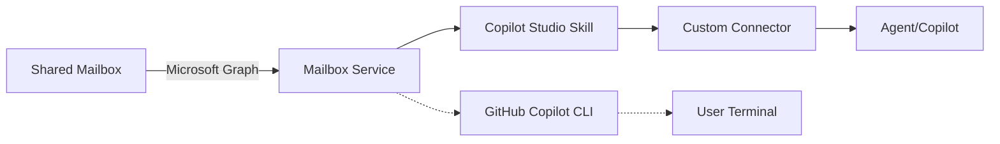

# Phase 1: Shared Mailbox Skill & Custom Connector Setup

**Objective:** Build the core shared mailbox service, Copilot Studio skill, and custom connector.

**Harnesses:** Copilot Studio standard harness (primary) + GitHub Copilot executable skill (parallel).

---

## 1. Prerequisites

- Azure subscription with Copilot Studio environment
- Power Platform admin access
- Shared mailbox address and permissions
- Application registration in Microsoft Entra (for workload identity)
- PowerShell 7+ with Azure CLI/modules

---

## 2. Architecture Overview



---

## 3. Application Registration

Create or use an existing application registration for mailbox access:

1. Navigate to **Azure Entra** → **App registrations**
2. Create new registration (or use existing)
3. Add API permission: **Mail.Read** (delegated or application scope)
4. Create a client secret and note the credentials

**Note:** For production, use managed identity instead of client secrets.

---

## 4. Copilot Studio Skill Setup

### 4.1 Create the Skill

1. Open **Copilot Studio** → **Skills** → **Create new skill**
2. Name: `SharedMailboxDraft`
3. Description: `Manages shared mailbox messages and draft creation`

### 4.2 Add Skill Actions

Add these placeholder actions (filled in later phases):

```
Input: messageId (text)
Output: message (object)
---
Input: messageId (text)
Output: classifications (object array)
---
Input: messageId, classifications, answer (text/objects)
Output: draftId (text)
```

Use the provided PowerShell script to register these actions programmatically:

```powershell
.\docs\wiki\scripts\setup-shared-mailbox-skill.ps1 `
  -EnvironmentId "your-env-id" `
  -SkillName "SharedMailboxDraft"
```

---

## 5. Custom Connector Setup

### 5.1 Create the Connector

1. Open **Power Platform** → **Connectors** → **Create a new connector**
2. Name: `SharedMailboxConnector`
3. Host: `your-api-host.azurewebsites.net` (or local for development)

### 5.2 Define OpenAPI Spec

The connector exposes these endpoints (operations to be implemented in later phases):

```yaml
/mailbox/messages:
  get:
    operationId: GetMessages
    parameters:
      - name: $top
        in: query
        type: integer
        default: 10

/mailbox/messages/{messageId}:
  get:
    operationId: GetMessage
    
  post:
    operationId: CreateReplyDraft
    requestBody:
      content:
        application/json:
          schema:
            properties:
              subject:
                type: string
              body:
                type: string

/mailbox/classify:
  post:
    operationId: ClassifyMessage
    requestBody:
      content:
        application/json:
          schema:
            properties:
              messageId:
                type: string
```

Use the provided PowerShell script:

```powershell
.\docs\wiki\scripts\setup-custom-connector.ps1 `
  -EnvironmentId "your-env-id" `
  -ConnectorName "SharedMailboxConnector" `
  -ApiHost "your-api-host.azurewebsites.net"
```

### 5.3 Configure Authentication

1. **Authentication type:** Azure AD (Entra)
2. **Tenant ID:** Your Azure tenant ID
3. **Client ID:** Application registration ID
4. **Redirect URL:** (auto-populated by Power Platform)

---

## 6. GitHub Copilot Skill (Parallel)

### 6.1 CLI Commands

Add executable skill commands to the GitHub Copilot harness:

```bash
shared-mailbox-drafts fetch-messages --mailbox "<address>" --top 10
shared-mailbox-drafts fetch-message --mailbox "<address>" --message-id "<id>"
shared-mailbox-drafts classify-message --mailbox "<address>" --message-id "<id>"
```

### 6.2 SKILL.md Documentation

Add to `SKILL.md`:

```markdown
## Shared Mailbox Commands

Use these commands to fetch and manage messages in a shared mailbox.

### Fetch Messages
\`\`\`bash
shared-mailbox-drafts fetch-messages --mailbox "service@company.com" --top 10
\`\`\`

Returns the 10 most recent messages from the shared mailbox.

### Fetch Single Message
\`\`\`bash
shared-mailbox-drafts fetch-message --mailbox "service@company.com" --message-id "<id>"
\`\`\`

Returns the full message details including sender, subject, and body.

### Classify Message
\`\`\`bash
shared-mailbox-drafts classify-message --mailbox "service@company.com" --message-id "<id>"
\`\`\`

Classifies the message and returns plausible classifications.
```

---

## 7. Testing the Setup

### Test Copilot Studio Skill

1. Open your Copilot Studio agent
2. Invoke the **SharedMailboxDraft** skill with a test messageId
3. Verify the action executes without error

### Test Custom Connector

1. Open **Power Platform** → **Connectors** → **Test**
2. Call `GetMessages` with the shared mailbox address
3. Verify the response contains message objects

### Test GitHub Copilot Skill

```bash
shared-mailbox-drafts fetch-messages --mailbox "service@company.com" --top 1
```

Verify the command returns a message.

---

## 8. Troubleshooting

| Issue | Resolution |
|---|---|
| **401 Unauthorized** | Verify application registration permissions and client credentials |
| **403 Forbidden** | Check mailbox permissions; ensure workload identity has read access |
| **Skill not found** | Verify skill is registered in Copilot Studio environment |
| **Connector authentication fails** | Reconfigure Entra credentials; test with PowerShell first |

---

## 9. Next Steps

- Proceed to Phase 2: Classification via Table
- Create sample classification data
- Implement the classification provider

---

## References

- [Microsoft Graph Mail API](https://learn.microsoft.com/graph/api/resources/message)
- [Copilot Studio Skills](https://learn.microsoft.com/power-virtual-agents/advanced-generative-actions)
- [Power Platform Custom Connectors](https://learn.microsoft.com/connectors/custom-connectors/)

---

**Copyright & License**

(c) 2026 Holger Imbery (contact@holgerimbery.blog)

Licensed under the project LICENSE file.
